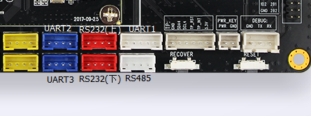

# UART 使用

## 简介

AIO-3288J 支持 SPI 桥接/扩展 4个增强功能串口(UART)的功能，分别为 UART2，RS232（上），RS485，UART3 和 3个主控自带的串口，分别为 UART1，RS232（下）和调试串口。每个 UART 都拥有 256字节的 FIFO 缓冲区，用于数据接收和发送。其中：

* UART1～UART3 为 TTL 电平接口，RS232 为 RS232 电平接口，RS485 为 RS485 电平接口
* 每个子通道 UART 的波特率、字长、校验格式可以独立设置，最高可以提供 2Mbps 的通信速率
* 每个子通道具备收/发独立的 256 BYTE FIFO，FIFO 的中断可按用户需求进行编程触发点
* 具备子串口接收 FIFO 超时中断
* 支持起始位错误检测

AIO-3288J 开发板的串口接口图如下：



## DTS 配置

文件 `kernel/arch/arm/boot/dts/firefly-rk3288-aio-3288j.dts` 有spi转uart相关节点的定义,使能该节点即可使用：

```dts
 &spi0 {
     status = "okay";
     max-freq = ;
     spidev@00 {
         status = "disabled";
         compatible = "linux,spidev";
         reg = ;
         spi-max-frequency = ;
     };
     spi_wk2xxx: spi_wk2xxx@00{
         status = "okay";
         compatible = "firefly,spi-wk2xxx";
         reg = ;
         spi-max-frequency = ;
         reset-gpio = ;
         irq-gpio = ;
         cs-gpio = ;
         pwr-en-gpio = ;
     };
 };
 ```

## 调试方法

配置好串口后，硬件接口对应软件上的节点分别为：

```c
RS485：/dev/ttysWK3
RS232（上）：/dev/ttysWK1
RS232（下）：/dev/ttyS3
UART1：/dev/ttyS1
UART2：/dev/ttysWK0
UART3：/dev/ttysWK2
```

用户可以根据不同的接口使用不同的主机的 USB 转串口适配器向开发板的串口收发数据，例如 RS485 的调试步骤如下：

### 连接硬件

将开发板 RS485 的 A、B、GND 引脚分别和主机串口适配器（USB 转 485 转串口模块）的 A、B、GND 引脚相连。

### 打开主机的串口终端

在终端打开 kermit，并设置波特率：

```bash
$ sudo kermit
C-Kermit> set line /dev/ttyUSB0
C-Kermit> set speed 9600
C-Kermit> set flow-control none
C-Kermit> connect
```

* `/dev/ttyUSB0` 为 USB 转串口适配器的设备文件

### 发送数据

RS485 的设备文件为 `/dev/ttysWK3`。在设备上运行下列命令：

```bash
echo firefly RS485 test... > /dev/ttysWK3
```

主机中的串口终端即可接收到字符串 “firefly RS485 test...”

### 接收数据

首先在设备上运行下列命令：

```bash
cat /dev/ttysWK3
```

然后在主机的串口终端输入字符串 “Firefly RS485 test...”，设备端即可见到相同的字符串。