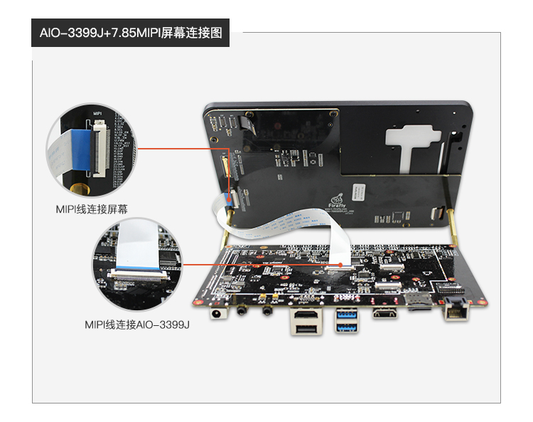
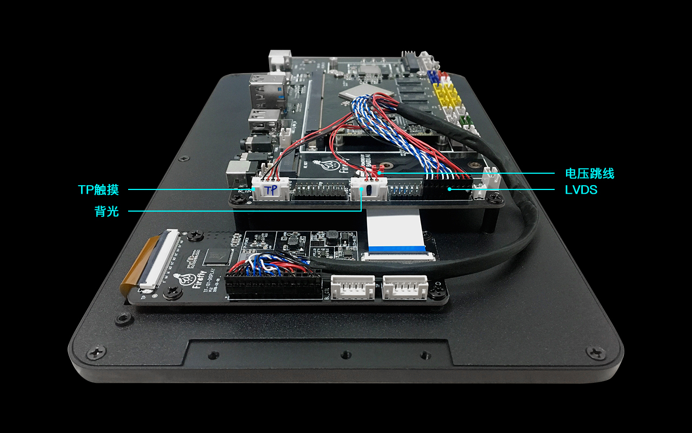
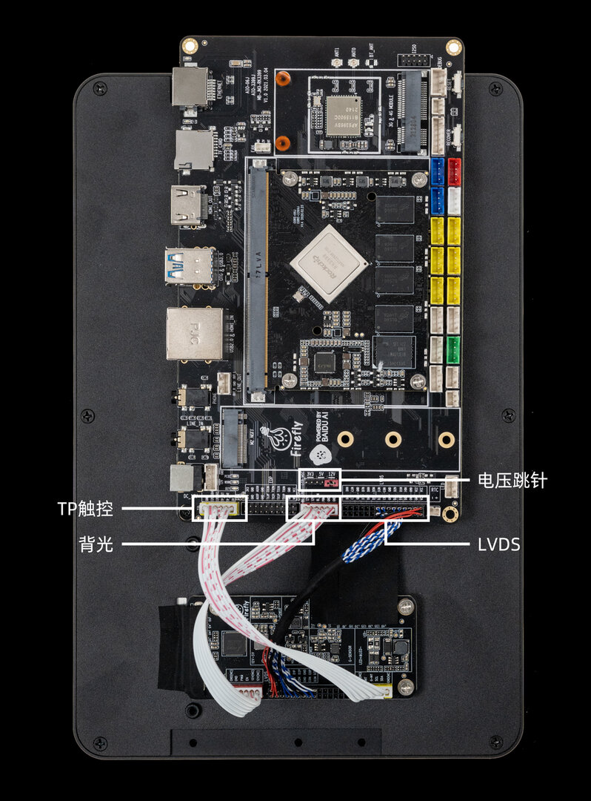

# 屏幕模组

## 7.85 寸 MIPI 液晶屏模组

注意：默认的 AIO-3399J 主板不带 mipi_dsi 接口，如需要此功能需修改硬件。详情参考 [LCD 驱动章节](driver_lcd.md)

###  产品参数

* 型号：B080XAN01
* 尺寸： 7.85 寸
* 分辨率：1024x768
* 显示接口： MIPI
* 面板材料：IPS 面板
* 可视角度：160°
* 触摸屏：多点电容触摸

### 编译命令

用官网 SDK 编译支持的 7.85 寸屏的固件时需加上补丁（[0001-AIO-SDK-mipi-support- 7.85 - MIPI -lcd.patch](https://pan.baidu.com/s/1n2GDhQNEWvJwvSy7b0Ecyg)）后再使用以下命令：

*  Android 7.1 (Industry)

```
./FFTools/make.sh -j8 -d rk3399-firefly-aio-mipi -l rk3399_firefly_aio_mipi-userdebug
./FFTools/mkupdate/mkupdate.sh -l rk3399_firefly_aio_mipi-userdebug
```

### 实物图

**注意：** 下图中电压跳线要使用 12V。



## [10.1 寸LVDS屏模组](https://store.t-firefly.com/goods.php?id=80)

### 产品参数

* 型号：HSX101H40C-L28A
* 尺寸：10.1 寸
* 分辨率：800x1280
* 显示接口：LVDS
* 可视角度：170°
* 触摸屏：多点电容触摸

###  参考固件

**注意：** 支持 10.1 寸屏的官方固件名带有 `LVDS` 字样，下面是固件的链接：[固件链接](http://www.t-firefly.com/doc/download/page/id/48.html#other_138)

### 编译命令

用官网 SDK 编译支持的 10.1 寸屏的固件时使用以下命令：

*    Android 7.1 (Industry)

```
  ./FFTools/make.sh -j8 -d rk3399-firefly-aio-lvds-HSX101H40C -l rk3399_firefly_aio_lvds-userdebug
  ./FFTools/mkupdate/mkupdate.sh -l rk3399_firefly_aio_lvds-userdebug
```
*    Android 7.1 (Box)

```
  ./FFTools/make.sh -j8 -d rk3399-firefly-aio-lvds-HSX101H40C -l rk3399_firefly_aio_lvds_box-userdebug
  ./FFTools/mkupdate/mkupdate.sh -l rk3399_firefly_aio_lvds_box-userdebug
```

### 参考资料

[屏幕模组 Datasheet & 转接板原理图](http://www.t-firefly.com/doc/download/page/id/48.html#other_137)

### 实物图

**注意：** 下图中电压跳线要使用 12V。
旧版本排线连接图



新版本排线连接图



