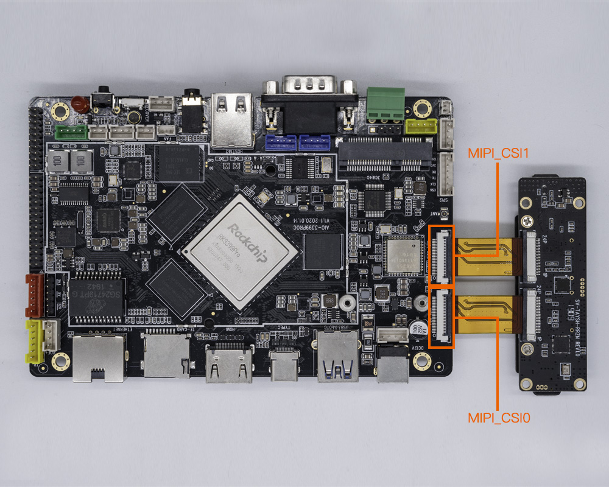

## SV-TAYSH-TQ摄像头模组

### 产品参数

* 型号：XC7022(RGB)/XC6130(IR)

* 接口：MIPI

* 像素：200W

### 修改方法 (手动修改)
kernel/arch/arm64/boot/dts/rockchip/rk3399pro-firefly-aioc.dtsi
```
        xc7160b: xc7160b@1b {
+                status = "disabled";
        };

        xc7160f: xc7160f@1b {
+                status = "disabled";
        };

        XC7022b: XC7022b@1b{
+                status = "okay";
        };

        XC6130b: XC6130b@23{
+                status = "okay";
        };
```
修改上述补丁后重新[编译内核](compile_android9.0_firmware.html#shou-dong-bian-yi-aio-3399proc-android-9-0)并烧写 boot.img 后重启。


### 实物图


### 连接方式



### 实拍图片


