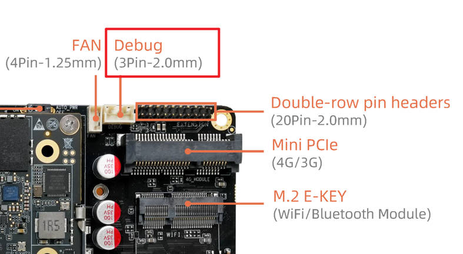
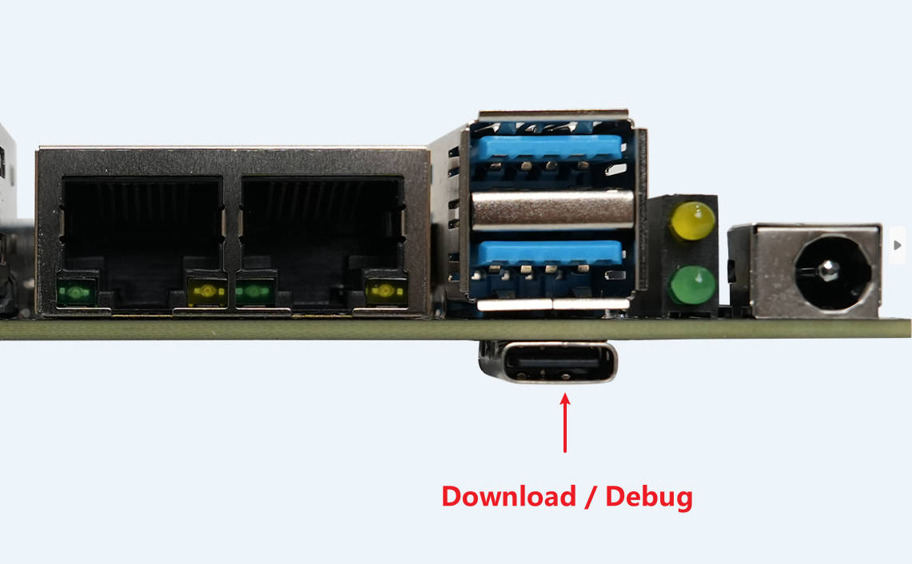
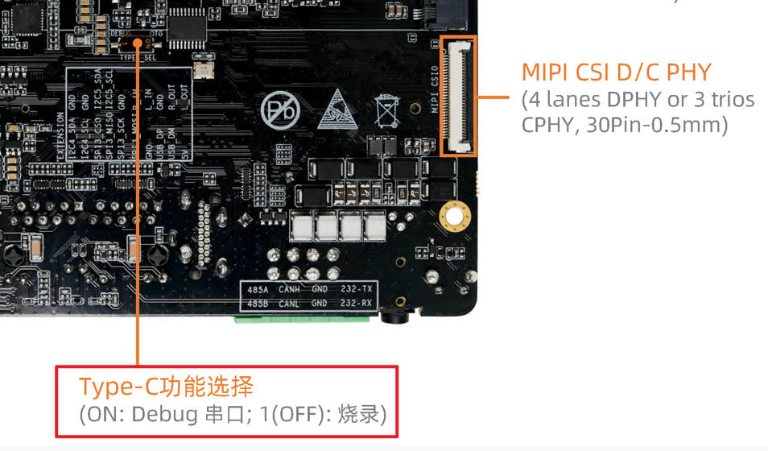

# 串口调试

Debug 串口在调试和排查问题时非常有用，特别是在图形界面不可用的情况下。

## 连接

AIO-8550JD4 的调试串口提供两种接口

* 3pin ttl 插槽

需要额外的 usb 转串口模块，详情请查看 [串口模块](https://wiki.t-firefly.com/USB-TO-TTL-Serial/usb-to-ttl-serial.html)

* Type-C 接口

由于这个 Typec-C 接口同时还作为下载口，所以需要先将如下拨码开关切换到 ON 才能开启 debug 串口功能。

然后使用 USB 线连接设备上的 Console 口和电脑：

**注意**: 以上两个实际为同一个串口，只是引出的接口类型不同，并不是两个串口。同时只能选择一个使用。

## 驱动安装

* 如果选择 3pin ttl 插槽

Linux 电脑无需安装驱动。

Windows 电脑驱动的安装方法也在详情链接中 [串口模块](https://wiki.t-firefly.com/USB-TO-TTL-Serial/usb-to-ttl-serial.html)

* 如果选择 Type-C 接口

Type-C 接口使用的串口转 USB 芯片是 PL2303GL。

Linux 电脑无需安装驱动。

Windows 电脑需要安装驱动，前往 [下载地址](https://www.t-firefly.com/doc/download/371.html#other_924) 下载 `PL23XX-M_LogoDriver_Setup_4500.zip`

解压后双击其中的 exe 文件运行，同意用户协议并一直点击 next 即可，最后点击 finish 完成。

## 串口使用

驱动安装成功后，在 Windows 的设备管理器中应该可以看到名称为 "Prolific PL2303GL USB Serial COM Port" 或者 "Silicon Labs CP210x USB to UART Bridge" 的设备。

Linux 中则是 /dev/ttyUSBX 或 /dev/ttyACMX，其中数字 X 可能不同，可以拔插 USB 来寻找对应的设备。

找到设备后就可以使用你常用的串口工具 (MobaXterm、Minicom 等) 打开串口设备，波特率为 115200，数据位 8 位，停止位 1 位，无奇偶校验。