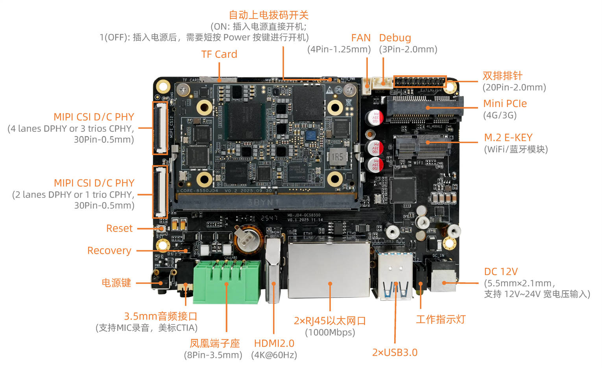
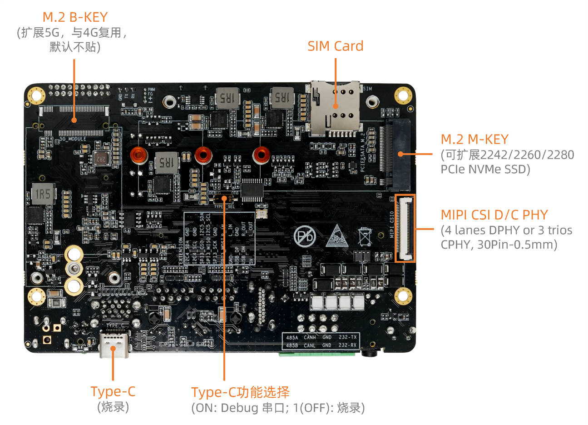
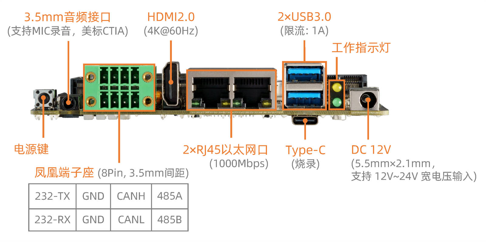

# 接口定义

## 整机接口定义

AIO-8550JD4 提供了丰富的接口，主要包括：

* 电源接口
* 2 x USB3.0
* 1 x Type-C（烧录/调试串口）
* 1 x Console（调试串口）
* 2 x 1000M 以太网口
* 1 x TF 卡槽
* 1 x SIM 卡槽
* 1 x HDMI2.0
* 1 x 3.5mm 耳机孔
* 3 x MIPI CSI
* 1 x FAN
* 1 x Mini PCIe（4G 模块）
* 1 x M.2 E-KEY（wifibt模块）
* 1 x M.2 M-KEY（PCIe NVMe SSD）
* 2 x 拨码开关
* 1 x EDL 烧录按钮（recovery）
* 1 x Reset 复位按钮
* Power 按键

具体如下图：

