# 升级完整固件

## 进入 EDL 升级模式

### 硬件方式

1. 首先确认设备完全断开电源。

2. 确保拨码开关处于 "1" 的位置。

3. 使用 Type-A 转 C USB 数据线 连接设备的 TypeC 口和电脑。

4. 按下下载按钮，保持住。

5. 插入电源。

6. 2 秒后松开下载按钮。

<center>

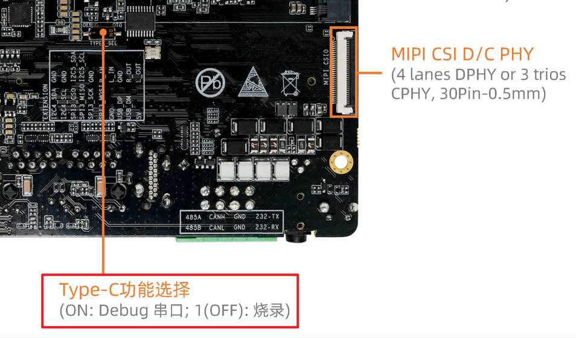
</center>
<center>

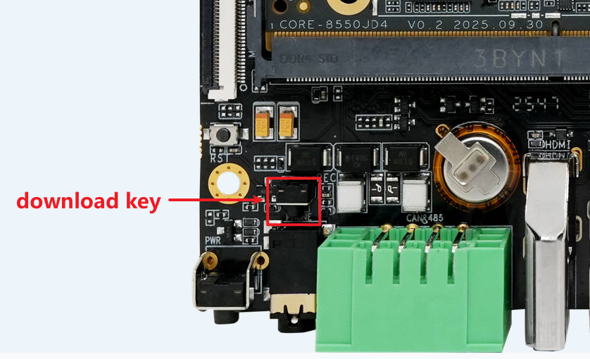
</center>
### 软件方式

在设备正常运行的情况下，使用 Type-A 转 C USB 数据线 连接好设备的烧录口和电脑，然后在设备终端或调试串口上运行：

```shell
sudo systemctl reboot edl
```

<center>

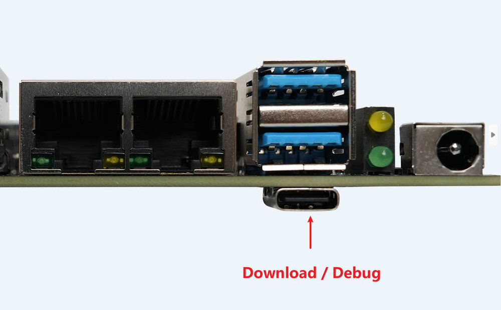
</center>

### 确认是否成功

如果设备成功进入 EDL 模式，QFIL 工具上一般会显示 Qualcomm HS-USB QDLoader 9008。

<center>

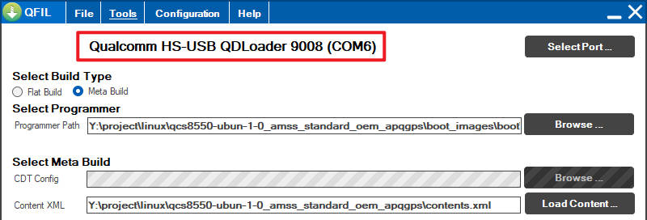
</center>

也有可能显示 Please Select an Existing Port，此时点击右侧 SelectPort，也可以看到 Qualcomm HS-USB QDLoader 9008，选中并点击 OK 即可。

<center>

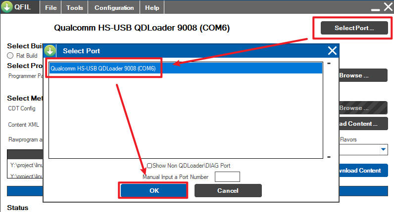
</center>

**注意：必须要显示 9008 设备才行** 如果显示其他编号，如 900E，则说明设备状态异常，请断电重新尝试进入升级模式。

如果显示 No Port Available，则检查驱动是否安装成功、USB 线连接是否正确。

## 烧写固件

1 点击上方 Configuration，再点击 FireHose Configuration，在弹出的窗口中，按照下图设置。完成后点击 OK

<center>

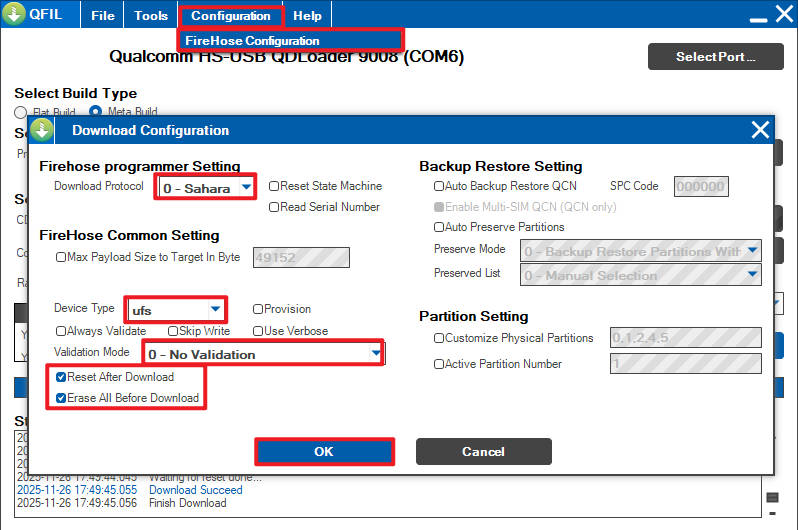
</center>

2 在主界面选择 Flat Build，点击 Browse

<center>

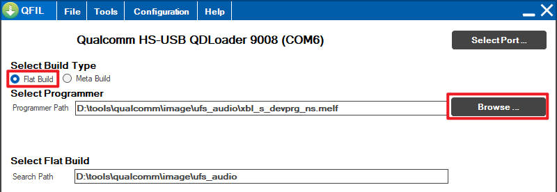
</center>

3 在弹出的窗口中前往你解压好的固件位置，文件类型选择 All Files，然后找到 xbl_s_devprg_ns.melf (也可能是 prog_firehose_ddr.elf，不同芯片不一样)并点击打开。

<center>

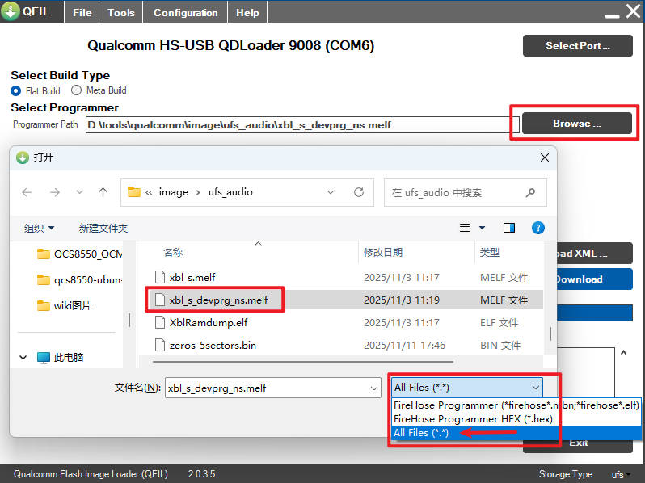
</center>

4 主界面点击 Load XML，在弹出的串口中，全选所有 xml 文件并点击打开。此时又会弹出相同的窗口，继续选择全部 xml 文件点击打开。

<center>

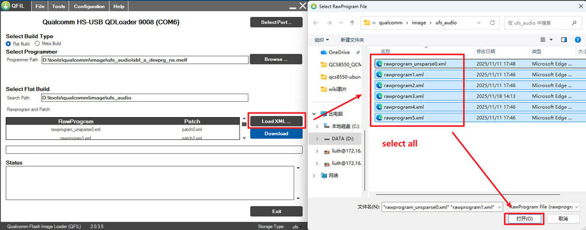
</center>

<center>

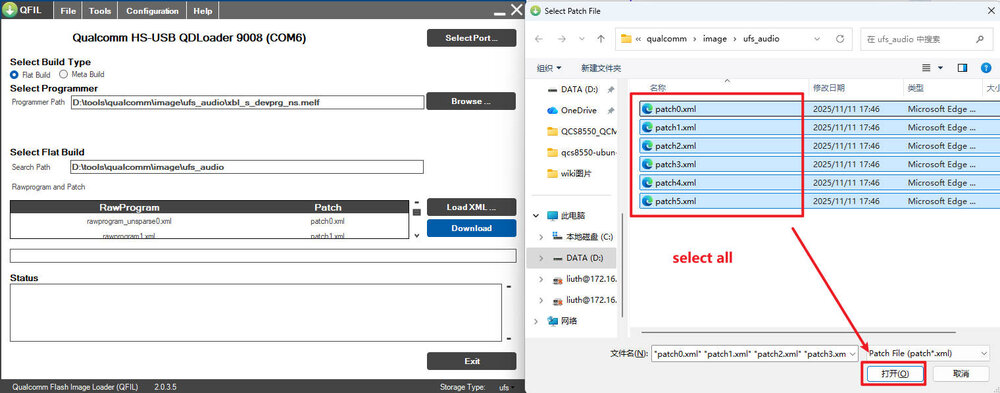
</center>

5 最后点击 Download 开始烧录，等待它完成，需要几分钟。完成后如图

<center>

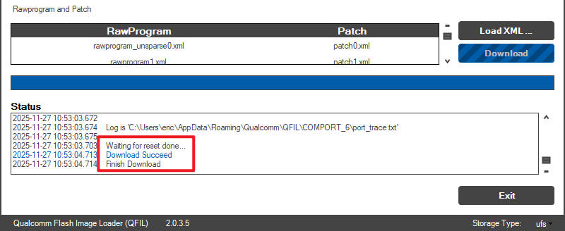
</center>

6 完成后等待一会，设备应该会自动重启到正常模式。