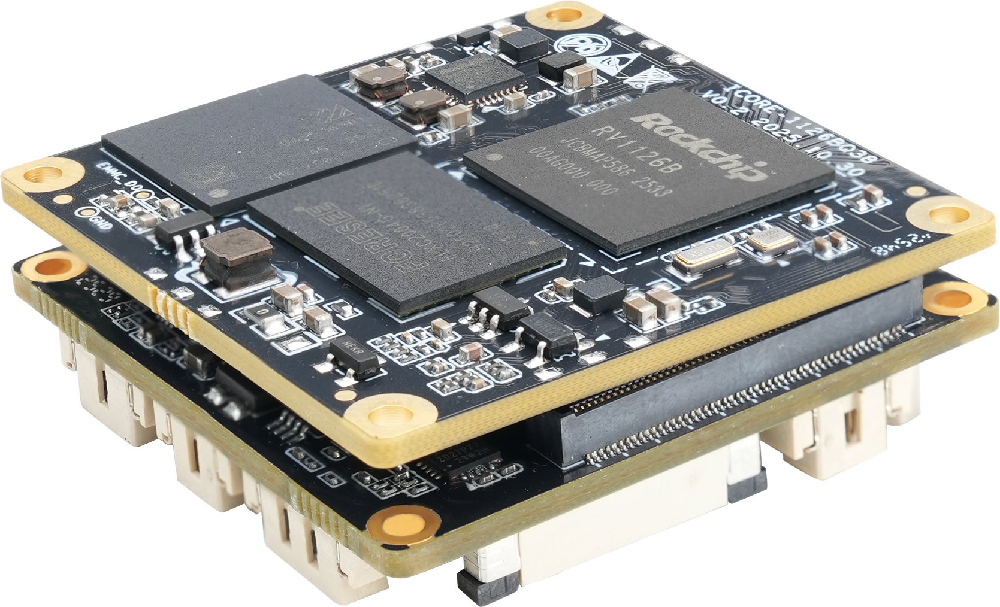
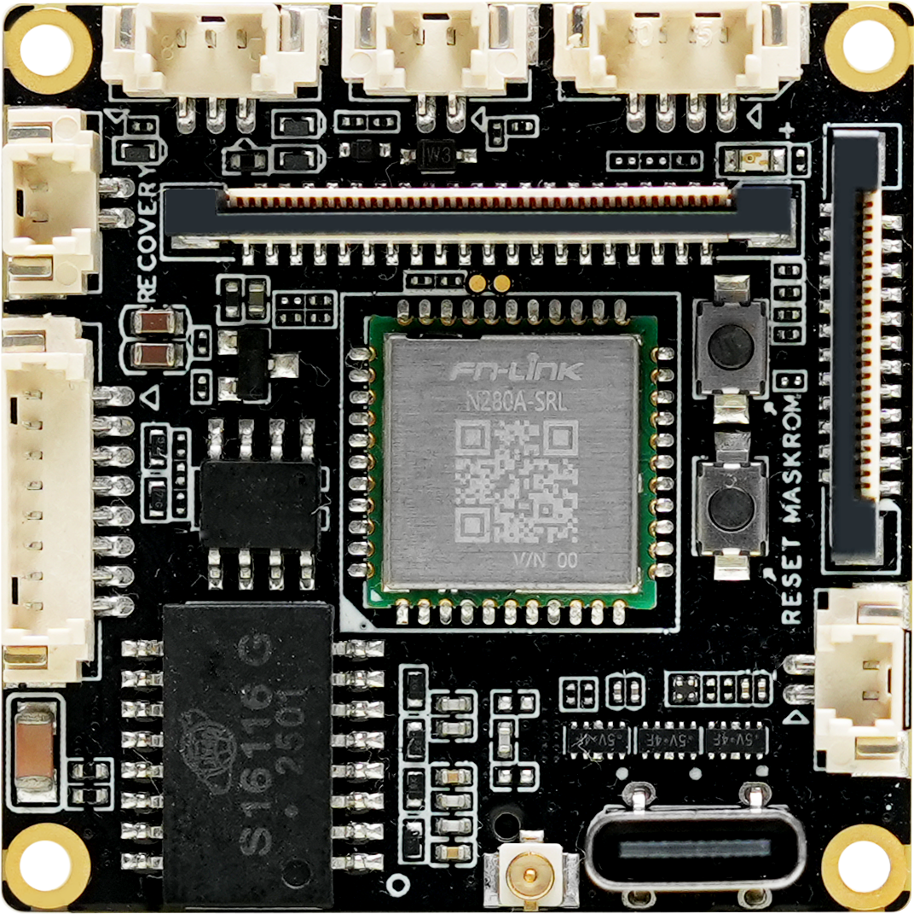

# 介绍

**CAM-1126BQ38** 采用 Rockchip 四核 AI 视觉处理器 RV1126B，集成 3 TOPS NPU，支持 2B 多模态大模型和深度学习框架。支持 12M 视频编码与 4K 视频解码，内置 12M ISP / 8MP AI-ISP，适用于人脸识别、闸机门禁、智能安防和智能网络摄像头等场景。

**CAM-1126BQ38** 套板基于 ICORE-1126BQ38 核心板。

## 产品外观

**CAM-1126BQ38** 正面：

**CAM-1126BQ38** 背面：

 