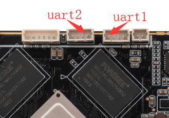
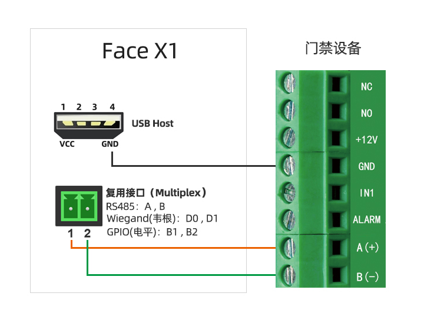
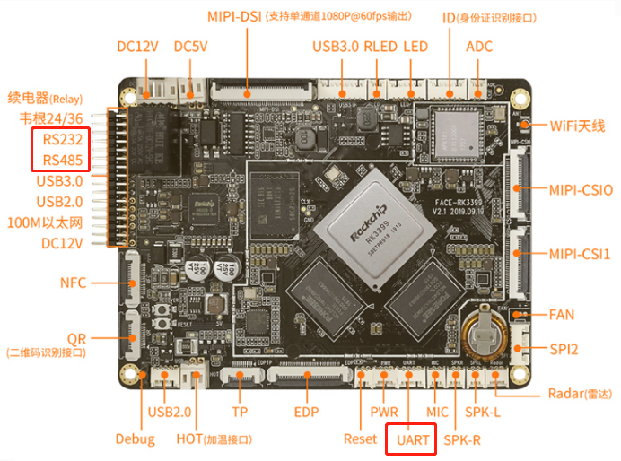

# UART 使用


## 简介

Face-RK3399 外置3个增强功能串口(UART)的功能，分别为UART1，UART2，RS485。每个UART都拥有256字节的FIFO缓冲区，用于数据接收和发送。 其中：

* UART1，UART2为TTL电平接口，RS485为RS485电平接口

* UART1 UART2最高支持波特率691200。RS485受通讯媒介影响一般只支持115200以下。

* 每个子通道具备收/发独立的256 BYTE FIFO,FIFO的中断可按用户需求进行编程触发点

* 具备子串口接收FIFO超时中断

* 支持起始位错误检测

* 其中,RS485的端口可复用为韦根协议端口

设备端接口对应软件上的节点分别为：
```
RS485：/dev/ttyS4
UART2：/dev/ttyS0
UART1：/dev/ttyS3
```

Face-RK3399开发板的串口接口图如下：




如下是具体用RS485连接示意图，注意有需要可以通过USB提供VCC和GND



## RS485调试方法

### DTS配置

文件kernel/arch/arm64/boot/dts/rockchip/rk3399.dtsi 有uart转RS485相关节点的定义：
```
uart4: serial@ff370000 {
        compatible = "rockchip,rk3399-uart", "snps,dw-apb-uart";
        reg = <0x0 0xff370000 0x0 0x100>;
        clocks = <&pmucru SCLK_UART4_PMU>, <&pmucru PCLK_UART4_PMU>;
        clock-names = "baudclk", "apb_pclk";
        interrupts = <GIC_SPI 102 IRQ_TYPE_LEVEL_HIGH 0>;
        reg-shift = <2>;
        reg-io-width = <4>;
        pinctrl-names = "default";
        pinctrl-0 = <&uart4_xfer>;
        status = "disabled";
};

```
可以看到，在kernel/arch/arm64/boot/dts/rockchip/rk3399-firefly-face.dtsi文件中使能该节点即可使用,如下：
```
&uart4 {
-    status = "disable";
+    status = "okay";
};
```
### 连接硬件
将开发板RS485 的A、B、GND 引脚分别和主机串口适配器（USB转485转串口模块）的 A、B、GND 引脚相连。

(1) 首先在PC端运行以下命令接收数据：
```
cat /dev/ttyUSB1
```

(2) 在设备端运行下列命令发送数据：
```
echo 1 > /sys/devices/platform/wiegand-gpio/mode_switch //切换为RS485接口功能
echo firefly RS485 test... > /dev/ttyS4
```

然后在PC端的串口终端便可以看到与设备端相同的字符串 “Firefly RS485 test...”。

## V2新硬件版本

后续Face-rk3399更新了V2的硬件版本，串口接口部分有相应的更改。

设备端接口对应软件上的节点分别为：
```
RS485：/dev/ttyS4
UART：/dev/ttyS0
RS232：/dev/ttyS3
```

其中原本的一个TTL串口变成RS232



注意：UART(/dev/ttyS0)是和蓝牙接口复用了，两者同时只能使用其中一个功能，出厂默认使用的是UART的功能。
