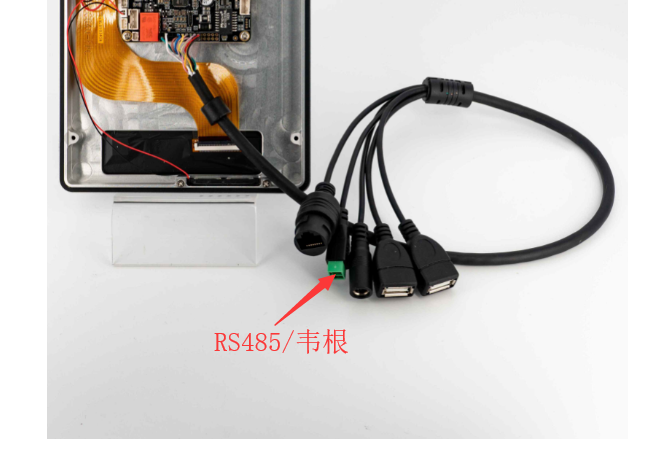
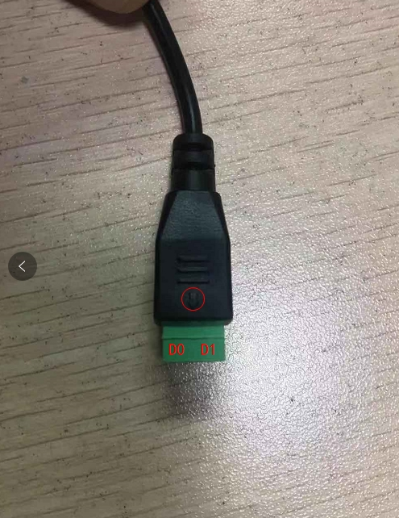
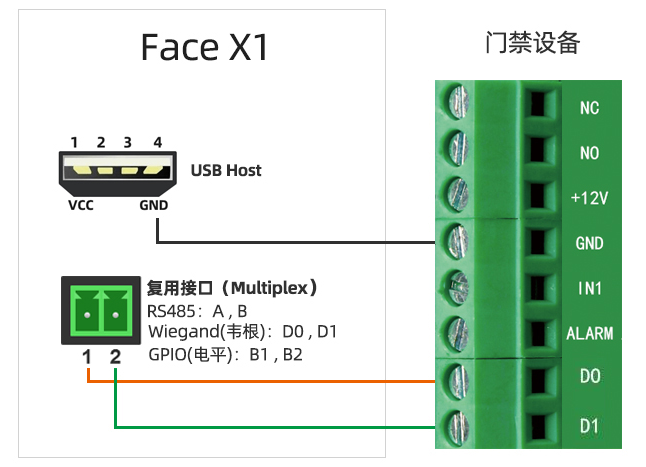
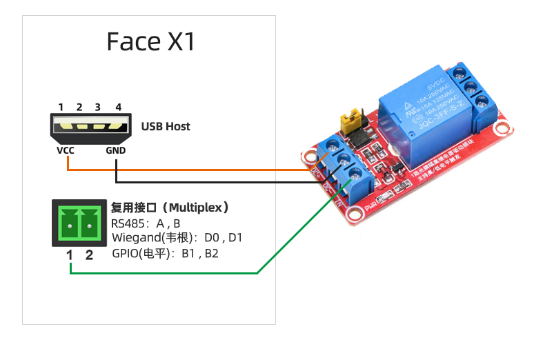

# WIEGAND 使用

## 简介
Wiegand（韦根）协议是由摩托罗拉公司制定的一种通讯协议，它适用于涉及门禁控制系统的读卡器和卡片的许多特性；其协议并没有定义通讯的波特率、也没有定义数据长度韦根格式主要定义是数据传输方式：Data0和Data1两根数线分别传输0和1.现在应用最多的是26bit,34bit，36bit，44bit等等。




## 调试方法

Face-RK3399的RS485端口是可以复用为韦根协议发送端口从而进行数据的传输。

### DTS配置
在 kernel/arch/arm64/boot/dts/rockchip/rk3399-firefly-face.dtsi 文件中定义韦根节点，具体定义如下:
```
wiegand-gpio {
    compatible = "firefly,wiegandout";
    level_effect = <1>;/*0-low effect 1-high effect*/
    gpio_d0 = <&gpio1 9 GPIO_ACTIVE_HIGH>;
    gpio_d1 = <&gpio1 10 GPIO_ACTIVE_HIGH>;
    gpio_mode_switch = <&gpio1 17 GPIO_ACTIVE_HIGH>;
    status = "okay";
};
```

在设备端输入命令：
```
echo 0 > /sys/devices/platform/wiegand-gpio/mode_switch //切换为韦根接口功能
echo 卡号 > /sys/devices/platform/wiegand-gpio/wiegand26 //发送韦根26数据
echo 卡号 > /sys/devices/platform/wiegand-gpio/wiegand34 //发送韦根34数据
```
如下是韦根发送接口具体接线方法图，注意需要通过USB提供VCC和GND


 

韦根接口也可作为普通输入输出IO口:
```
# 拉高D0
echo 1 > /sys/devices/platform/wiegand-gpio/D0
# 拉高D1
echo 1 > /sys/devices/platform/wiegand-gpio/D1
```
 
如下是具体用D0 D1 IO口控制继电器的连接示意图，注意需要通过USB提供VCC和GND




## V2硬件版本韦根接口和继电器
Face-RK3399在后续新增V2版本，韦根接口部分相应也有更新，现在已经不用尾线，通过拓展板引出韦根接口。

V2 版本拓展板韦根部分外观接口请参考[《接口定义》](interface_definition.md)章节部分图片。

注意的是连接韦根设备的时候需要把地线也连上。

### V2韦根输出
在设备端输入命令：
```
echo 卡号 > /sys/devices/platform/wiegand-gpio/wiegand26 //发送韦根26数据
echo 卡号 > /sys/devices/platform/wiegand-gpio/wiegand34 //发送韦根34数据
```

### V2韦根输入
文件系统会生成/dev/wiegand 节点，提供如下韦根输入调用的demo程序
```
#include <stdio.h>
#include <sys/types.h>
#include <sys/stat.h>
#include <fcntl.h>
#include <unistd.h>
#include <errno.h>
#include <asm-generic/ioctl.h>

#define WG_IOC_MAGIC 'k'

#define WG_IOCGETFUN    _IOR(WG_IOC_MAGIC, 1, int)  //
#define WG_IOC_FUN_IN   _IOR(WG_IOC_MAGIC, 2, int)  //设置为普通输入IO
#define WG_IOC_FUN_WG   _IOR(WG_IOC_MAGIC, 3, int)  //设置为韦根输入IO
#define WG_IOCGETD0     _IOR(WG_IOC_MAGIC, 4, int)  //获取IO电平
#define WG_IOCGETD1     _IOR(WG_IOC_MAGIC, 5, int)  //
#define WG_IOCGETWG     _IOR(WG_IOC_MAGIC, 6, int)  //获取韦根数据 

int main()
{
    int fd = 0;
    char dst[12] = { 0};
    int val;
    int result =0;
    fd = open("/dev/wiegand", O_RDWR);
    if(fd < 0)
    {
        printf("file open error ! \n");
        return -1;
    }
    while(1)
    {
        //result=read(fd, dst, sizeof(dst));
        ioctl(fd, WG_IOC_FUN_WG, &val);
        result = ioctl(fd, WG_IOCGETWG, &val);
        if(result < 0) {
            printf("Unable to get value: %s\n", strerror(errno));
            close(fd);
            return -1;
        } else    
            printf("val is %d, size=%d\n", val,result);
        sleep(1);
    }
    /*关闭设备*/
    close(fd);
    
    return 0;
}

```

执行上述程序，能对韦根输入数据进行接收和打印。

### V2继电器
V2新增继电器可以控制两线路的通断。

具体外观接口请参考[《接口定义》](interface_definition.md)章节部分图片。

```
echo 0 > /sys/devices/platform/wiegand-gpio/mode_switch //COM 和 ON 连通
echo 1 > /sys/devices/platform/wiegand-gpio/mode_switch //COM 和 OFF 连通
```