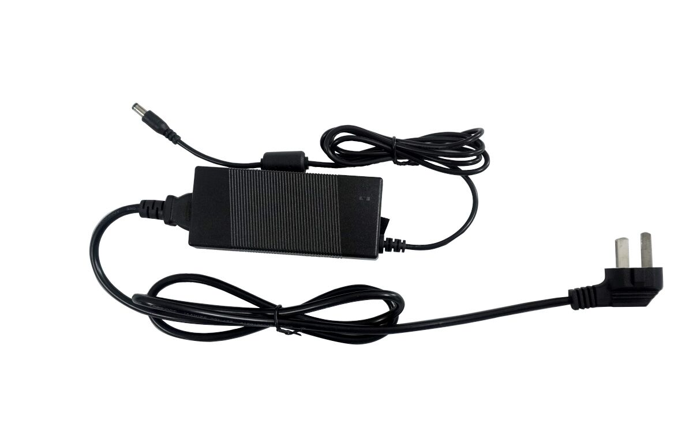

# 电源适配器
### 产品参数
* 产品：电源适配器
* 规格：美规/欧规
* 输入标准：AC100-240V 50/60Hz
* 输出标准：12V-3A

* 注意：Face-RK3399一体机正常工作需要电源12V/3A，电流低于2A可能会因电流过小而异常重启，为了保证开发板的正常工作，请使用电压为12V，电流为2A~3A的电源，推荐使用Firefly官网电源配件。

### 实物图

