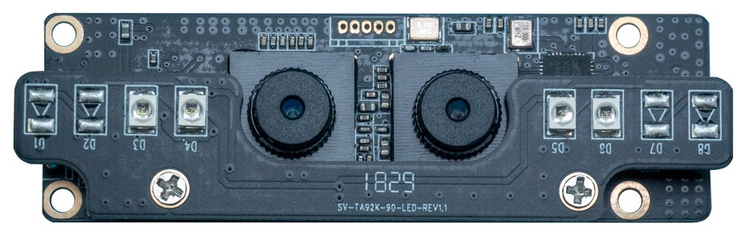
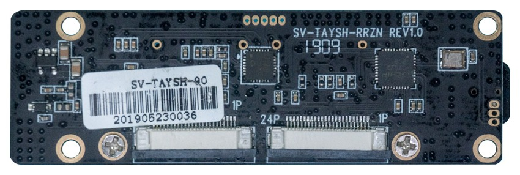
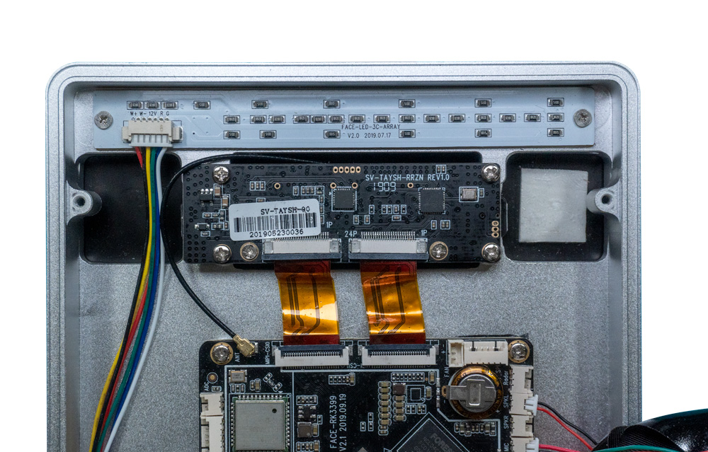
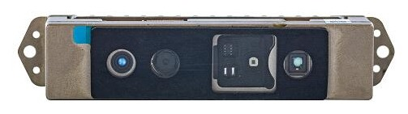
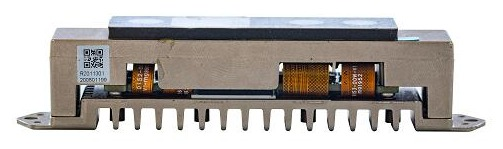
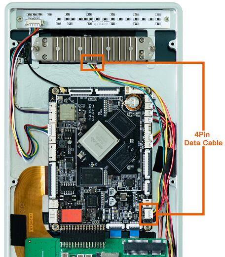
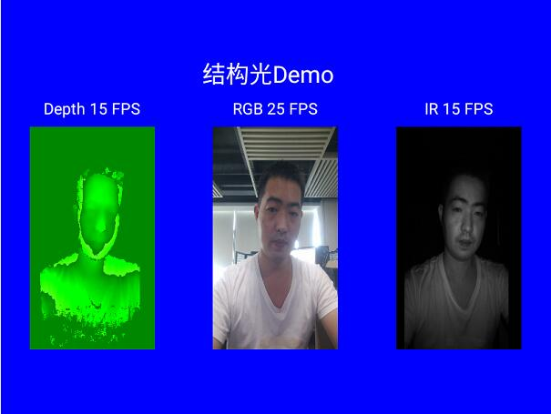

# 摄像头模组

## SV-TAYSH-90摄像头模组
### 产品参数

* 品牌：赛威思（serves）
* 型号：SV-TAYSH-90
* 接口：MIPI
* 像素：双200W
### 参考固件
公版固件默认支持SV-TAYSH-90摄像头模组
### 技术资料
[SV-TAYSH-90摄像头模组DataSheet](https://pan.baidu.com/s/1X6opa5DodrNROJ8-CIH_xA)
### 实物图

### 连接方法

## RMSL201-1301 结构光模组
### 简介
RMSL201-1301 是一款成熟的全功能的结构光 3D 摄像机模组。内置高达 3 万点的散斑投
射器，500 万像素的 RGB 摄像头，100 万像素全局曝光的红外摄像头以及红外照明光源。广泛适
用于人脸支付，门禁安防，手势、肢体识别，高精度 3D 建模等产品应用。

### 产品参数
* 品牌：瑞芯微（Rockchip）
* 型号：RMSL201-1301
* 接口：USB
* 像素：500W(RGB传感器) 100W(IR传感器)
* 支持微信人脸支付

### 技术资料
[RMSL201-1301 用户手册和接口使用SDK](http://www.t-firefly.com/share/index/index/id/7885e56933fef8aefd086e02412643fc.html)

### 固件
[RMSL201-1301 结构光固件](https://community.t-firefly.com/doc/download/75)

### 实物图

### 连接图

### 演示

