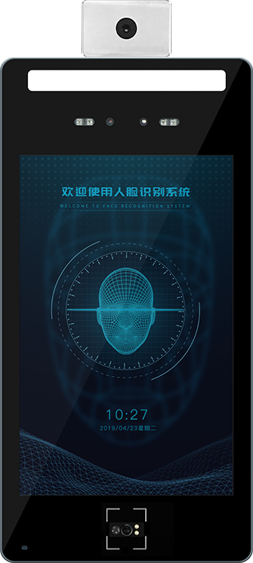

## 红外热像仪测温模块
Face X2(Face-rk3399) 可配置选用红外热像仪测温模块，如下图所示，已经封装成型。

Face-X2内部硬件上连接，此测温模块连接的是串口,默认节点为/dev/ttyS2，波特率‐19200。

(若客户选购的是Face-rk3399单板,可根据实际选用其他串口节点)

在出厂人脸识别APK中已经适配温度显示功能，用户只需要点击 设置->闸机设置->温度，打开此功能即可。

红外测温模块适用场景及要求：

测温距离：30‐50CM 测温量程：23‐48 度

室温环境温度：20‐35 度（医学环境），因为人体表面温度在室温 15 度以下已经不是线行关系，无论怎么补偿也是不准确的。

