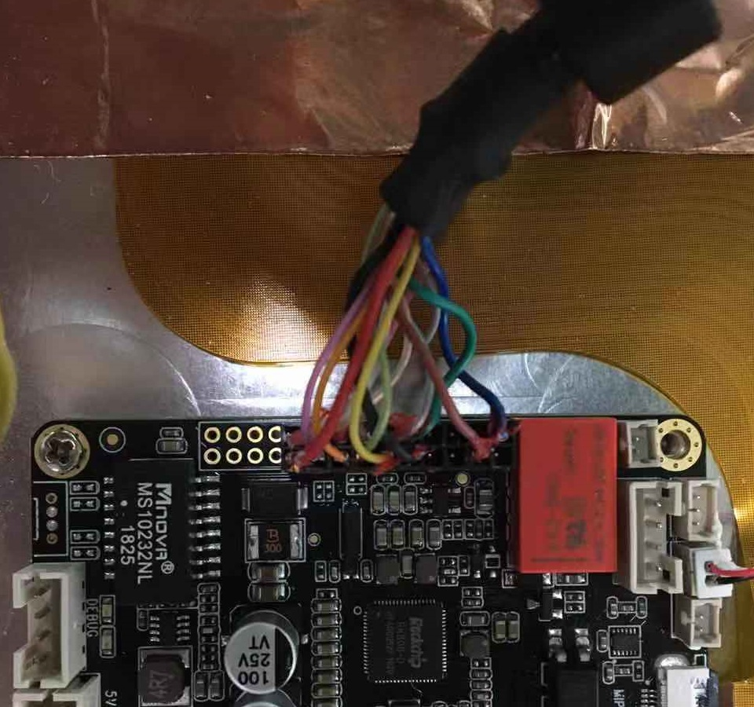

# 入手指南
## V1版本硬件配件

Face-RK3399 V1版本 的标准套装包含以下配件：

* Face-RK3399 主板一块 
* 12V-2A电源适配器一个
* 20pin集成转接口一根

可以选购的配件有：

* Firefly串口模块

另外，在使用过程中，你可能需要以下配件：

*    显示设备
     * 带 MIPI-DSI 接口的显示器或电视
*    网络
     *   100M 以太网线缆，及有线路由器
     *   WiFi 路由器
*    升级固件，调试
     *   双端公头USB数据线
     *   串口转 USB 适配器.
*    发货清单可参考以下链接和咨询商城客服   

[商城链接](https://store.t-firefly.com/goods.php?id=116)

### 尾线接法
Face-RK3399 配备一条20pin集成转接线，跟板子的连接线序如下图：

## V2版本硬件配件

Face-RK3399 V2版本发货的详细配套套件和可选购配件可参考以下链接和咨询商城客服

[商城链接](https://store.t-firefly.com/goods.php?id=116)

 
## 固件类型

 固件有两种格式：

 * 原始固件(raw firmware)
 * RK固件(Rockchip firmware)

    [原始固件]是一种能以逐位复制的方式烧写到存储设备的固件，是存储设备的原始映像。原始固件一般烧写到SD卡中，但也可以烧写到eMMC中。烧写原始固件有许多工具可以选用：
		

    [RK固件]是以Rockchip专有格式打包的固件，使用Rockchip提供的upgrade_tool(Linux)或AndroidTool(Windows)工具烧写到eMMC闪存中。RK固件是Rockchip的传统固件打包格式，常用于Android设备上。另外，Android的RK固件也可以使用SD Firmware Tool工具烧写到SD卡中。

    [分区映像]是分区的映像数据，用于存储设备对应分区的烧写。例如，编译Android SDK会构建出`boot.img`、`kernel.img`和`system.img`等分区映像文件，`kernel.img`会被写到eMMC或SD卡的“kernel”分区。

## 下载和烧写固件

以下是支持的系统列表：

- Android 7.1
- Ubuntu 16.04 
- Ubuntu 18.04
- Debian 9

根据所使用的操作系统来选择合适的工具去烧写固件：

- 烧写 SD卡
  + 图形界面烧写工具：
	* [Etcher] (windows/linux/Mac)
  + 命令行烧写工具
	* [dd] (Linux)

- 烧写 eMMC
  + 图形界面烧写工具：
	* [AndroidTool] (Windows)
  + 命令行烧写工具：
	* [upgrade_tool] (Linux)

## 开机
确认主板配件连接无误后，将电源适配器插入带电的插座上，电源线接口插入开发板，开发板第一次加电会自动开机。 在 Android 系统选择关机后，维持开发板供电，此时 Face-RK3399 方式如下：

*    长按电源键三秒(扩展按键)

开机时，蓝色的电源指示灯会亮起。如果板子接了显示器，可以看到Firefly 官方logo.
 