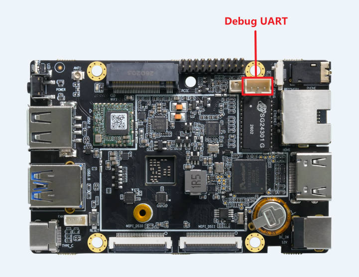

# 串口调试

Debug 串口在调试和排查问题时非常有用，特别是在图形界面不可用的情况下。

## 连接

* 3pin ttl 插槽

需要额外的 usb 转串口模块，详情请查看 [串口模块](usb_to_ttl.md)

## 驱动安装

Linux 电脑无需安装驱动。

Windows 电脑驱动的安装方法也在详情链接中 [串口模块](usb_to_ttl.md)

## 串口使用

驱动安装成功后，在 Windows 的设备管理器中应该可以看到名称为 "Silicon Labs CP210x USB to UART Bridge" 的设备。

Linux 中则是 /dev/ttyUSBX 或 /dev/ttyACMX，其中数字 X 可能不同，可以拔插 USB 来寻找对应的设备。

找到设备后就可以使用你常用的串口工具 (MobaXterm、Minicom 等) 打开串口设备，波特率为 115200，数据位 8 位，停止位 1 位，无奇偶校验。