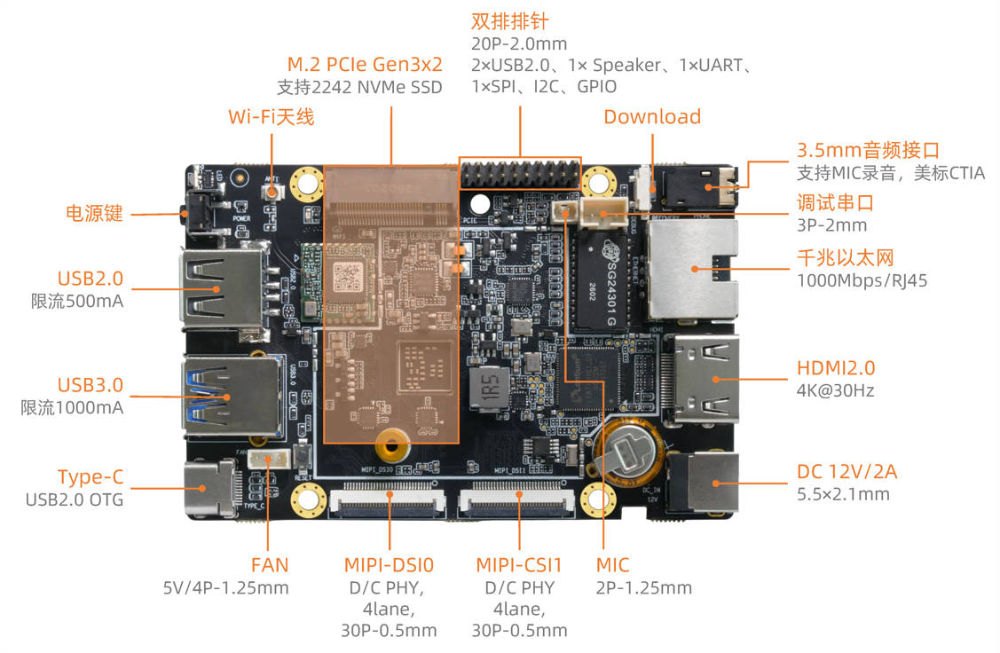
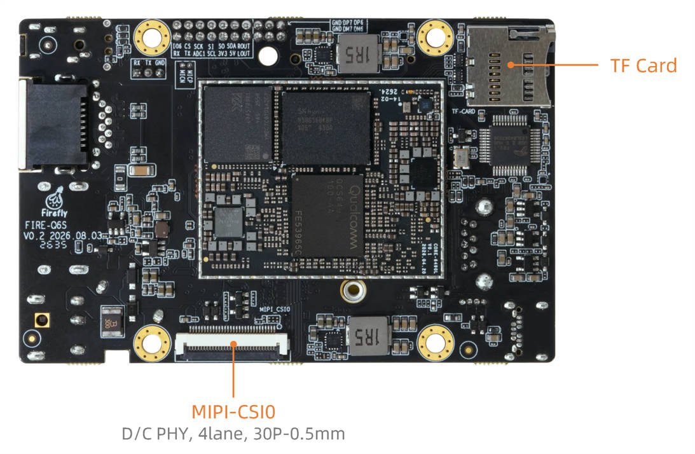

# 接口定义

## 整机接口定义

Firefly-Q6490A 提供了丰富的接口，主要包括：

* 电源接口
* 1 x TypeC (烧录)
* 1 x USB3.0
* 1 x USB2.0
* 1 x 1000M 以太网口
* 1 x HDMI 2.0
* 1 x TF 卡槽
* 1 x 3.5mm 耳机孔
* 1 x PCIE M.2
* 1 x MIPI-DSI
* 2 x MIPI-CSI
* Download 按键
* Power 按键
* 拓展排针

具体如下图：

