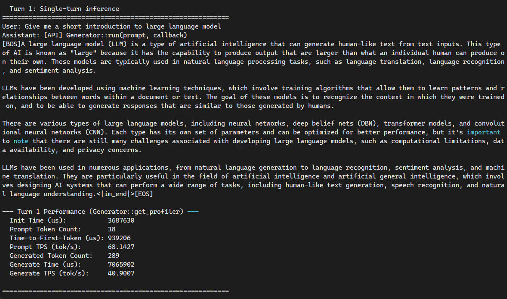
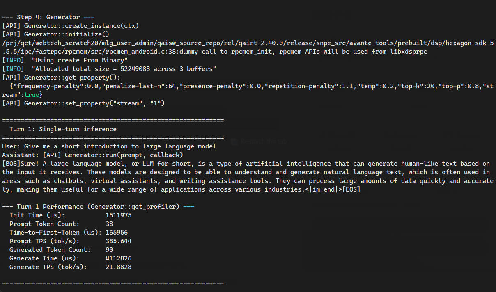

# AI 教程

## AidLux 介绍

AidLux 是一套完备的边缘端 AI 开发工具套件，能简化高通平台的环境部署，帮助开发者加速 AI 应用落地。

我们推荐使用 AidLux 来进行 AI 应用的开发。AidLux 包含 AidLite、AidGen、AidGenSE、AidStream 等组件。

## 系统依赖配置

* 配置 AidLux 源

```bash
# 下载正确的公钥
sudo wget -O- https://archive.aidlux.com/ubuntu24/public.key | gpg --dearmor | sudo tee /etc/apt/trusted.gpg.d/private-aidlux.gpg > /dev/null

# 编辑源文件
sudo vim /etc/apt/sources.list.d/private-aidlux.list

# 在源文件中填入AidLux 提供的私钥
deb [arch=arm64 signed-by=/etc/apt/trusted.gpg.d/private-aidlux.gpg] https://archive.aidlux.com/ubuntu24 noble main

# 更新缓存
sudo apt update
```

* 安装 AidLux 依赖

```bash
# 准备 python 虚拟环境，后续的 demo 都推荐使用虚拟环境来运行
sudo apt install python3-venv
python3 -m venv aidlux
source aidlux/bin/activate

# 安装 opencv
pip config set global.index-url https://mirrors.ustc.edu.cn/pypi/simple
pip install opencv-python

# 安装依赖
sudo apt install aidlux-aistack-base aidrtcm
sudo apt install aid-lms aidlms-sdk aid-mms cmake g++ libopencv-dev

# DSP 支持
sudo apt-get install qcom-fastrpc1
sudo apt-get install qcom-fastrpc-dev

# GPU 支持
sudo apt-add-repository -s ppa:ubuntu-qcom-iot/qcom-ppa
sudo apt install qcom-adreno-cl1
sudo ln -s /usr/lib/aarch64-linux-gnu/libOpenCL.so.1 /usr/lib/aarch64-linux-gnu/libOpenCL.so

# 支持 aidlite-sdk 和 aidgen-sdk
sudo apt install aidlite-sdk aidlite-*
sudo apt install aidgen-qnn240 aidgen-sdk
sudo apt-get install libfmt-dev nlohmann-json3-dev

apt download aidlite-sdk
mkdir extract
dpkg-deb -x aidlite-sdk_*.deb extract/
pip install extract/tmp/pyaidlitewhl/pyaidlite-2.5.0.284-cp312-none-any.whl
```

安装完成后，检查系统 /usr/local/share/ 新增 aidlite 和 aidgen 目录。

<center>


</center>

## 模型广场

模型广场聚集了大量的经过优化适配在高通 NPU 上的前沿 AI 模型，结合 AidLux 工具链，可以帮助开发者在高通芯片上更快的构建自己的 AI 应用。

地址：https://aiot.aidlux.com/zh/models

请前往注册账号，后续的例子会用到。

## AidLite

AidLite 是 AI 执行框架，旨在充分调度端侧芯片的各计算单元 (CPU、GPU、NPU) 实现AI模型的加速推理。

例子：

### YOLOv8s

YOLOv8 是一款前沿的、最先进的（SOTA）模型，基于之前YOLO版本的成功进行了构建，并引入了新功能和改进，进一步提升了性能和灵活性。YOLOv8 设计快速、准确且易于使用，是广泛应用于物体检测与跟踪、实例分割、图像分类以及姿态估计任务的优秀选择。

* 通过 mms 命令下载对应的 yolov8s 模型，需要提前注册模型广场的账号。

```bash
# 登录，根据提示输入模型广场的账户和密码
mms login

# 列举并下载模型
mms list | grep YOLOv8s | grep 6490
mms get -m YOLOv8s -p INT8 -c QCS6490 -b QNN2.31 -d ./

# 解压
unzip YOLOv8s_qcs6490_w8a8.zip
```

* 移动到模型目录，阅读 README 文档中操作执行模型调用

```bash
cd ./code
python3 python/run_test.py --target_model ../models/QCS6490/W8A8/cutoff_yolov8s_qcs6490_w8a8.qnn231.ctx.bin --imgs python/bus.jpg --invoke_nums 10
```

<center>


</center>

<center>


</center>

* 检查生成的结果 code/python/result.jpg

<center>


</center>

### ConvNeXt-Tiny

ConvNeXt-Tiny是ConvNeXt模型家族中的轻量级版本，它是一种现代卷积神经网络（CNN），旨在对传统CNN进行重新设计，以与当前流行的Transformer模型相竞争。ConvNeXt-Tiny保留了卷积网络的优势，同时引入了许多来自视觉Transformer的设计思想，如更深的网络结构、更大的卷积核和LayerNorm等。与其他模型相比，ConvNeXt-Tiny具有更少的参数和计算需求，但仍能提供高效的图像分类性能，因此特别适合在资源有限的环境中使用，如移动设备或边缘计算。

* 通过mms 命令下载对应的ConvNeXt-Tiny 模型，这里需要注册Aplux  模型广场的账户

```bash
#登录,根据提示输入模型广场的账户和密码
mms login
#列举并下载模型
mms list | grep ConvNeXt-Tiny | grep 6490
mms get -m ConvNeXt-Tiny -p W8A16 -c QCS6490 -b QNN2.16 -d ./
unzip ConvNeXt-Tiny_qcs6490_w8a16.zip
```

* 移动到模型目录，阅读 README 文档中操作执行模型调用

```bash
cd ./code
python3 python/run_test.py --target_model ../models/QCS6490/W8A16/convnext_tiny_w8a16.qnn216.ctx.bin --imgs python/tiger_cat.jpg --invoke_nums 10
```
<center>


</center>

<center>


</center>


### Depth-Anything-V2-Small

Depth-Anything-V2 是单目深度估计领域的先进基础模型，旨在从单张 RGB 图像中预测高精度的深度信息。相比于第一代模型，V2 版本通过采用更强大的教师模型（基于 DINOv2-Giant）以及更大规模的合成数据（59.5万张）与伪标签真实数据（6200万张）联合训练，显著提升了对复杂场景和微小细节的捕捉能力。它不仅在处理透明物体、高反射表面及弱光环境时更具鲁棒性，还通过优化的推理架构实现了比同类扩散模型快 10 倍以上的速度。Depth-Anything-V2 提供了从轻量级（25M）到超大规模（1.3B）的多种尺寸，能够完美适配从嵌入式实时应用到高精度 3D 重建的多元化需求。

* 通过mms 命令下载对应的Depth-Anything-V2-Small 模型，这里需要注册Aplux  模型广场的账户

```bash
#登录,根据提示输入模型广场的账户和密码
mms login
#列举并下载模型
mms list | grep Depth-Anything-V2-Small | grep 6490
mms get -m Depth-Anything-V2-Small -p W8A16 -c QCS6490 -b QNN2.40 -d ./
unzip Depth-Anything-V2-Small_qcs6490_w8a16.zip
```

* 移动到模型目录，阅读 README 文档中操作执行模型调用

```bash
cd code
pip install matplotlib
python3 python/run_test.py --target_model ../models/QCS6490/W8A16/depth_anything_v2_vits_518x518_qcs6490_w8a16.qnn240.ctx.bin --imgs python/demo01.jpg --invoke_nums 10
```
<center>


</center>

<center>


</center>

* 检查生成的结果

<center>


</center>

### YOLO11l-Pose

YOLO11 pose 是 Ultralytics 姿态估计技术的最新巅峰，涵盖了从极致轻量化（Nano）到高精度（Extra-Large）的完整模型阵列。该系列采用了全新的主干网络与颈部架构设计，通过引入改进的 C3k2 模块和 C2PSA 机制，在精度与推理速度的帕累托前沿上取得了显著突破。相比前代版本，它能更精准地捕捉复杂人体姿态，并在严苛的遮挡环境下保持关键点追踪的稳定性。无论是对实时性要求极高的边缘侧端计算，还是追求最高学术指标的离线分析任务，YOLO11 pose 都能通过其灵活的可伸缩性提供最优的 2D 关键点检测方案。

* 通过mms 命令下载对应的YOLO11l-Pose 模型，这里需要注册Aplux  模型广场的账户

```bash
#登录,根据提示输入模型广场的账户和密码
mms login
#列举并下载模型
mms list | grep YOLO11l-Pose | grep 6490
mms get -m YOLO11l-Pose -p W8A16 -c QCS6490 -b QNN2.36 -d ./

unzip YOLO11l-Pose_qcs6490_w8a16.zip
```

* 移动到模型目录，阅读 README 文档中操作执行模型调用

```bash
cd code
python3 python/run_test.py --target_model ../models/QCS6490/W8A16/cutoff_yolo11l-pose_qcs6490_w8a16.qnn236.ctx.bin --imgs python/bus.jpg --invoke_nums 10
```
<center>


</center>

<center>


</center>

* 检查生成的结果

<center>


</center>

### YOLO11s-obb
**YOLO11s-obb** 是 YOLO 系列中轻量级的定向边界框（Oriented Bounding Box，OBB）检测模型，优化了传统 YOLO 架构以支持旋转物体的高效识别，适合资源受限的嵌入式和移动端应用。

**主要特性**：

- **Anchor-Free 结构**：采用 anchor-free 设计，简化模型并提升推理速度；
- **方向检测头**：除了位置和类别，该模型还能预测目标的旋转角度，实现对旋转物体（如无人机、车辆、路牌、文本区域）的准确定位；
- **轻量化骨干**：结合轻量级骨干网络与定向检测模块，参数量和计算量低，满足近实时推理需求；
- **场景适应性强**：适用于航拍视频分析、工业零件检测、地图元素识别等方向敏感的视觉任务。

* 通过mms 命令下载对应的YOLO11s-obb 模型，这里需要注册Aplux  模型广场的账户

```bash
#登录,根据提示输入模型广场的账户和密码
mms login
#列举并下载模型
mms list | grep YOLO11s-obb | grep 6490
mms get -m YOLO11s-obb -p W8A16 -c QCS6490 -b QNN2.31 -d ./

unzip YOLO11s-obb_qcs6490_w8a16.zip
```

* 移动到模型目录，阅读 README 文档中操作执行模型调用

```bash
cd code
python3 python/run_test.py --target_model ../models/QCS6490/W8A16/cutoff_yolo11s-obb_qcs6490_w8a16.qnn231.ctx.bin --imgs python/boats.jpg --invoke_nums 10
```
<center>


</center>

<center>


</center>

* 检查生成的结果

<center>


</center>

## AidGen

AidGen 是基于 AidLite 构建的专门针对生成式 Transformer 模型的推理框架，旨在充分调用硬件的各计算单元（CPU、GPU、NPU）实现大模型在端侧的推理加速。

AidGen 提供原子级别的大模型推理接口，适用于开发者将大模型推理集成到自己的应用中。

AidGen 支持多种类型的生成式 AI 模型:

语言类大模型 -> AidLLM 推理

多模态大模型 -> AidMLM 推理

例子：

### Qwen2-0.5B-Instruct

Qwen2 是 Qwen 大型语言模型的新系列。对于 Qwen2，我们发布了多个基础语言模型和指令微调语言模型，规模从5亿到72亿个参数不等，其中包括一个专家混合模型。

与当前最先进的开源语言模型相比，包括先前发布的 Qwen1.5，Qwen2 在大多数基准测试中普遍超过了大多数开源模型，并在语言理解、语言生成、多语言能力、编码、数学、推理等方面表现出了与专有模型的竞争力。

* 通过 mms 命令下载对应的 Qwen2-0.5B-Instruct 模型，需要提前注册模型广场的账号。

```bash
# 登录，根据提示输入模型广场的账户和密码
mms login

# 列举并下载模型
mms list | grep Qwen2-0.5B-Instruct | grep 6490
mms get -m Qwen2-0.5B-Instruct -p W4A16 -c QCS6490 -b QNN2.29 -d ./
```

* 解压模型

```bash
mkdir Qwen2-0.5B-aidllm
unzip qnn229_qcs6490_cl1024.zip -d Qwen2-0.5B-aidllm/
cd Qwen2-0.5B-aidllm/qnn229_qcs6490_cl1024
```

* 检查配置文件 aidgen_config.json

```json
      "token-penalty": {
        "version": 1,
        "repetition-penalty" : 1.1,
        "penalize-last-n": 128
      }
```
检查配置文件的 token-penalty 中是否有如上的 penalize-last-n 参数，如果没有需要加上。

* 拷贝示例工程目录到模型目录，并编译

```bash
# 拷贝工程目录到模型目录：
cp -rfd /usr/local/share/aidgen/examples .

# 编译
cd examples
mkdir build && cd build
cmake ..
make
```

* 调用执行

```bash
cd ../../
./examples/build/test_t2t aidgen_config.json "Give me a short introduction to large language model" qnn240
```

<center>


</center>

### Qwen2.5-0.5B-Instruct

Qwen2.5 是新系列的 Qwen 大语言模型。Qwen2.5 版本发布了多个基础语言模型和指令微调语言模型，参数规模从 0.5B 到 72B 不等。相比 Qwen2，Qwen2.5 带来了以下改进：

1. 显著增强的知识储备，在 代码编写 和 数学能力 方面表现出色，得益于我们在这些领域的专业专家模型。
2. 在 指令遵循、长文本生成（超过 8K token）、结构化数据理解（如表格）和 结构化输出生成（特别是 JSON）方面有了显著提升。
3. 对不同系统提示词的适应性更强，提升了角色扮演实现和聊天机器人的条件设定能力。
4. 长上下文支持，可处理最多 128K token，并能生成最多 8K token 的文本。
5. 多语言支持，覆盖 29+ 种语言，包括：中文、英语、法语、西班牙语、葡萄牙语、德语、意大利语、俄语、日语、韩语、越南语、泰语、阿拉伯语等

* 通过 mms 命令下载对应的 Qwen2.5-0.5B-Instruct 模型，需要提前注册模型广场的账号。

```bash
# 登录，根据提示输入模型广场的账户和密码
mms login

# 列举并下载模型
mms list | grep Qwen2.5-0.5B-Instruct | grep 6490
mms get -m "Qwen2.5-0.5B-Instruct (QCS6490)" -p W8A16 -c QCS6490 -b QNN2.36 -d ./
```

* 解压模型

```bash
mkdir Qwen2.5-0.5B-aidllm
unzip qnn235_qcs6490_cl2048.zip -d Qwen2.5-0.5B-aidllm/
cd Qwen2.5-0.5B-aidllm/qnn235_qcs6490_cl2048/
```

* 拷贝示例工程目录到模型目录，并编译

```bash
# 拷贝工程目录到模型目录：
cp -rfd /usr/local/share/aidgen/examples .

# 编译
cd examples
mkdir build && cd build
cmake ..
make
```

* 运行

```bash
cd ../../
./examples/build/test_t2t aidgen_config.json "Give me a short introduction to large language model" qnn240
```

<center>


</center>

## AidGenSE

AidGenSE 是基于 AidGen 封装的适配了 OpenAI HTTP 协议的生成式 AI HTTP 服务。开发者可以通过 HTTP 方式调用生成式 AI 并快速集成到自己的应用中。

下面介绍 AidGenSE 的用法：

* 环境准备

```bash
# 安装 AidGenSE deb
sudo apt install aidgense
sudo aidllm system --sys linux --soc 6490
```

* 常用指令

```bash
# 查询服务器可供下载的模型
sudo aidllm remote-list api
# 拉取模型
sudo aidllm pull api qwen2.5-0.5b-instruct-qcs6490-qnn2.36-w8a16-qcs6490
# 枚举本地已下载的模型
sudo aidllm list api
# 启动运行本地模型
sudo aidllm start api
# 停止运行本地模型
sudo aidllm stop api
```

* start api 之后，即可通过 <设备ip>:8888 使用 OpenAI HTTP 请求进行交互

<center>


</center>

## AidVoice

AidVoice SDK 是阿加犀推出的专门针对语音类模型的 AI 推理 SDK，旨在简化开发者开发基于端侧 AI 技术的语音处理核心功能，灵活快速的集成到智能应用中。SDK 提供了统一高效的 API，支持业界领先的语音处理 AI 模型，可满足不同业务场景需求。

* 安装依赖

```bash
sudo apt install aidvoice-sdk
```

* 开发流程图

* ASR

ASR：在Linux 系统中识别音频文件

<center>


</center>

* TTS

TTS：在Linux 系统中文字转语音

<center>


</center>

* 例子

### Whisper-small（ASR）
Whisper-small 是 OpenAI Whisper 系列中的中等体积模型，在模型大小与识别精度之间实现了良好平衡。相比 tiny 和 base 版本，Whisper-small 拥有更多的参数和更强的建模能力，能提供更高的语音识别准确率，尤其在嘈杂环境、多语种语音以及长语音序列中表现更稳定。该模型适用于对识别质量有较高要求的场景，如会议记录、客户服务、语音转写平台等，同时依然具备较好的运行效率，适合中端计算设备部署。

* 通过 mms 命令下载对应的 Whisper-small 模型，需要提前注册模型广场的账号。

```bash
# 登录，根据提示输入模型广场的账户和密码
mms login

# 列举并下载模型
mms list | grep Whisper-small | grep 6490
mms get -m Whisper-small -p W8A16 -c QCS6490 -b QNN2.40 -d ./
```

* 解压模型

```bash
mkdir Whisper-small
unzip Whisper-small_qcs6490_w8a16.zip -d Whisper-small
cd Whisper-small
```

* 拷贝示例工程目录到模型目录并编译

```bash
# 拷贝工程目录到模型目录：
cp -r /usr/local/share/aidvoice/examples ./

# 编译
cd examples/asr/cpp
mkdir build && cd build
cmake ..
make
```

* 调用执行

```bash
# -m 模型路径   
# -a 音频路径，有默认值可不传
./test_asr_nostream -m ../../../../models/QCS6490/W8A16/
```

* 检查生成的结果

<center>


</center>
