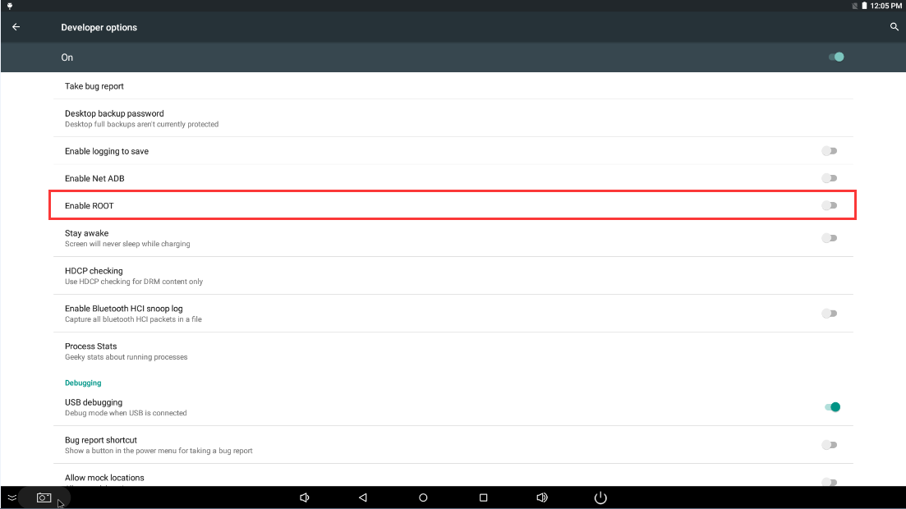
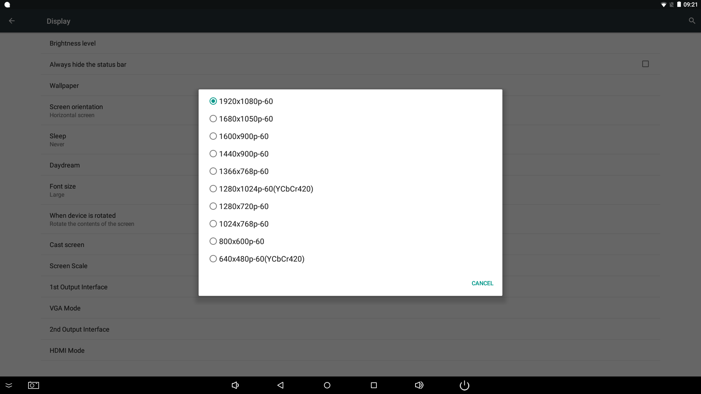
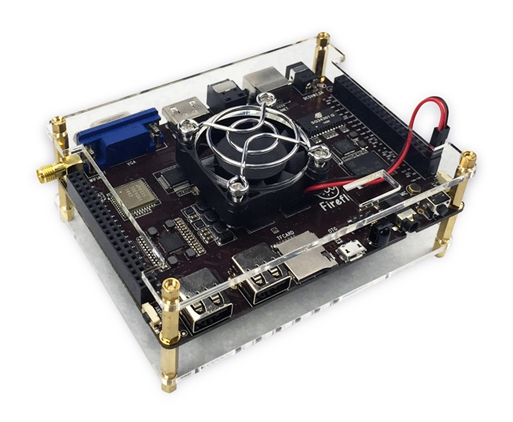

# FAQ

## 开机异常并循环重启


可能是电源电流不够，请使用电压为 5V，电流为 2.5A~3A 的电源。


## Ubuntu 用户名和密码

```bash
用户：root 密码：firefly
用户：firefly 密码：firefly
```

## Git链接地址

[https://bitbucket.org/T-Firefly/firefly-rk3288](https://bitbucket.org/T-Firefly/firefly-rk3288)

## MAC 地址和序列号烧写

Firefly-RK3288 的 MAC 地址可以让用户自己更改，请使用 SDK 下的统一动态库工具 `RKTools/UpgradeDllTool_Release_v1.3.tar.gz` 烧写 MAC 地址和序列号

## 打开 Root 权限

Android 系统有很多很强大的功能都需要用到 root 权限，开发者经常在使用的时候遇到权限的问题。

那如何在 Firefly 平台上开启系统的 root 权限功能呢？Firefly 已在系统添加启动 root 权限的功能，具体的步骤如下：

1. 在 Settgins apk 里面找到 About device 然后点击进去
2. 点击 Build number 7次后会提示(you are now a developer)
3. 然后返回上一级点击 Developer options 选项后，在选项中点击 Enable ROOT 就打开 root 权限功能




## 如何切换板载麦克风和耳麦

Firefly-RK3288 可以使用板子麦克风或耳麦来进行音频输入，而系统默认音频输入为板子麦克风，我们可以通过修改音频输入节点 mic_state 的值来切换是使用板子的麦克风或耳麦。方法如下:

```bash
shell@firefly:/ # echo 1 > sys/class/es8323/mic_state/mic_state  //使用板上 mic
shell@firefly:/ # echo 2 > sys/class/es8323/mic_state/mic_state  //使用耳机 mic
```

## 关于 VGA 的自动识别

Firefly-RK3288 的 VGA 能自动识别显示的分辨率。假如无法读取显示器的 EDID (Extended Display Identification Data，扩展显示器标识数据)，VGA 会默认设置为 1080P 的分辨率。可以进入【设置】->【显示】->【VGA输出模式】选择切换方式对 VGA 分辨率进行手动调整。<font color=#ff0000 size=2>Firefly-RK3288-Reload 不支持 VGA 输出，但是支持双 HDMI 输出。</font>



## Firefly-RK3288-Reload双HDMI输出及HDMI输入  

Firefly-RK3288-Reload底板上有三个HDMI接口，其中两个为HDMI输出接口，一个为HDMI输入接口，其中HDMI1为RGB信号转HDMI，为主显示设备。HDMI2为RK3288芯片内置HDMI，为从显示设备。HDMI1默认输出分辨率为1080P，不会读取外设的EDID信息。HDMI2可以读取外设的EDID信息，自动选择匹配的输出分辨率。在Android系统下，各HDMI输出分辨率可以在系统设置中手动调整。

## 蓝牙语音通话及VoIP  

Firefly-RK3288 和 Firefly-RK3288-Reload 硬件不支持蓝牙语音通话或者 VoIP。

## 关于散热风扇

Firefly-RK3288 官网中的散热风扇工作电压为 5V，在开发板中有对应的接口，标记为：FAN+ FAN-，风扇的黑色电源线对应 FAN-，红色电源线对应 FAN+，本端口直接与开发板的电源模块连接，不能通过软件控制，具体连接图如下：




