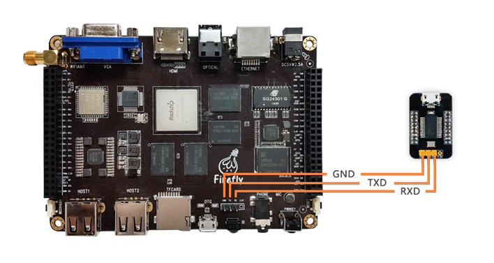

# 串口模块

## [USB转TTL串口模块](https://store.t-firefly.com/goods.php?id=24)

### 产品参数

* 品牌：Firefly
* 尺寸：29mm*19mm

### 技术资料

驱动下载：[https://www.prolific.com.tw/en/portfolio-item/pl2303gl/](https://www.prolific.com.tw/en/portfolio-item/pl2303gl/)

### 实物图

### 连接方法

