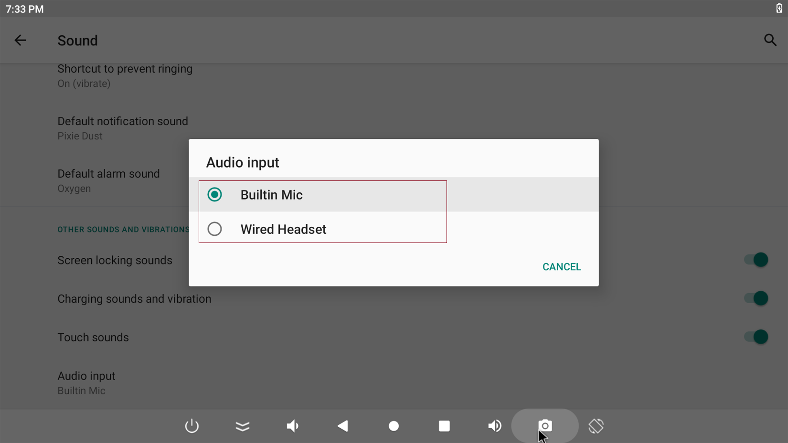

## 切换录音输入源
Firefly-RK3399 默认录音输入源采用的是板载麦克风 `Builtin Mic`,可手动切换为phone录音`Wired Headset`:

1. 在 `Settgins apk` 里面找到 `Sound` 然后点击进去;
2. 点击 `Advanced` 后会出现 `Audio input`选项;
3. 选择`Wired Headset`

## 如何强行进入 MaskRom 模式

如果板子进入不了 Loader 模式，此时可以尝试强行进入 MaskRom 模式。操作方法见[《MaskRom模式》](04-maskrom_mode.md)。

## PCIE
* 开发板上的两个 PCIE 的区别?
  * 正面是 PCIe 1.0, M.2，背面的是 USB 转的 Mini PCIe。SSD、SATA 接 M.2，LTE/3G 接 Mini PCIe。

* M2 接口类型：
  * B-key

* 如何接 SSD：
  * 市面上的 SSD 基本是 M-key，如果要接 SSD，需要到[商城](https://store.t-firefly.com/goods.php?id=51)购买 B-key 转 M-key 的转接板

* SSD 支持 NVME 吗：
  * 支持，测试过英特尔（Intel）600P 系列，三星 EVO 系列

* 如何接 SATA 硬盘：
  * 如果要接 SATA，需要到[商城](https://store.t-firefly.com/goods.php?id=52)购买 PCIE 转 SATA 的转接板

## TYPE-C

* 怎样接显示器？
  * 需要转接头，目前我们这边测试过有转 DP 和 HDMI 的转接头：
  * Type-C 转 DP：[购买参考链接](https://detail.tmall.com/item.htm?id=531442057703&areaId=442000&user_id=1127317597&cat_id=2&is%20_b=1&rn=4eff2fc1aac30e8c67ff74ef5fe76b56)
  * Type-C 转 HDMI: [购买参考链接](https://item.taobao.com/item.htm?spm=a1z0d.6639537.1997196601.291.150IpW&id=540645282055&qq-pf-to=pcqq.temporaryc2c)
  * 类似的转 VGA 和 DVI 也可以，我们没有买过类似的转接头，客户可以自行验证

* 显示的最大分辨率
  * 默认最大为2K，如果需要4K，需要修改软件

* 显示 Linux 下可以吗
  * 目前只有 Android 支持，Linux 驱动原厂还在调试中

* 可以跟板载的 HDMI 同时显示吗
  * 可以同时显示

* 支持 OTG（UFP/DFP）吗
  * 支持，需要购买 3.0 的转接线,购买[参考链接](https://detail.tmall.com/item.htm?spm=a220o.1000855.w5003-14913680624.1.W2eSKK&id=528676463455&scene=taobao_shop&skuId=3173247769269)

## BT (蓝牙)

* 开发板支持蓝牙耳机吗？
  * 支持

## LTE/4G

* 目前支持的型号：
  * EC20

## Camera

* 支持双摄像头吗？
  * 支持，目前我们调试验证过的有 OV13850

* 支持 USB 摄像头吗？
  * 支持

* 最多可以支持多少个 USB 摄像头
  * 理论上板子上的 USB 口都支持接摄像头，但考虑到一个 hub 上只能挂一个 YUV 和编码的限制，两个是没有问题

* 支持两个 MIPI 摄像头，一个 DVP 摄像头同时用吗？
  * 不支持，由于软件架构问题，目前只支持最多两个同时用

## 风扇

* 支持速度控制吗？
  * 目前的硬件不支持，只支持检测运行状态

## RTC

* 开发板上电后时间不同步
  * 检查一下 RTC 电池是否正确接入。

* 支持定时开机吗
  * 支持，详细请看[wiki](http://wiki.t-firefly.com/zh_CN/Firefly-RK3399/driver_rtc.html)

