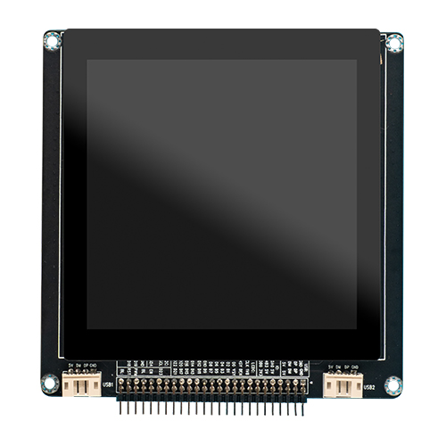
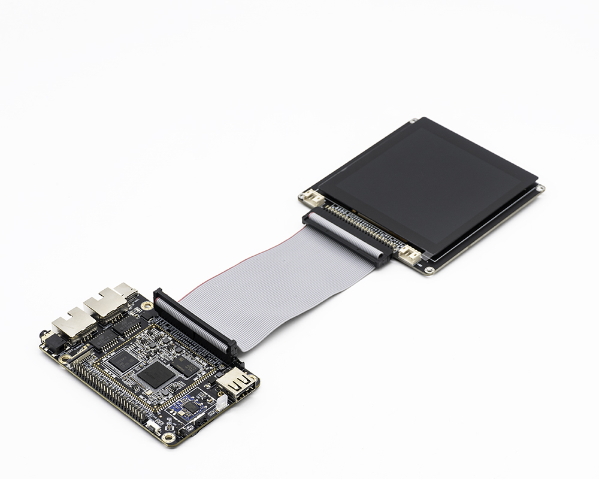
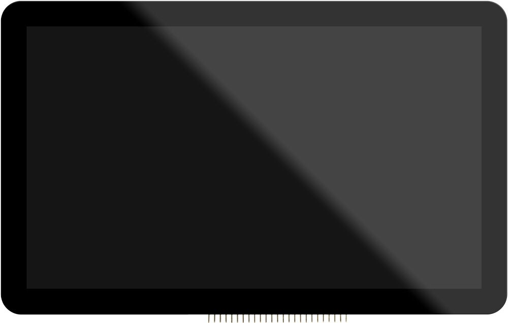
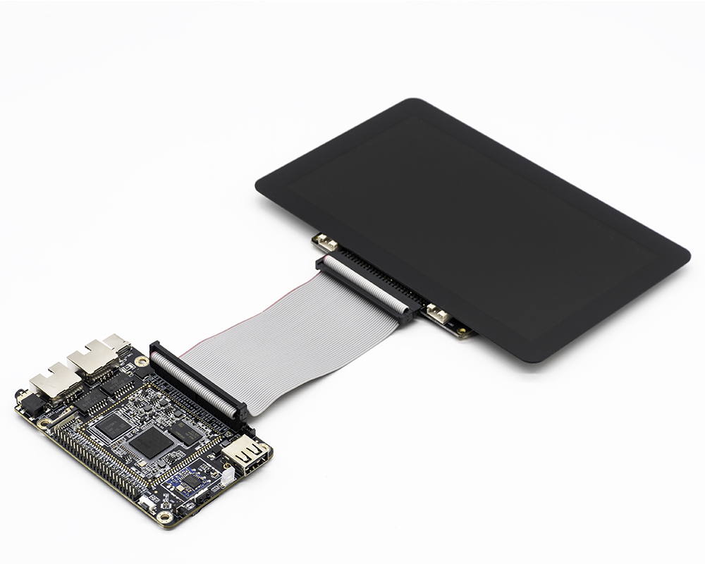

# 屏幕模组

## 4.0寸RGB液晶屏模组

###  产品参数

* 型号：HC480480TFT40-499-CT
* 尺寸：4.0寸
* 分辨率：480x480
* 显示接口：RGB
* 面板材料：IPS面板
* 触摸屏：多点电容触摸

<!-- ### 参考固件 -->

### 编译

用官网SDK编译支持的4.0寸屏的固件时，注意如下：
 

* ROC-RK3308B-CC-PLUS的板级配置文件：`rk3308b-roc-cc-plus-amic-rgb_4.0inch_emmc.dts`
* 屏幕模组的配置文件：`rk3308b-rgb_4.0inch_ST7701S.dtsi`

<!-- ### 技术资料 -->

### 实物图

### 连接方法

注意：屏板的引脚丝印要与开发板的引脚丝印要一一对应

  

## 7.0寸RGB液晶屏模组

###  产品参数

* 型号：CZNB070762T
* 尺寸：7.0寸
* 分辨率：1024x600
* 显示接口：RGB
* 面板材料：IPS面板
* 触摸屏：多点电容触摸

<!-- ### 参考固件 -->

### 编译

用官网SDK编译支持的7.0寸屏的固件时，注意如下：
 

* ROC-RK3308B-CC-PLUS的板级配置文件：`rk3308b-roc-cc-plus-amic-rgb_7.0inch_emmc.dts`
* 屏幕模组的配置文件：`rk3308b-rgb_7.0inch_CZNB070762T.dtsi`

<!-- ### 技术资料 -->

### 实物图

### 连接方法

注意：屏板的引脚丝印要与开发板的引脚丝印要一一对应

