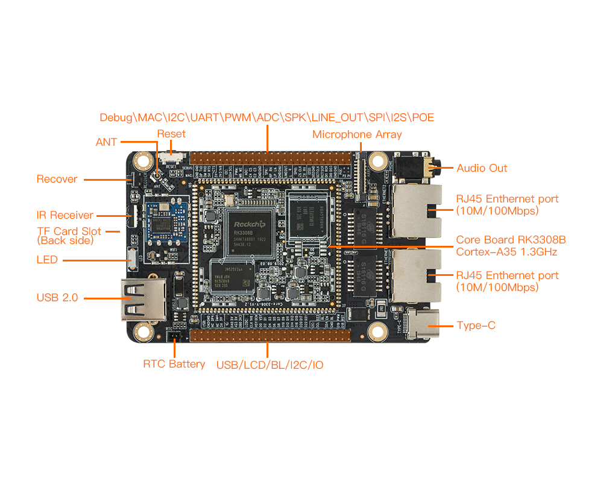
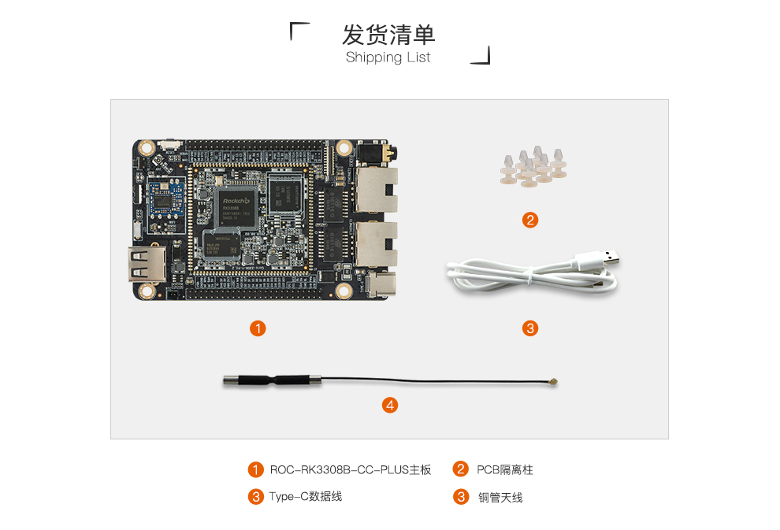

# 介绍
## 产品规格

## 发货清单参考
  

具体信息以官网商城为准。

## 自选配件

以上的发货清单为 ROC-RK3308B-CC-PLUS 的标准套装，如果要使用 ROC-RK3308B-CC-PLUS 的语音开发功能以及相关的固件，需要另外购买我们的智能语音开发套件。

**ROC-RK3308B-CC-PLUS 的标准套装，包含以下配件：**

* ROC-RK3308B-CC-PLUS 开发板一块
* Type-A 转 Type-C 线一根
* WiFi天线一根  

具体信息以官网商城为准。

**另外，在使用过程中，你可能需要做以下准备：**

**电源：**

* ROC-RK3308B-CC-PLUS由 USB Type-C 接口供电，可接电源适配器，也可接到PC主机上供电。要求工作电压 5V ,工作电流 500mA 以上。

**网络：**

ROC-RK3308B-CC-PLUS支持 **双以太网** 以及 2.4G WiFi 的使用，使用需准备：

* 100M 以太网线缆，及有线路由器
* WiFi 路由器

**升级固件**

* 通过 USB Type-C 连接主机，烧写固件

**调试**

* 串口转 USB 适配器，支持波特率：1500000 

调试串口默认波特率为1500000，一定要注意自己所使用的 USB转串口工具 是否支持。    

## 其他
* 调试串口：使用的是UART4    
* 蓝牙：不支持
* 以太网：存在eth0和eth1网卡 
* 耳机座子：硬件版本V1.0没有接入HP_MIC    

开发板在使用过程中遇到的问题，可以到开源社区[发贴](http://dev.t-firefly.com/forum-499-1.html)。
 