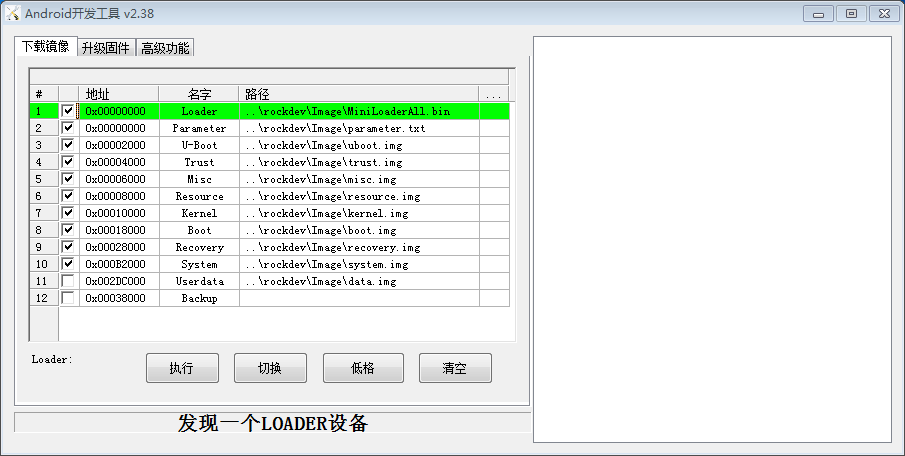

# 升级固件

## 前言

本文介绍了如何将主机上的固件文件，通过 Type-C 数据线，烧录到开发板的闪存中。   
升级时，需要根据主机操作系统和固件类型来选择合适的升级方式。

## 准备工作
### 设备和环境
* ROC-RK3328-CC 开发板
* 固件
* 主机
* 良好的 Type-C 数据线

注：固件文件一般有两种:

* 单个统一固件 update.img, 将启动加载器、参数和所有分区镜像都打包到一起，用于固件发布。
* 多个分区镜像, 例如 Linux 系统就有 uboot.img、boot.img、rootfs.img; Android 系统就有 kernel.img, system.img 等，均在开发阶段生成。

注：主机操作系统支持：
> * Windows XP （32/64位）
> * Windows 7 (32/64位)
> * Windows 8 (32/64位)
> * Linux (32/64位)

### 安装 RK USB 驱动

下载 [Release_DriverAssistant.zip](http://download.t-firefly.com/product/RK3328/Tools/DriverAssitant/DriverAssitant_v4.5.rar) ，解压，然后运行里面的 DriverInstall.exe 。   
为了所有设备都使用更新的驱动，请先选择"驱动卸载"，然后再选择"驱动安装"。   


### 设备模式
有两种方法可以使设备进入升级模式

* 一种方法是设备先断开电源适配器和 Type-C 数据线的连接：
   * USB数据线一端连接主机，Type-C 一端连接开发板 Type-C 母口。
   * 按住设备上的 RECOVERY （恢复）键并保持。
   * 接上电源
   * 大约两秒钟后，松开 RECOVERY 键。

* 另一种方法，无需断开电源适配器和 Type-C 数据线的连接：
   * USB数据线一端连接主机，Type-C一端连接开发板 Type-C 母口。
   * 按住设备上的 RECOVERY （恢复）键并保持。
   * 短按一下 RESET（复位）键。
   * 大约两秒钟后，松开 RECOVERY 键

主机应该会提示发现新硬件并配置驱动。打开设备管理器，会见到新设备 "Rockusb Device" 出现，如下图。如果没有，则需要返回上一步重新安装驱动。   


### 固件下载

* [固件下载页面](https://community.t-firefly.com/doc/download/65)

### 烧录工具下载

Windows下：
1. Linux 或者 Android8.1 系统   [AndroidTool_v2.58](http://download.t-firefly.com/product/RK3328/Tools/AndroidTool/AndroidTool_Release_V2.58.zip)
2. Android7.1 系统  [AndroidTool_v2.38](http://download.t-firefly.com/product/RK3328/Tools/AndroidTool/AndroidTool_Release_v2.38.rar)
3. Android10 系统  [AndroidTool_v2.71](http://download.t-firefly.com/product/RK3328/Tools/AndroidTool/AndroidTool_Release_v2.71.zip)

Linux下：  
1. Linux 系统或者 Android8.1 系统   [Upgrade_Tool_v1.34](http://download.t-firefly.com/product/RK3328/Tools/Linux_Upgrade_Tool/Linux_Upgrade_Tool_1.34.zip)
2. Android7.1 系统  [Upgrade_Tool_v1.24](http://download.t-firefly.com/product/RK3328/Tools/Linux_Upgrade_Tool/Linux_Upgrade_Tool_v1.24.zip)
2. Android10 系统  [Upgrade_Tool_v1.49](http://download.t-firefly.com/product/RK3328/Tools/Linux_Upgrade_Tool/Linux_Upgrade_Tool_v1.49.zip)

<a id="androidtool"></a>

## Windows 主机升级固件
下载 AndroidTool 工具后，解压，运行里面的 AndroidTool.exe（注意，如果是 Windows 7/8,需要按鼠标右键，选择以管理员身份运行）。

### 烧写统一固件 update.img

烧写统一固件 update.img 的步骤如下:

1. 切换至"升级固件"页。
2. 按"固件"按钮，打开要升级的固件文件。升级工具会显示详细的固件信息。
3. 按"升级"按钮开始升级。


<font color=#ff0000 >如果升级失败，可能是因为你烧写的固件 laoder 版本与原来的机器的不一致，可以尝试先按"擦除Flash"按钮来擦除 Flash，然后再升级。</font>

**注意："擦除Flash"一定要根据[《烧写须知》]进行擦除** 

### 烧写分区映像

每个固件的分区可能不相同,请注意以下两点:
1. 使用`Androidtool_2.38`烧写`Android7.1`固件时使用默认配置即可;
2. 使用`Androidtool_2.58`烧写`Linux`分区固件使用默认配置即可,烧写`Android8.1`分区固件请先执行以下操作:
3. 使用`Androidtool_2.71`烧写`Android10`固件时使用默认配置即可;

<font color=#ff0000 >切换至”下载镜像页面”; 右键点击表格，选择”导入配置”; 选择rk3328-Android81.cfg</font>

烧写分区映像的步骤如下：

1. 切换至"下载镜像"页。
2. 勾选需要烧录的分区，可以多选。
3. 确保映像文件的路径正确，需要的话，点路径右边的空白表格单元格来重新选择。
4. 点击"执行"按钮开始升级，升级结束后设备会自动重启。



<a id="upgrade-tool"></a>

## Linux 主机升级固件

Linux 下无须安装设备驱动，参照 Windows 章节连接设备则可。

下载Linux工具 Upgrade_Tool 后, 按以下方法安装到系统中，方便调用：
```
unzip Linux_Upgrade_Tool_xxxx.zip
cd Linux_UpgradeTool_xxxx
sudo mv upgrade_tool /usr/local/bin
sudo chown root:root /usr/local/bin/upgrade_tool
sudo chmod a+x /usr/local/bin/upgrade_tool
```

### 烧写统一固件 update.img：   
```
sudo upgrade_tool uf update.img
```
<font color=#ff0000 >如果升级失败，可以尝试先擦除后再升级。一定要根据[烧写须知]的表格进行擦除烧写。</font>
```
# 擦除flash 使用ef参数需要指定loader文件或者对应的update.img
sudo upgrade_tool ef update.img 
# 重新烧写
sudo upgrade_tool uf update.img 
```
**注意："擦除Flash"一定要根据[《烧写须知》]进行擦除**

### 烧写分区镜像：   
Android7.1 使用以下方式:
```
sudo upgrade_tool di -b boot.img
sudo upgrade_tool di -k kernel.img
sudo upgrade_tool di -s system.img
sudo upgrade_tool di -r recovery.img
sudo upgrade_tool di -m misc.img
sudo upgrade_tool di resource resource.img
sudo upgrade_tool di -p paramater   #烧写 parameter
sudo upgrade_tool ul bootloader.bin # 烧写 bootloader
```

Android8.1 使用以下方式:
```
sudo upgrade_tool ul bootloader.bin # 烧写 bootloader
sudo upgrade_tool di -p paramater   # 烧写 parameter
sudo upgrade_tool di -uboot uboot.img
sudo upgrade_tool di -trust trust.img
sudo upgrade_tool di -m misc.img
sudo upgrade_tool di -baseparameter baseparameter.img
sudo upgrade_tool di -b boot.img
sudo upgrade_tool di -k kernel.img
sudo upgrade_tool di -resource resource.img
sudo upgrade_tool di -r recovery.img
sudo upgrade_tool di -s system.img
sudo upgrade_tool di -vendor vendor.img
sudo upgrade_tool di -oem oem.img
```

Android10 使用以下方式:
```
sudo upgrade_tool di -b boot.img
sudo upgrade_tool di -dtbo dtbo.img  
sudo upgrade_tool di -misc misc.img
sudo upgrade_tool di -parameter parameter.txt
sudo upgrade_tool di -r recovery.img
sudo upgrade_tool di -super super.img
sudo upgrade_tool di -trust trust.img
sudo upgrade_tool di -uboot uboot.img
sudo upgrade_tool di -vbmeta vbmeta.img

```

Ubuntu(GPT) 使用以下方式
```
sudo upgrade_tool ul $LOADER
sudo upgrade_tool di -p $PARAMETER
sudo upgrade_tool di -uboot $UBOOT
sudo upgrade_tool di -trust $TRUST
sudo upgrade_tool di -b $BOOT
sudo upgrade_tool di -r $RECOVERY
sudo upgrade_tool di -m $MISC
sudo upgrade_tool di -oem $OEM
sudo upgrade_tool di -userdata $USERDATA
sudo upgrade_tool di -rootfs $ROOTFS
```

如果因 flash 问题导致升级时出错，可以尝试低级格式化、擦除 nand flash：   
```
sudo upgrade_tool lf update.img	# 低级格式化
sudo upgrade_tool ef update.img	# 擦除
```
## 常见问题

### 如何强行进入 MaskRom 模式

如果板子进入不了 Loader 模式，此时可以尝试强行进入 MaskRom 模式。操作方法见[《MaskRom》]。

[《上手指南》]: getting_started.md
[《常见问题解答》]: faqs.md
[《串口调试》]: debug.md
[《编译 Linux 根文件系统》]: linux_build_ubuntu_rootfs.md
[联系方式]: resource.md#社区
[原始固件]: getting_started.md#raw-firmware-format
[RK 固件]: getting_started.md#rk-firmware-format
[分区映像]: getting_started.md#partition-image
[SDCard Installer]: flash_sd.md#sdcard-installer
[Etcher]: flash_sd.md#etcher
[dd]: flash_sd.md#dd
[SD Firmware Tool]: flash_sd.md#sd-firmware-tool
[AndroidTool]: flash_emmc.md#androidtool
[upgrade_tool]: flash_emmc.md#upgrade-tool
[rkdeveloptool]: flash_emmc.md#rkdeveloptool
[Rockusb 模式]: flash_emmc.md#rockusb-mode
[Maskrom 模式]: flash_emmc.md#maskrom-mode
[Rockusb 驱动]: flash_emmc.md#rockusb-driver
[ROC-RK3328-CC]: http://www.t-firefly.com/product/rocrk3328cc.html "ROC-RK3328-CC 官网"
[下载页面]: https://community.t-firefly.com/doc/download/34
[论坛]: http://bbs.t-firefly.com
[脸书]: https://www.facebook.com/TeeFirefly
[Google+]: https://plus.google.com/u/0/communities/115232561394327947761
[油管]: https://www.youtube.com/channel/UCk7odZvUrTG0on8HXnBT7gA
[推特]: https://twitter.com/TeeFirefly
[在线商城]: http://store.t-firefly.com
[USB 转串口适配器]: https://store.t-firefly.com/goods.php?id=24
[5V2A 电源适配器]: https://store.t-firefly.com/goods.php?id=69
[eMMC 闪存]: https://store.t-firefly.com/goods.php?id=71
[《存储映射》]: http://opensource.rock-chips.com/wiki_Partitions#Default_storage_map