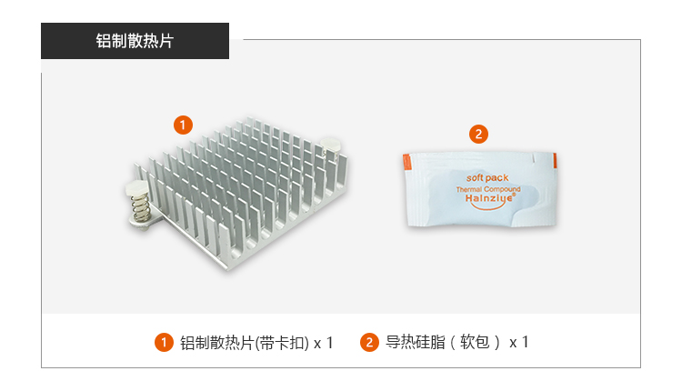

# 散热套件

## [铝制散热片](https://store.t-firefly.com/goods.php?id=54)

### 产品参数

* 适配：ROC-RK3399-PC Pro
* 尺寸：尺寸：43mm (L)* 39.5mm(W)*11mm(H)

### 实物图

### 安装方式

## [一体散热风扇](https://store.t-firefly.com/goods.php?id=46)

### 产品参数

* 型号：TFAN_55S_B
* 适配：ROC-RK3399-PC Pro
* 尺寸：5.5±0.3mm * 55.5±0.3mm
* 电压：12V (10.8-13.2V)
* 最大风量：5.8CFM

### 实物图

### 安装方式

