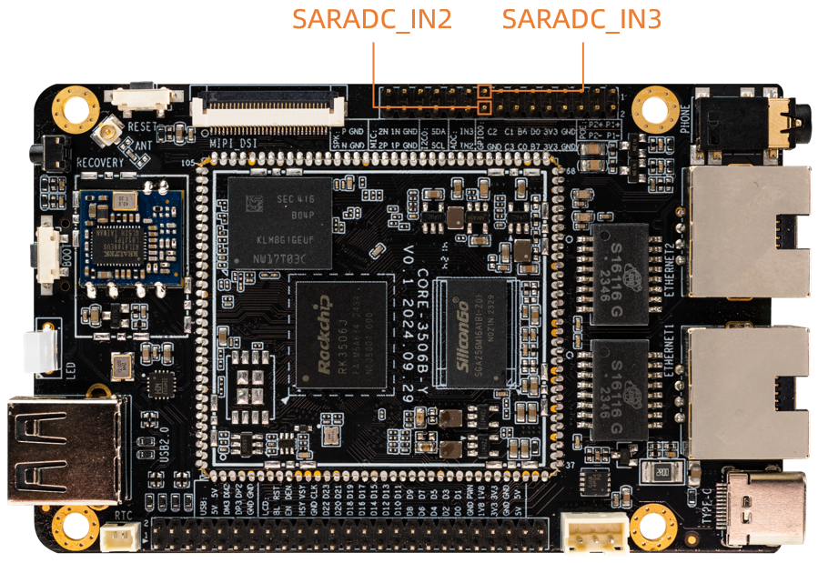

# ADC 使用

## 简介

ROC-RK3506B-CC 开发板上的 AD 接口有两种，分别为：温度传感器 (Temperature Sensor)、逐次逼近ADC (Successive Approximation Register)。其中：

*    TS-ADC(Temperature Sensor)：支持一通道。
*    SAR-ADC(Successive Approximation Register)：支持四个单端输入通道，10位的SAR-ADC，最大转换速率为1MS/s 。

内核采用工业 I/O 子系统来控制 ADC，该子系统主要为 AD 转换或者 DA 转换的传感器设计。 下面以 SAR-ADC 为例子，介绍 ADC 的基本配置方法。


## 硬件连接

* 排针上引出的 ADC 接口如下




## DTS配置

### 配置DTS节点

ROC-RK3506B-CC SAR-ADC 的 DTS 节点在 `kernel/arch/arm/boot/dts/rk3502.dtsi` 文件中定义，如下所示：

```
saradc: adc@ff4e8000 {
	compatible = "rockchip,rk3506-saradc", "rockchip,rk3562-saradc";
	reg = <0xff4e8000 0x8000>;
	interrupts = <GIC_SPI 57 IRQ_TYPE_LEVEL_HIGH>;
	#io-channel-cells = <1>;
	clocks = <&cru CLK_SARADC>, <&cru PCLK_SARADC>;
	clock-names = "saradc", "apb_pclk";
	resets = <&cru SRST_P_SARADC>;
	reset-names = "saradc-apb";
	status = "disabled";
};
```

## 驱动说明

### 获取 AD 通道

```
struct iio_channel *chan;     #定义 IIO 通道结构体
chan = iio_channel_get(&pdev->dev, NULL);    #获取 IIO 通道结构体
```

**注意：** `iio_channel_get` 通过 probe 函数传进来的参数 pdev 获取 IIO 通道结构体，probe 函数如下：

```
static int XXX_probe(struct platform_device *pdev);
```

### 读取 AD 采集到的原始数据

```
int val,ret;
ret = iio_read_channel_raw(chan, &val);
```

调用 iio_read_channel_raw 函数读取 AD 采集的原始数据并存入 val 中。

### 计算采集到的电压

使用标准电压将 AD 转换的值转换为用户所需要的电压值。其计算公式如下：

```
Vref / (2^n-1) = Vresult / raw
```

注意：

*    Vref 为标准电压
*    n 为 AD 转换的位数
*    Vresult 为用户所需要的采集电压
*    raw 为 AD 采集的原始数据

例如，标准电压为 1.8V，AD 采集位数为 10 位，AD 采集到的原始数据为 445，则：

```
Vresult = (1800mv * 445) / 1023 ;
```

## 接口说明

```
struct iio_channel *iio_channel_get(struct device *dev, const char *consumer_channel);
```

*    功能：获取 iio 通道描述
*    参数：
     * dev: 使用该通道的设备描述指针
     * consumer_channel: 该设备所使用的 IIO 通道描述指针

```
void iio_channel_release(struct iio_channel *chan);
```

*    功能：释放 iio_channel_get 函数获取到的通道

*    参数：
     * chan：要被释放的通道描述指针

```
int iio_read_channel_raw(struct iio_channel *chan, int *val);
```

*    功能：读取 chan 通道 AD 采集的原始数据。

*    参数：
     * chan：要读取的采集通道指针
     * val：存放读取结果的指针

## 调试方法

### 获取所有 ADC 值

有个便捷的方法可以查询到每个 SARADC 的值：

```
cat /sys/bus/iio/devices/iio\:device0/in_voltage*_raw
```
## FAQs

### 为何按上面的步骤申请 SARADC，会出现申请报错的情况？

驱动需要获取ADC通道来使用时，需要对驱动的加载时间进行控制，必须要在saradc初始化之后。saradc是使用module_platform_driver()进行平台设备驱动注册，最终调用的是module_init()。所以用户的驱动加载函数只需使用比module_init()优先级低的，例如：late_initcall()，就能保证驱动的加载的时间比saradc初始化时间晚，可避免出错。
