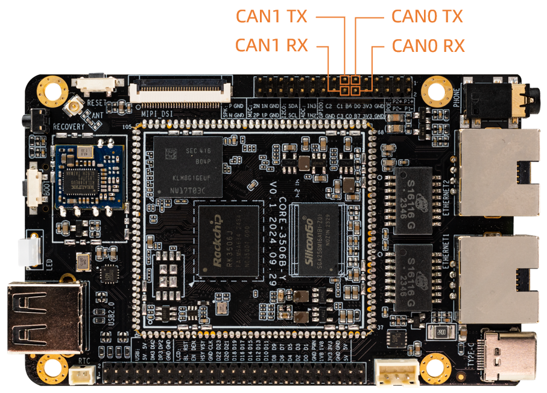

## CAN 使用
### CAN 简介
CAN(Controller Area Network)总线，即控制器局域网总线，是一种有效支持分布式控制或实时控制的串行通信网络。CAN总线是一种在汽车上广泛采用的总线协议，被设计作为汽车环境中的微控制器通讯。
如果想了解更多的内容可以参考[CAN应用报告](https://www.ti.com/lit/an/sloa101b/sloa101b.pdf)
### 硬件连接


**注意：排针上的 CAN 只引出了 CAN TX 和 CAN RX 接口，板子上没有内置 CAN 收发器 IC 。所以没有办法直接测试 CAN 接口，需要接入 CAN 收发器模块才能进行 CAN 收发测试。并且默认 CAN 配置是关闭的。需要使用和测试请在对应 dts 文件打开 CAN0 和 CAN1 配置。**
<font color=red>
GPIO0_B6 已经上拉到 3.3V，不能用于 can0_tx 。要使用 can0_tx，请使用其他的 RM_IO。
</font>
<br>

* 打开 CAN0 和 CAN1配置
```dts
#define CAN0 1
#define CAN1 1
```

利用 RM_IO 特性，灵活设置了 CAN TX 和 CAN RX 的 GPIO 为以下管脚：

* CAN0

GPIO0_B6 --> can0_tx ; GPIO0_C0 --> can0_rx

* CAN1

GPIO0_C1 --> can1_tx ; GPIO0_C3 --> can1_rx




### DTS 节点配置
* 公共配置 `kernel/arch/arm/boot/dts/rk3506.dtsi`
```
can0: can@ff320000 {
	compatible = "rockchip,rk3506-canfd", "rockchip,rk3576-canfd";
	reg = <0xff320000 0x1000>;
	interrupts = <GIC_SPI 45 IRQ_TYPE_LEVEL_HIGH>;
	clocks = <&cru CLK_CAN0>, <&cru HCLK_CAN0>;
	clock-names = "baudclk", "apb_pclk";
	resets = <&cru SRST_CAN0>, <&cru SRST_H_CAN0>;
	reset-names = "can", "can-apb";
	assigned-clocks = <&cru CLK_CAN0>;
	assigned-clock-rates = <300000000>;
	status = "disabled";
};

can1: can@ff330000 {
	compatible = "rockchip,rk3506-canfd", "rockchip,rk3576-canfd";
	reg = <0xff330000 0x1000>;
	interrupts = <GIC_SPI 46 IRQ_TYPE_LEVEL_HIGH>;
	clocks = <&cru CLK_CAN1>, <&cru HCLK_CAN1>;
	clock-names = "baudclk", "apb_pclk";
	resets = <&cru SRST_CAN1>, <&cru SRST_H_CAN1>;
	reset-names = "can", "can-apb";
	assigned-clocks = <&cru CLK_CAN1>;
	assigned-clock-rates = <300000000>;
	status = "disabled";
};
```
* 板级配置 `kernel/arch/arm/boot/dts/rk3506b-firefly-roc-rk3506b-cc.dtsi`
```
&can0 {
    status = "okay";
    pinctrl-names = "default";
    pinctrl-0 = <&rm_io14_can0_tx &rm_io16_can0_rx>; //GPIO0_B6 --> can0_tx ; GPIO0_C0 --> can0_rx
};

&can1 {
    status = "okay";
    pinctrl-names = "default";
    pinctrl-0 = <&rm_io17_can1_tx &rm_io19_can1_rx>; //GPIO0_C1 --> can1_tx; GPIO0_C3 --> can1_rx
};
```

另外可设置时钟频率 `assigned-clock-rates`，如果 CAN 的比特率低于等于 3M 建议修改 CAN 时钟到 100M，信号更稳定。高于 3M 比特率的，时钟设置 200M 就可以。

### 通信测试

#### CAN 通信测试
使用 candump 和 cansend 工具进行收发报文测试即可，Ubuntu 系统可使用 apt update && apt install can-utils 安装。

工具包含在 SDK 中,也可以在 [官方](http://www.t-firefly.com/share/index/index/id/3cacb04c663f9fe97bf494ca55763dcd.html) 或者 [github](https://github.com/linux-can/can-utils) 下载。

```
#在收发端关闭can0设备
ip link set can0 down
#在收发端设置比特率为250Kbps                 
ip link set can0 type can bitrate 250000 dbitrate 1000000 fd on
#在收发端打开can0设备  	
ip link set can0 up
#在接收端执行candump,阻塞等待报文                        	
candump can0
#在发送端执行cansend，发送报文        	
cansend can0 123#1122334455667788  	
```

### 更多指令
```
1、 ip link set canX down 		//关闭can设备；
2、 ip link set canX up   		//开启can设备；
3、 ip -details link show canX 		//显示can设备详细信息；
4、 candump canX  			//接收can总线发来数据；
5、 ifconfig canX down 			//关闭can设备，以便配置;
6、 ip link set canX up type can bitrate 250000 //设置can波特率
7、 conconfig canX bitrate + 波特率；
8、 canconfig canX start 		//启动can设备；
9、 canconfig canX ctrlmode loopback on //回环测试；
10、canconfig canX restart 		// 重启can设备；
11、canconfig canX stop 		//停止can设备；
12、canecho canX 			//查看can设备总线状态；
13、cansend canX --identifier=ID+数据 	//发送数据；
14、candump canX --filter=ID：mask	//使用滤波器接收ID匹配的数据
```

### FAQS
总结调试过程中遇到的几个问题及解决方法：

#### 报文发送后很久才接收到，或者接收不到。

检查总线 CAN_H 和 CAN_L， 杜邦线是否松动或者接反。

#### CAN时钟频率配置

如果CAN的比特率低于等于3M建议修改CAN时钟到100M,信号更稳定。高于3M比特率的, 时钟设置200M就可以。

CAN时钟频率修改方法参考如下：
```diff
@@ -48,7 +48,7 @@ can0: can@ff320000 {
         resets = <&cru SRST_CAN0>, <&cru SRST_H_CAN0>;
         reset-names = "can", "can-apb";
         assigned-clocks = <&cru CLK_CAN0>;
-        assigned-clock-rates = <300000000>;
+        assigned-clock-rates = <200000000>;
         status = "disabled";
 };

@@ -61,7 +61,7 @@ can1: can@ff330000 {
         resets = <&cru SRST_CAN1>, <&cru SRST_H_CAN1>;
         reset-names = "can", "can-apb";
         assigned-clocks = <&cru CLK_CAN1>;
-        assigned-clock-rates = <300000000>;
+        assigned-clock-rates = <200000000>;
         status = "disabled";
 };
```

**注意**：    
* 在某些时钟频率下，CAN的bitrate无法获得准确的速率，大家可以自行调整`assigned-clock-rates`去解决。
* 查看是否得到所需的bitrare：

    ```shell
    ip -d link show can1
    ```

