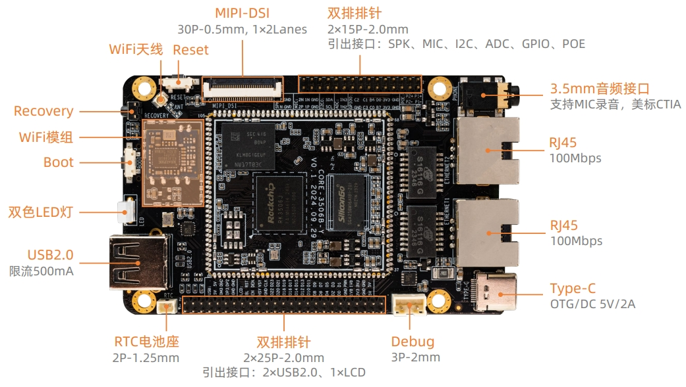
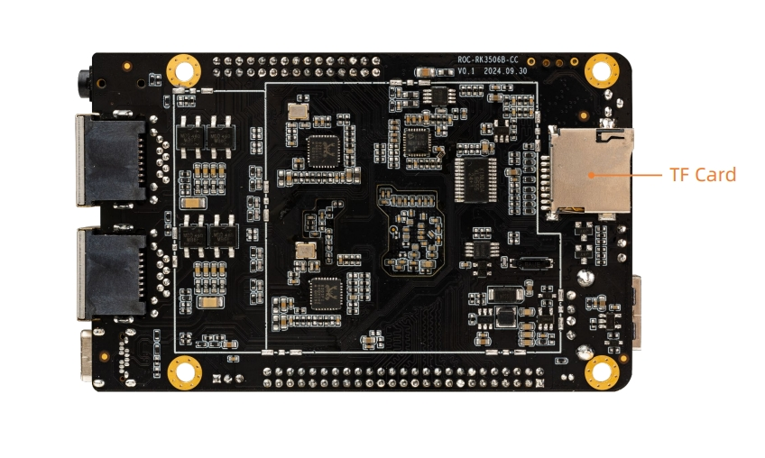

# 接口定义

## 整机接口定义

**ROC-RK3506J-CC V1.0** 使用的接口，主要包括：

* 1 x Recovery key
* 1 x Boot key
* 1 x Reset key
* 2 x LED
* 1 x RTC 电池座
* 1 x DEBUG 串口（UART0）
* 1 x USB2.0 OTG（Type-C）
* 1 x MIPI-DSI
* 1 x TF Card（与 EMMC 接口复用，默认不贴）
* 1 x USB2.0 （其中2个USB2.0由20Pin排针引出）
* 1 x WIFI（只支持 2.4G 频段，不支持 5G 频段）
* 2 x RJ45（支持 100Mbps）
* 1 × 3.5mm 耳机接口

具体如下图：

