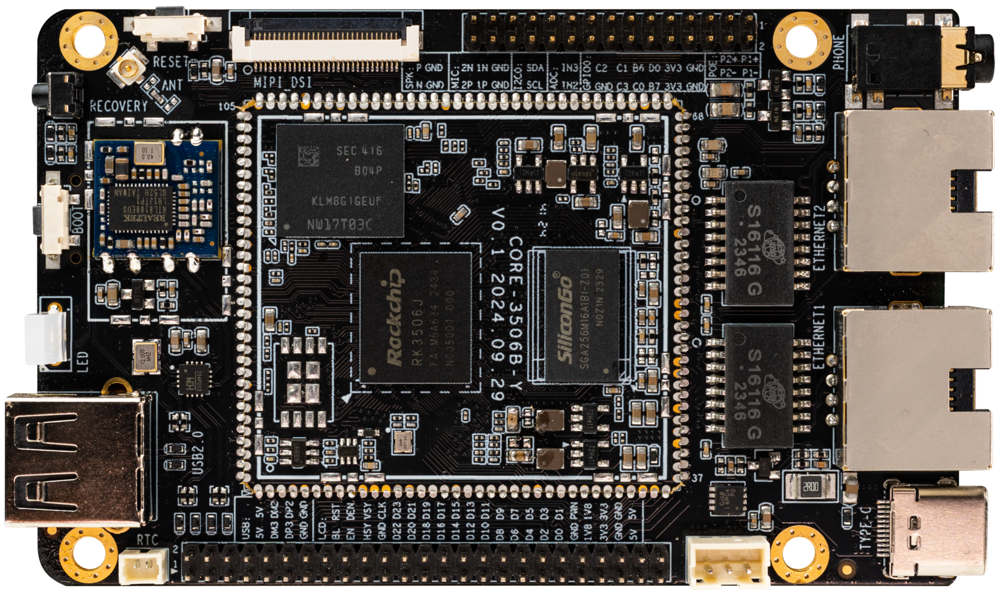

# 介绍
**ROC-RK3506J-CC** 搭载 Rockchip 全新芯片 RK3506J，22nm 先进制程工艺，集成了三核 ARM Cortex-A7 加单核 Cortex-M0，主频高达 1.5GHz。支持 AMP 多核异构架构，一颗芯片可支持 Linux、RTOS、Bare-metal 灵活组合搭配，如 2×Cortex-A7 Linux + 1×Cortex-A7 RTOS + Cortex-M0 HAL 或 3×Cortex-A7 RTOS + Cortex-M0 HAL 等组合，采用标准 RPMsg 核间通信机制。SDK 原生支持 LVGL 轻量级 UI 框架，并结合芯片内部 2D 硬件加速，让 LVGL 运行更加流畅，从硬件上电到引导程序加载及内核加载，最后到 UI 显示，全链路启动优化。

  
 