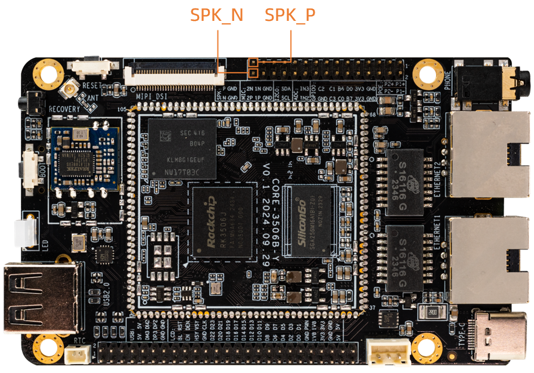

## Sound Card 使用

### EarPhone && Speak
EarPhone 和 Speak 均采用双声道接口

* Speak 的接口如下：


使用 aplay 命令播放 wav 格式音频
```
#path-to 表示存放音频的绝对路径
aplay /path-to/audio-name.wav
```
### Mic

* Mic 的接口如下：


* Mic 默认是关闭的，使用时需要将其打开，通过以下操作进行
```
#命令设置默认录制声卡通道 1 和通道 2 都打开
i2cset -f -y 0 0x11 0x73 0x3e
```
* Mic录制音频
```
arecord -l					#查看所有可用的MIC设备
arecord -Dhw:0,0 -f cd -d 10 /path-to/audio.wav	#选择声卡并录制音频
```