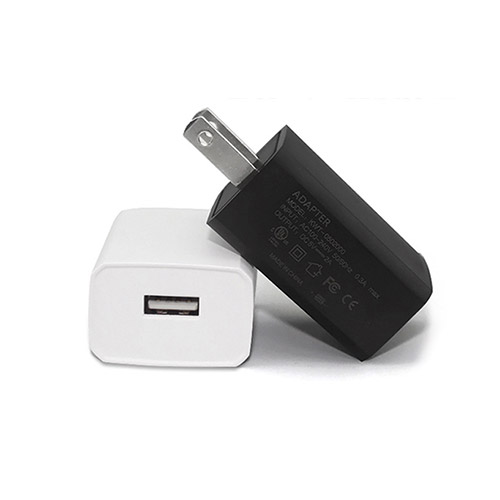

# [USB电源适配器](https://store.t-firefly.com//goods.php?id=69)
### 产品参数
* 产品：USB充电头（美规）
* 输入电压：110-240VAC
* 输出电压：5V DC
* 输出电流：2A
* 额定功率：10W
* DC接口  ：USB口

* 注意：ROC-RK3566-PC 正常工作需要的电源参数为5V/2A，电流低于2A可能会因电流过小而异常重启，为了保证开发板的正常工作，请使用电压为5V，电流大于2A的电源，推荐使用Firefly官网电源配件。
### 实物图

