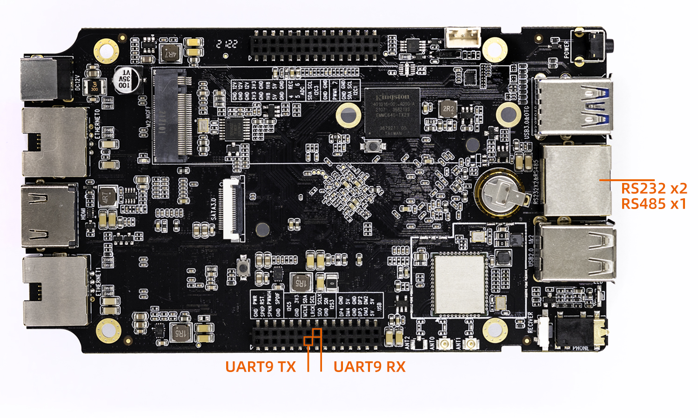

# UART 使用

## 简介

ROC-RK3568-PC支持UART、RS232、RS485接口，分别为双扩展接口上的UART9、集成在RJ45接口的两路RS232和一路RS485，其串口接口图如下:



**注意**:在此章节wiki说明中，会将两路RS232分别定义为`RS232_1`、`RS232_2`，以此定义来说明讲解UART的使用

## PIN脚定义

### UART9
UART9的TX、RX引脚存在复用的情况，实际`UART9 TX`和`UART9 RX` 分别对应着开发板上的丝印`I2S3 SDI`、`I2S3 SDO`，公版固件默认UART9是打开的，使用做其他功能需先关闭UART9，以下是复用详情：

| func0 | func1 | func2 | func3 | func4 | func5 |
| --- | --- | --- | --- | --- | --- |
| GPIO4_C5 | PWM12_M1 | SPI3_MISO_M1 | SATA1_ACT_LED | UART9_TX_M1 | I2S3_SDO_M1 |
| GPIO4_C6 | PWM13_M1 | SPI3_CS0_M1 | SATA0_ACT_LED | UART9_RX_M1 | I2S3_SDI_M1 |

### RS232和RS485

RS232_1、RS232_2和RS485分别从主控的UART2、UART3、UART4转换而来，其中由于UART2默认作为DEBUG串口，RS232_1无法直接使用，需要将[UART2配置为普通串口](#ru-he-jiang-uart2-pei-zhi-wei-pu-tong-chuan-kou)后才可使用。相关的硬件连接及定义可以参考[ROC-RK3568-PC原理图](https://www.t-firefly.com/doc/download/107.html#other_465)，以下是RJ45接口的部分PIN脚定义：

| RJ45引脚 |    定义    | RJ45引脚 |    定义    |
| :------: | :--------: | :------: | :--------: |
|    1     | RS232_2 TX |    5     |    GND     |
|    2     | RS232_2 RX |    6     | RS232_1 RX |
|    3     | RS232_1 TX |    7     |  RS485_A   |
|    4     |    GND     |    8     |  RS485_B   |

## DTS配置

 由于UART2默认为DEBUG口，其转换出来的RS232_1不能直接使用，只需在`kernel/arch/arm64/boot/dts/rockchip/rk3568-firefly-roc-pc.dtsi`配置:

* RS232_2
    * 对应节点`/dev/ttyS3`
    ```
    &uart3 {
	    status = "okay";
	    pinctrl-0 = <&uart3m1_xfer>;
    };
    ```

* RS485
    * 对应节点`/dev/ttyS4`
    ```
    &uart4 {
	    status = "okay";
	    pinctrl-0 = <&uart4m1_xfer>;
    };
    ```

* UART9
    * 对应节点`/dev/ttyS9`
    ```
    &uart9 {
	    status = "okay";
	    pinctrl-0 = <&uart9m1_xfer>;
    };
    ```

## 调试方法

用户可以根据不同的接口使用不同的主机的 USB 转串口适配器向开发板的串口收发数据，**例如 RS485 的调试步骤如下**：

(1) 连接硬件

将开发板RS485所在RJ45 第5(GND)、7(A)、8(B)脚分别与主机串口适配器（USB 转 485 转串口模块）的 GND、A、B 引脚相连。


(2) 打开主机的串口终端

在终端输入安装kermit命令`sudo apt install ckermit`，安装完成后打开kermit，设置波特率并连接：

```
$ sudo kermit
C-Kermit> set line /dev/ttyUSB0
C-Kermit> set speed 9600
C-Kermit> set flow-control none
C-Kermit> connect
```

* `/dev/ttyUSB0` 为 主机USB 转串口适配器的设备文件

(3) 开发板发送数据

开发板的RS485 设备文件为 /dev/ttyS4。在开发板设备上运行下列命令：

```
echo "firefly RS485 test..." > /dev/ttyS4
```

主机中的串口终端即可接收到字符串 "firefly RS485 test..."

(4) 开发板接收数据

首先在开发板设备上运行下列命令：

```
cat /dev/ttyS4
```

然后在主机的串口终端输入字符串 "Firefly RS485 test..."，设备端即可见到相同的字符串。

(5) 主机退出kermit串口连接

`ctrl+\`后按c，退回终端可输入exit

```
C-Kermit>exit
OK to exit? ok
```
## 如何将UART2配置为普通串口

公版固件中，UART2默认为DEBUG串口，下面以Android平台为例，将UART2修改为普通串口。

### kernel的修改

* 去掉`kernel/arch/arm64/configs/firefly_defconfig`中`CONFIG_SERIAL_8250_CONSOLE`的配置
```
diff --git a/kernel/arch/arm64/configs/firefly_defconfig b/kernel/arch/arm64/configs/firefly_defconfig
index 57ed787..8d6bc18 100644
--- a/kernel/arch/arm64/configs/firefly_defconfig
+++ b/kernel/arch/arm64/configs/firefly_defconfig
@@ -500,7 +500,7 @@ CONFIG_INPUT_RK805_PWRKEY=y
 # CONFIG_LEGACY_PTYS is not set
 CONFIG_SERIAL_8250=y
 # CONFIG_SERIAL_8250_DEPRECATED_OPTIONS is not set
-CONFIG_SERIAL_8250_CONSOLE=y
+#CONFIG_SERIAL_8250_CONSOLE=y
 # CONFIG_SERIAL_8250_PCI is not set
 CONFIG_SERIAL_8250_NR_UARTS=10
 CONFIG_SERIAL_8250_RUNTIME_UARTS=10
```

* 关闭 `kernel/arch/arm64/boot/dts/rockchip/rk3568-android.dtsi`中的`fiq-debugger`节点
```
diff --git a/kernel/arch/arm64/boot/dts/rockchip/rk3568-android.dtsi b/kernel/arch/arm64/boot/dts/rockchip/rk3568-android.dtsi
index 55a1716..0e297e6 100644
--- a/kernel/arch/arm64/boot/dts/rockchip/rk3568-android.dtsi
+++ b/kernel/arch/arm64/boot/dts/rockchip/rk3568-android.dtsi
@@ -26,7 +26,7 @@
                interrupts = <GIC_SPI 252 IRQ_TYPE_LEVEL_LOW>;
                pinctrl-names = "default";
                pinctrl-0 = <&uart2m0_xfer>;
-               status = "okay";
+               status = "disabled";
        };

        debug: debug@fd904000 {

```

* 打开UART2
```
diff --git a/kernel/arch/arm64/boot/dts/rockchip/rk3568-firefly-roc-pc.dtsi b/kernel/arch/arm64/boot/dts/rockchip/rk3568-firefly-roc-pc.dtsi
index f4af38a..fb9a3ff 100644
--- a/kernel/arch/arm64/boot/dts/rockchip/rk3568-firefly-roc-pc.dtsi
+++ b/kernel/arch/arm64/boot/dts/rockchip/rk3568-firefly-roc-pc.dtsi
@@ -137,6 +137,10 @@
        status = "okay";
 };

+&uart2 {
+       status = "okay";
+};
+
```
重新编译kernel并烧录后生效，生效后即会生成`/dev/ttyS2`节点。


