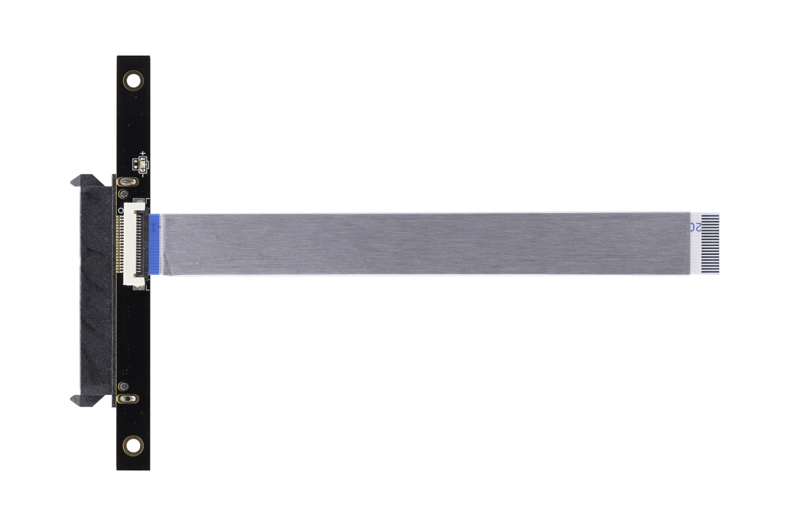
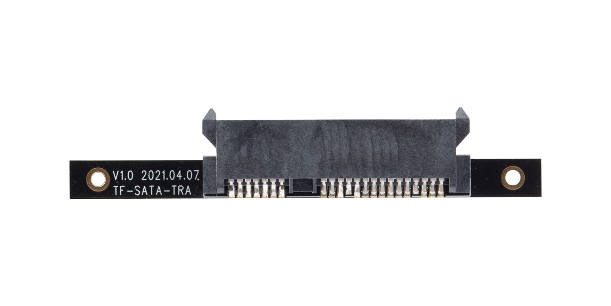
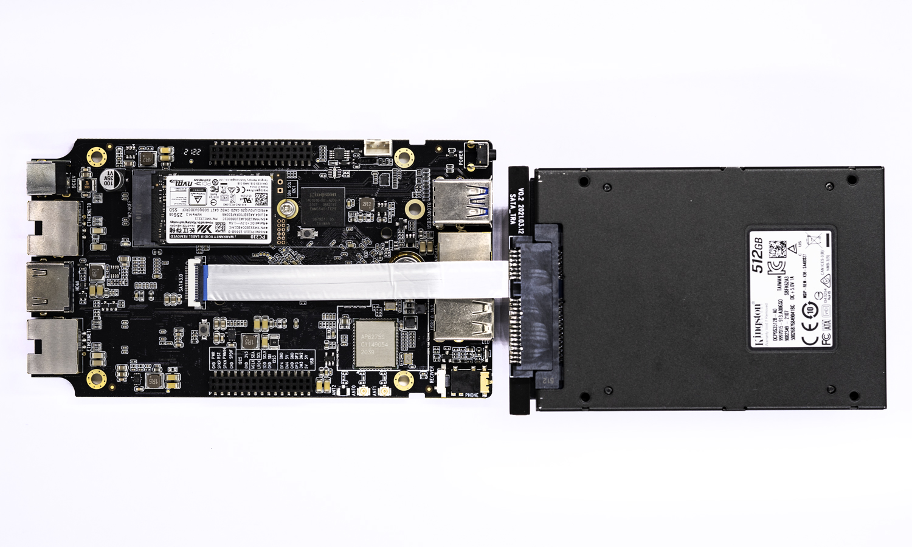

# [SATA转接板](https://store.t-firefly.com/goods.php?id=154)
ROC-RK3568-PC使用SATA硬盘时需要用到SATA转接板模块，SATA转接板模块适配Firefly具有FPC SATA接口的所有系列主板，可接2.5”或3.5” SSD/HDD。SATA转接板和ROC-RK3568-PC采用FPC排线连接，铝箔屏蔽，最大限度减少信号干扰

## SATA转接板模块实物图

* SATA转接板正面

* SATA转接板背面

## ROC-RK3568-PC连接SATA硬盘

**注意:** 为防止烧坏的情况发生，板子请先断电再接上SATA硬盘

