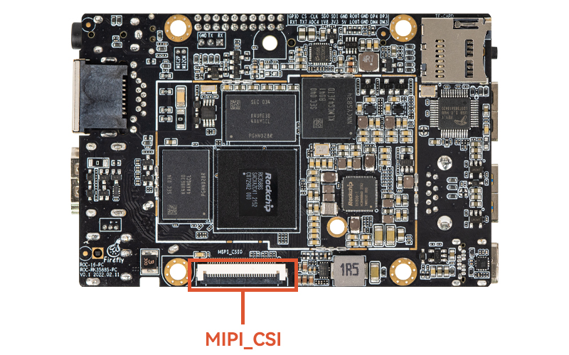

# Camera 使用

* 接口效果图




## MIPI CSI用法
RK3588/RK3588S平台支持两个DPHY硬件, 分别是 dphy0_hw/ dphy1_hw, 两个dphy硬件都可以工作在两个模式: full mode 和split
mode, 其中 dphy0_hw 拆分为 csi2_dphy0/ csi2_dphy1/ csi2_dphy2 三个逻辑dphy(参见rk3588s.dtsi)。
**目前ROC-RK3588S-PC硬件只支持一个DPHY硬件。**

## DPHY
### Full Mode
* 仅使用csi2_dphy0,csi2_dphy0与csi2_dphy1/csi2_dphy2互斥,不可同时使用;
* data lane最大4 lanes;
* 最大速率2.5Gbps/lane;

### Split Mode
* 仅使用csi2_dphy1和csi2_dphy2, 与csi2_dphy0互斥,不可同时使用;
* csi2_dphy1和csi2_dphy2可同时使用;
* csi2_dphy1和csi2_dphy2各自的data lane最大是2 lanes;
* csi2_dphy1对应物理dphy的lane0/lane1;
* csi2_dphy2对应物理dphy的lane2/lane3;
* 最大速率2.5Gbps/lane;


简单点来讲，如果用单目摄像头我们可以配置full mode，若使用双目摄像头我们可以配置split mode。

## Full Mode配置
**链接关系**: sensor->csi2_dphy0->mipi2_csi2->rkcif_mipi_lvds2 - - -> rkcif_mipi_lvds2_sditf->rkisp0_vir0

### Full Mode设备树配置要点

### 配置sensor端
我们需要根据板子原理图的MIPI CSI接口找到sensor是挂在哪个I2C总线上，然后在对应的I2C节点配置camera节点，正确配置camera模组的I2C设备地址、引脚等属性。如下ROC-RK3588S-PC的xc7160配置：
* 参考kernel-5.10/arch/arm64/boot/dts/rockchip/rk3588-roc-pc-cam-8ms1m.dtsi
```shell
&i2c7 {
        status = "okay";
        pinctrl-names = "default";
        pinctrl-0 = <&i2c7m2_xfer>;

        XC7160: XC7160b@1b{
               compatible = "firefly,xc7160";
               reg = <0x1b>;
               clocks = <&cru CLK_MIPI_CAMARAOUT_M1>;
               clock-names = "xvclk";
               pinctrl-names = "default";
               pinctrl-0 = <&mipim1_camera1_clk>;
               power-domains = <&power RK3588_PD_VI>;
               power-gpios = <&gpio4 RK_PB5 GPIO_ACTIVE_LOW>;
               reset-gpios = <&gpio0 RK_PD5 GPIO_ACTIVE_HIGH>;
               pwdn-gpios = <&gpio4 RK_PB4 GPIO_ACTIVE_HIGH>;
               firefly,clkout-enabled-index = <0>;
               rockchip,camera-module-index = <0>;
               rockchip,camera-module-facing = "back";
               rockchip,camera-module-name = "NC";
               rockchip,camera-module-lens-name = "NC";
               port {
                        xc7160_out0: endpoint {
                               remote-endpoint = <&mipidphy0_in_ucam0>;
                               data-lanes = <1 2 3 4>;
                       };
               };
       };
};
```

### csi2_dphy0相关配置
csi2_dphy0与csi2_dphy1/csi2_dphy2互斥,不可同时使用。另外需要使能csi2_dphy0_hw节点
```shell
&csi2_dphy0 {
        status = "okay";
...
};

&csi2_dphy0_hw {
   status = "okay";
};

&mipi2_csi2 {
        status = "okay";
...
};

&rkcif {
        status = "okay";
};

&rkcif_mmu {
        status = "okay";
};

&rkcif_mipi_lvds2 {
        status = "okay";
...
};
```

### isp相关配置
其中rkisp_vir0节点的`remote-endpoint`指向`mipi_lvds2_sditf`

**ROC-RK3588S-PC的xc7160自带ISP，因此不需要RKISP，其他情况sensor默认请打开以下配置**
```shell
&rkcif_mipi_lvds2_sditf {
        status = "disabled";
};

&rkisp0 {
        status = "disabled";
};

&isp0_mmu {
        status = "disabled";
};

&rkisp0_vir0 {
        status = "disabled";
};
```


## Split Mode配置
**链接关系**: 

sensor1->csi2_dphy1->mipi2_csi2->rkcif_mipi_lvds2 - - -> rkcif_mipi_lvds2_sditf->rkisp0_vir2

sensor2->csi2_dphy2->mipi3_csi2->rkcif_mipi_lvds3 - - -> rkcif_mipi_lvds3_sditf->rkisp1_vir0

### Split Mode设备树配置要点

### 配置sensor端
我们需要根据板子原理图的MIPI CSI接口找到两个sensor是挂在哪个I2C总线上，然后在对应的I2C节点配置两个camera节点，正确配置camera模组的I2C设备地址、引脚等属性。如下ROC-RK3588S-PC的gc2053/gc2093配置：
* 参考kernel-5.10/arch/arm64/boot/dts/rockchip/rk3588-firefly-itx-cam-2ms2m.dtsi
```shell
&i2c3 {
        gc2053: gc2053b@37 {
                compatible = "galaxycore,gc2053";
                status = "okay";
                reg = <0x37>;

                clocks = <&cru CLK_MIPI_CAMARAOUT_M4>;
                clock-names = "xvclk";
                power-domains = <&power RK3588_PD_VI>;
                pinctrl-names = "default";
                pinctrl-0 = <&mipim0_camera4_clk>;
                avdd-supply = <&vcc_mipidphy0>;

                power-gpios = <&gpio1 RK_PB0 GPIO_ACTIVE_HIGH>;
                pwdn-gpios = <&gpio1 RK_PB1 GPIO_ACTIVE_LOW>;
                firefly,clkout-enabled-index = <1>;
                rockchip,camera-module-index = <2>;
                rockchip,camera-module-facing = "back";
                rockchip,camera-module-name = "YT-RV1109-2-V1";
                rockchip,camera-module-lens-name = "40IR-2MP-F20";
                port {
                        gc2053_out2: endpoint {
                                remote-endpoint = <&mipi_in_ucam2>;
                                data-lanes = <1 2>;
                        };
                };
        };
        gc2093: gc2093b@7e {
                compatible = "galaxycore,gc2093";
                status = "okay";
                reg = <0x7e>;
                clock-names = "xvclk";
                pinctrl-names = "default";
                power-domains = <&power RK3588_PD_VI>;
                avdd-supply = <&vcc_mipidphy0>;
                flash-leds = <&flash_led>;
                pwdn-gpios = <&gpio1 RK_PA7 GPIO_ACTIVE_HIGH>;
                firefly,clkout-enabled-index = <0>;
                rockchip,camera-module-index = <3>;
                rockchip,camera-module-facing = "front";
                rockchip,camera-module-name = "YT-RV1109-2-V1";
                rockchip,camera-module-lens-name = "40IR-2MP-F20";
                port {
                        gc2093_out3: endpoint {
                                remote-endpoint = <&mipi_in_ucam3>;
                                data-lanes = <1 2>;
                        };
                };
        };
};
```


### csi2_dphy1/csi2_dphy2相关配置
csi2_dphy0与csi2_dphy1/csi2_dphy2互斥,不可同时使用
```shell
&csi2_dphy0_hw {
        status = "okay";
};

&csi2_dphy1 {
        status = "okay";
...
};
&csi2_dphy2 {
        status = "okay";
...
};
&mipi2_csi2 {
        status = "okay";
...
};
&mipi3_csi2 {
        status = "okay";
...
};

&rkcif {
        status = "okay";
};

&rkcif_mipi_lvds2 {
        status = "okay";
...
};

&rkcif_mipi_lvds2_sditf {
        status = "okay";
...
};

&rkcif_mipi_lvds3 {
        status = "okay";
... 
};


&rkcif_mipi_lvds3_sditf {
        status = "okay";
... 
};

&rkcif_mmu {
        status = "okay";
};

```

### isp相关配置
其中rkisp0_vir2节点的`remote-endpoint`指向`mipi2_lvds_sditf`, rkisp1_vir0节点的`remote-endpoint`指向`mipi3_lvds_sditf`
```shell
&rkisp0 {
        status = "okay";
};

&isp0_mmu {
        status = "okay";
};

&rkisp1 {
        status = "okay";
};

&isp1_mmu {
        status = "okay";
};

&rkisp0_vir2 {
        status = "okay";
...
};

&rkisp1_vir0 {
        status = "okay";
...
};
```

## 软件相关目录
```shell
Linux Kernel-5.10
|-- arch/arm/boot/dts #DTS配置文件
|-- drivers/phy/rockchip
|-- phy-rockchip-mipi-rx.c #mipi dphy驱动
|-- phy-rockchip-csi2-dphy-common.h
|-- phy-rockchip-csi2-dphy-hw.c
|-- phy-rockchip-csi2-dphy.c
|-- drivers/media
|-- platform/rockchip/cif #RKCIF驱动
|-- platform/rockchip/isp #RKISP驱动
|-- dev #包含 probe、异步注册、clock、pipeline、 iommu及media/v4l2 framework
|-- capture #包含 mp/sp/rawwr的配置及 vb2,帧中断处理
|-- dmarx #包含 rawrd的配置及 vb2,帧中断处理
|-- isp_params #3A相关参数设置
|-- isp_stats #3A相关统计
|-- isp_mipi_luma #mipi数据亮度统计
|-- regs #寄存器相关的读写操作
|-- rkisp #isp subdev和entity注册
|-- csi #csi subdev和mipi配置
|-- bridge #bridge subdev,isp和ispp交互桥梁
|-- platform/rockchip/ispp #rkispp驱动
|-- dev #包含 probe、异步注册、clock、pipeline、 iommu及media/v4l2 framework
|-- stream #包含 4路video输出的配置及 vb2,帧中断处理
|-- rkispp #ispp subdev和entity注册
|-- params #TNR/NR/SHP/FEC/ORB参数设置
|-- stats #ORB统计信息
|-- i2c
  |-- ov13850.c #CIS(cmos image sensor)驱动
```
## 单目CAM-8MS1M/双目CAM-2MS2MF摄像头的使用
firefly已经配置好相应的dts，单目摄像头CAM-8MS1M和双目摄像头CAM-2MS2MF使用互斥，只需包含相应的dtsi文件即可使用单目摄像头CAM-8MS1M或双目摄像头CAM-2MS2MF

### 使用单目摄像头CAM-8MS1M
dts的配置默认使用单目摄像头
```shell
diff --git a/kernel/arch/arm64/boot/dts/rockchip/roc-rk3588s-pc.dts b/kernel/arch/arm64/boot/dts/rockchip/roc-rk3588s-pc.dts
index 7e2a8b2..14fa027 100755
--- a/kernel/arch/arm64/boot/dts/rockchip/roc-rk3588s-pc.dts
+++ b/kernel/arch/arm64/boot/dts/rockchip/roc-rk3588s-pc.dts
@@ -7,6 +7,15 @@
+#include "roc-rk3588s-pc-cam-8ms1m.dtsi"
```

### 使用双目摄像头CAM-2MS2MF
```shell
diff --git a/kernel/arch/arm64/boot/dts/rockchip/roc-rk3588s-pc.dts b/kernel/arch/arm64/boot/dts/rockchip/roc-rk3588s-pc.dts
index 7e2a8b2..14fa027 100755
--- a/kernel/arch/arm64/boot/dts/rockchip/roc-rk3588s-pc.dts
+++ b/kernel/arch/arm64/boot/dts/rockchip/roc-rk3588s-pc.dts
@@ -7,6 +7,15 @@
-#include "roc-rk3588s-pc-cam-8ms1m.dtsi"
-//#include "roc-rk3588s-pc-cam-2ms2mf.dtsi"
+//#include "roc-rk3588s-pc-cam-8ms1m.dtsi"
+#include "roc-rk3588s-pc-cam-2ms2mf.dtsi"
```


## Camera底层调试
查找摄像头节点
```shell
# 由于一款主板可能存在多个摄像头，对于使用RKISP的摄像头如 CAM-8MS1M(IMX415) 需要抓取rkisp_mainpath对应的video节点
# 对于自带ISP的摄像头如 CAM-8MS1M 则是抓取stream_cif_mipi_id0 对应的video节点
root@firefly:~# grep '' /sys/class/video4linux/video*/name
/sys/class/video4linux/video0/name:stream_cif_mipi_id0
/sys/class/video4linux/video1/name:stream_cif_mipi_id1
/sys/class/video4linux/video10/name:rkcif_tools_id2
/sys/class/video4linux/video11/name:stream_cif_mipi_id0
/sys/class/video4linux/video12/name:stream_cif_mipi_id1
/sys/class/video4linux/video13/name:stream_cif_mipi_id2
/sys/class/video4linux/video14/name:stream_cif_mipi_id3
/sys/class/video4linux/video15/name:rkcif_scale_ch0
/sys/class/video4linux/video16/name:rkcif_scale_ch1
/sys/class/video4linux/video17/name:rkcif_scale_ch2
/sys/class/video4linux/video18/name:rkcif_scale_ch3
/sys/class/video4linux/video19/name:rkcif_tools_id0
/sys/class/video4linux/video2/name:stream_cif_mipi_id2
/sys/class/video4linux/video20/name:rkcif_tools_id1
/sys/class/video4linux/video21/name:rkcif_tools_id2
/sys/class/video4linux/video22/name:rkisp_mainpath
/sys/class/video4linux/video23/name:rkisp_selfpath
/sys/class/video4linux/video24/name:rkisp_fbcpath
/sys/class/video4linux/video25/name:rkisp_iqtool
/sys/class/video4linux/video26/name:rkisp_rawrd0_m
/sys/class/video4linux/video27/name:rkisp_rawrd2_s
/sys/class/video4linux/video28/name:rkisp_rawrd1_l
/sys/class/video4linux/video29/name:rkisp-statistics
/sys/class/video4linux/video3/name:stream_cif_mipi_id3
/sys/class/video4linux/video30/name:rkisp-input-params
/sys/class/video4linux/video31/name:stream_hdmirx
/sys/class/video4linux/video4/name:rkcif_scale_ch0
/sys/class/video4linux/video5/name:rkcif_scale_ch1
/sys/class/video4linux/video6/name:rkcif_scale_ch2
/sys/class/video4linux/video7/name:rkcif_scale_ch3
/sys/class/video4linux/video8/name:rkcif_tools_id0
/sys/class/video4linux/video9/name:rkcif_tools_id1
```

使用v4l2-ctl抓取camera数据帧
```shell
v4l2-ctl --verbose -d /dev/video0 --set-fmt-video=width=1920,height=1080,pixelformat='NV12' --stream-mmap=4 --set-selection=target=crop,flags=0,top=0,left=0,width=1920,height=1080 --stream-to=/data/out.yuv
```

把out.yuv文件拷贝出来通过ubuntu去查看
```shell
ffplay -f rawvideo -video_size 1920x1080 -pix_fmt nv12 out.yuv
```

## Android 系统使用 Camera 应用
除了官方默认支持的摄像头外，Android系统使用camera的apk打开摄像头都需要配置camera3_profiles*.xml，具体可参考Android SDK `hardware/rockchip/camera/etc/camera`目录下的文件

## Linux 系统预览摄像头
Ubuntu 固件集成了 `test_camera-cifisp.sh` 测试脚本，直接运行该脚本就可以了，脚本路径：`test_camera-cifisp.sh`。
```shell
#!/bin/sh

export DISPLAY=:0.0
#export GST_DEBUG=*:5
#export GST_DEBUG_FILE=/tmp/2.txt

echo "Start MIPI CSI Camera Preview!"


export XDG_RUNTIME_DIR=/run/user/1000

if cat /proc/device-tree/model | grep -q "3588" ;then
        gst-launch-1.0 v4l2src device=/dev/video0 io-mode=4 ! queue ! video/x-raw,format=NV12,width=1920,height=1080,framerate=30/1  ! glimagesink
else
        gst-launch-1.0 v4l2src device=/dev/video0 io-mode=4 ! videoconvert ! video/x-raw,format=NV12,width=640,height=480  ! rkximagesink
fi

```

## IQ文件
raw摄像头支持的iq文件路径`external/camera_engine_rkaiq/iqfiles/isp3x`, 与以前不一样的地方是iq文件不再采用`.xml`的方式，而是采用`.json`的方式。虽有提供xml转json的工具, 但isp20的xml配置转换后也不适用isp3x，同样isp21的json也不适用isp3x。

若使用raw摄像头sensor，请留意isp3x目录所支持的iq文件


