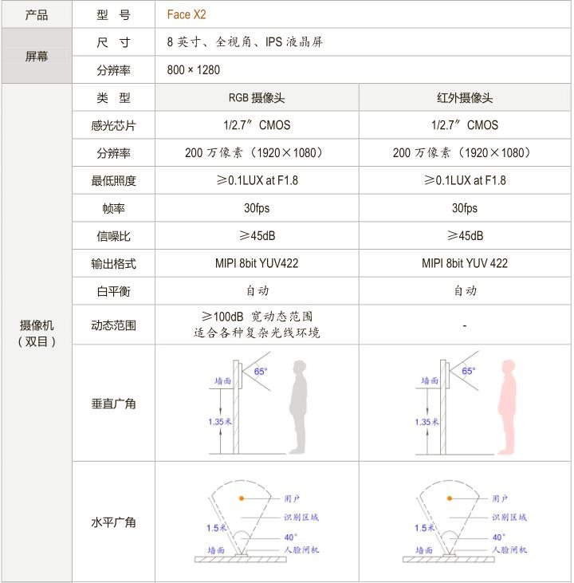
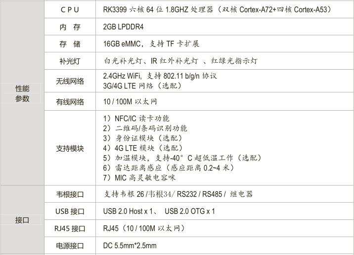
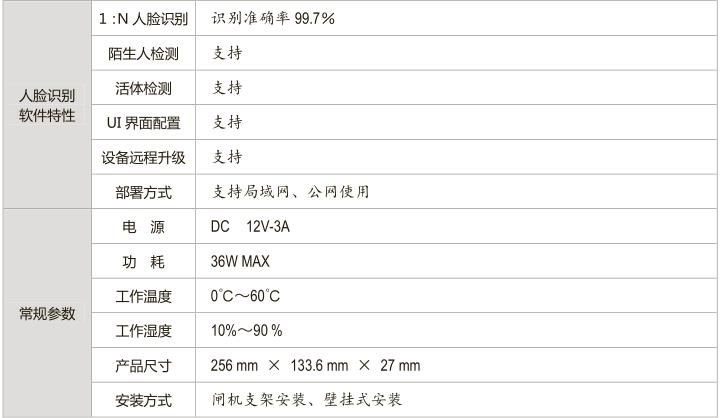
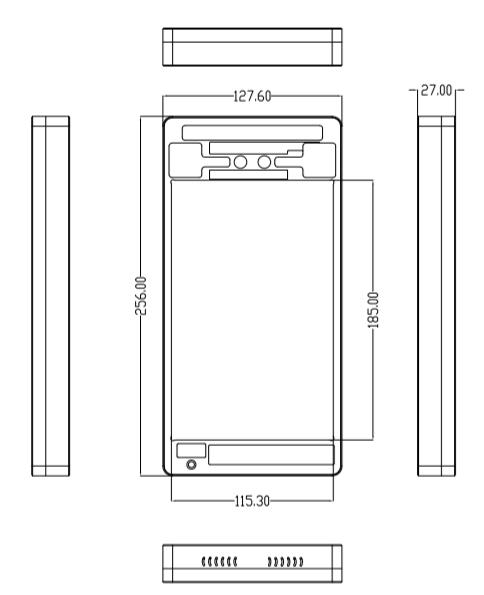
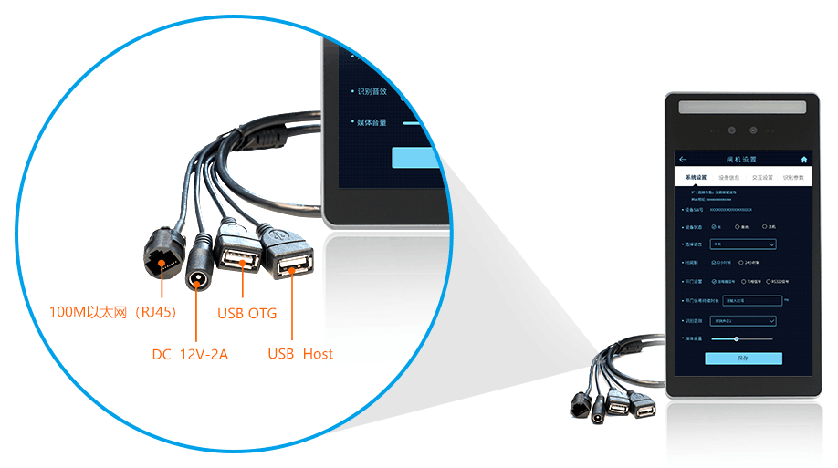
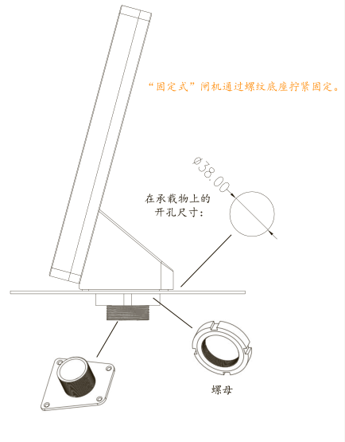
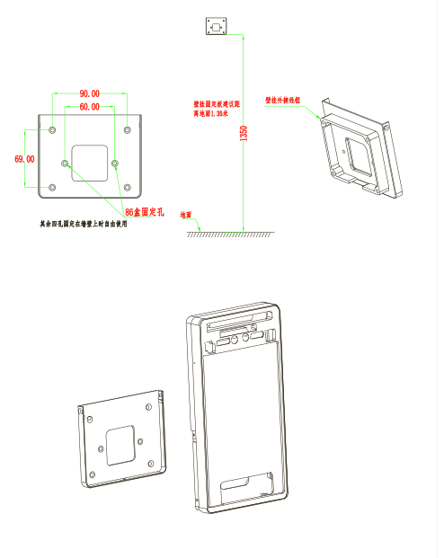

## 产品简介
Face X2 是由 Firefly 自主研发的一款基于人脸识别的智能门禁终端，它提供了先进的
人脸识别算法、手机管理软件、后台管理系统。相对于传统门禁的“密码开门”、“刷卡开
门”、“指纹识别”等方式，本产品打破了人员权限验证的局限性，通过人脸识别 SDK，可
轻松地进行门禁系统的智能化改造，只需“刷脸”就能快速准确进行人员的识别及出入控
制。从采集人脸照片、人脸比对、并获取结果，全程自动化操作，无需人工干预。

## 产品参数

## 尺寸规格

## 尾线介绍

## 固定方式

1、“固定式”闸机安装方式

2、“ 壁挂 式”闸机安装方式

3、壁挂式安装视频教学

## 产品资源

* [[Wiki]](../../主板/Face-RK3399/started.md)
包含Android 驱动开发等资料(Face-X2 内部主板用的是Face-rk3399，相关开发可参考Face-rk3399 Wiki)
 
* [[技术交流论坛]](http://dev.t-firefly.com/forum.php)
超过10万企业客户和用户沟通交流平台

## 相关开发文档

* [红外热成像测温模块](../../主板/Face-RK3399/module_temparature.md)
* [人脸识别应用开发](../../主板/Face-RK3399/face_sdk_v2_0.md)

## 人脸识别apk源码申请

在资源下载出提供demo版本源码，如果需要后续更新版的源码，请将人脸识别套件购买信息和订单号发送到 sales@t-firefly.com邮箱，官方审核成功后2天内会以邮件的形式提供SDK。

## 产品技术支持
本产品适用于：公司考勤、考场签到、基地门禁、车站安检、工地闸机、电梯门禁、
酒店公寓、银行入口、政府机关等人脸识别场景。

### 技术案例
* 双目摄像头数据采集
* 人脸识别

### 联系方式
* 邮箱：sales@t-firefly.com
* 手机：(+86) 186 8811 7175
* 座机：0760-89881218
* 全国服务热线：4001-511-533
* 地址：广东省中山市东区中山四路 57 号宏宇大厦 2101 室
 