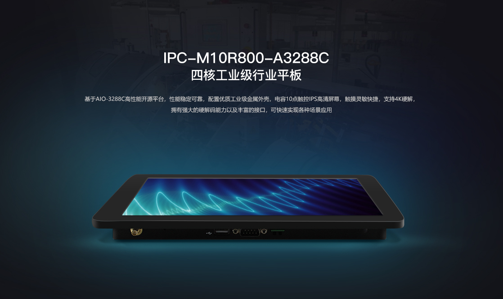
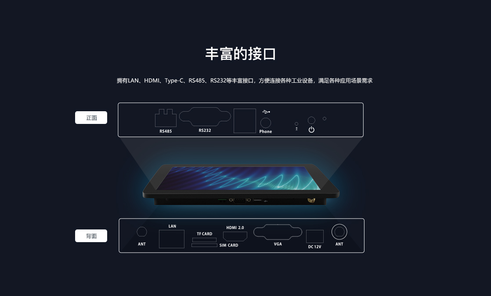
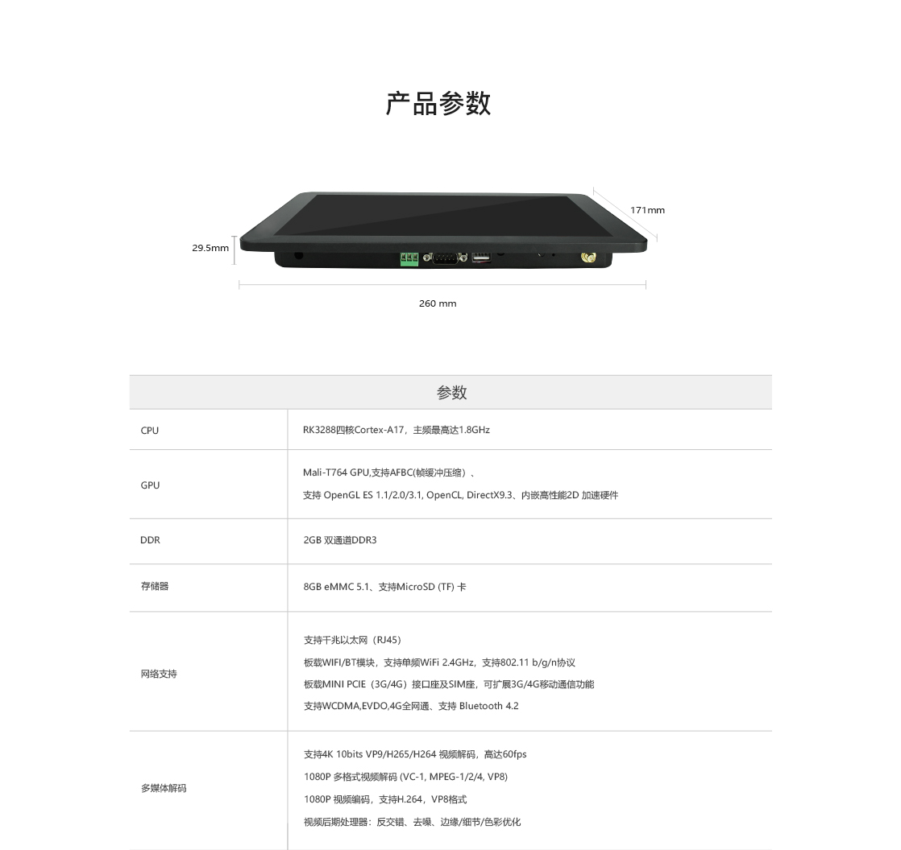
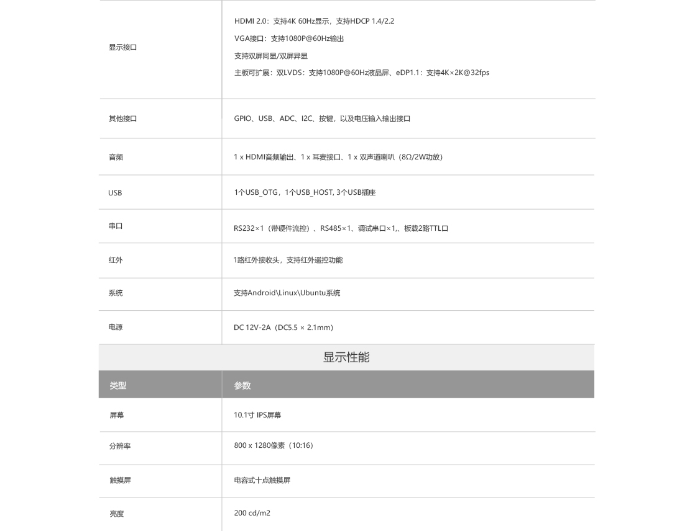
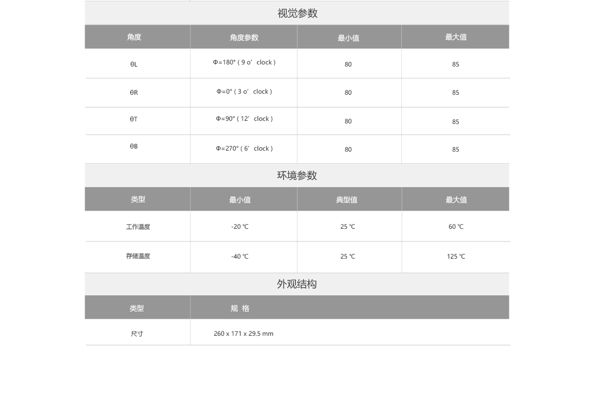

## 产品简介

IPC-M10R800-A3288C四核工业级行业平板，是基于AIO-3288C高性能开源平台，其配置优质工业级金属外壳，电容10点触控IPS高清屏幕，
触摸灵敏快捷，支持4K硬解，拥有强大的硬解码能力以及丰富的接口，可快速实现各种场景应用。其采用RK3288四核Cortex-A17处理器，
主频高达1.8GHz，集成四核Mali-T764 GPU，最大支持4K硬解，能实现4Kx2K的 H.264和H.265视频硬解码。

## 产品参数

## 产品资源

* [[Wiki]](../../../zh/主板/AIO-3288C/index.md)
包含Android&Ubuntu 驱动开发等资料(参考AIO-3288C Wiki)
 
* [[Git 链接地址]](https://bitbucket.org/T-Firefly/firenow-lollipop) 
Android SDK 源码

* [[技术交流论坛]](http://dev.t-firefly.com/forum.php)
超过10万企业客户和用户沟通交流平台

## 产品技术支持
IPC-M10R800-A3288C可以在多种场景实现客户不同方面的需要，在游戏设备，广告机，自动售货机，机器人等
已经广泛的使用，品质和性能在行业内已经有非常好的口碑，专业的技术团队为广大客户解决硬件设计和软件功能上
的各种各样问题。专业技术支持和更详细资料请联系商务。

### 技术案例
* [多路编解码例子]  
* [双屏异显例子]   
* [H.264硬编码&硬解码]
* [定时开关机例子]
* [Ubuntu双屏异显]
* [Firefly Android API Demo]

### 联系方式
* 邮箱：sales@t-firefly.com
* 手机：(+86) 186 8811 7175
* 座机：0760-89881218
* 全国服务热线：4001-511-533
* 地址：广东省中山市东区中山四路 57 号宏宇大厦 2101 室

 