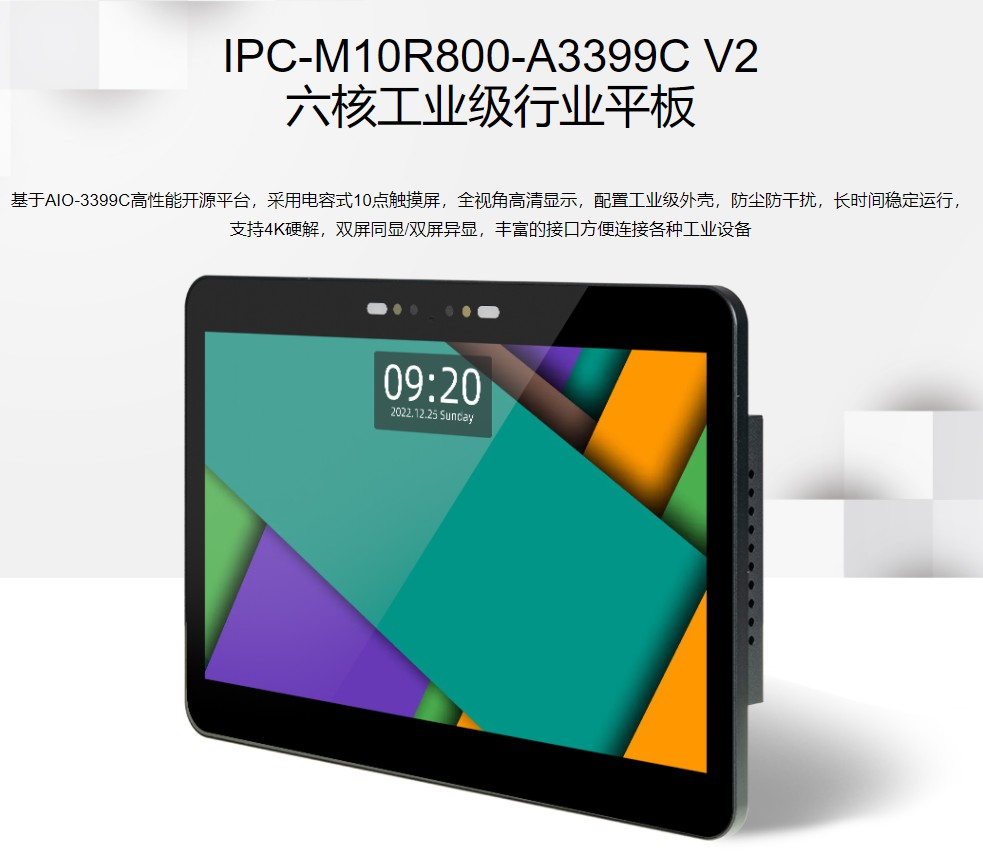
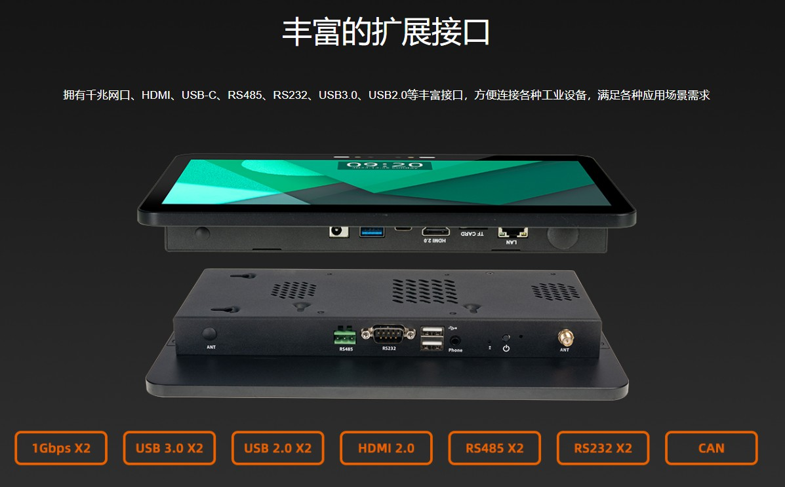
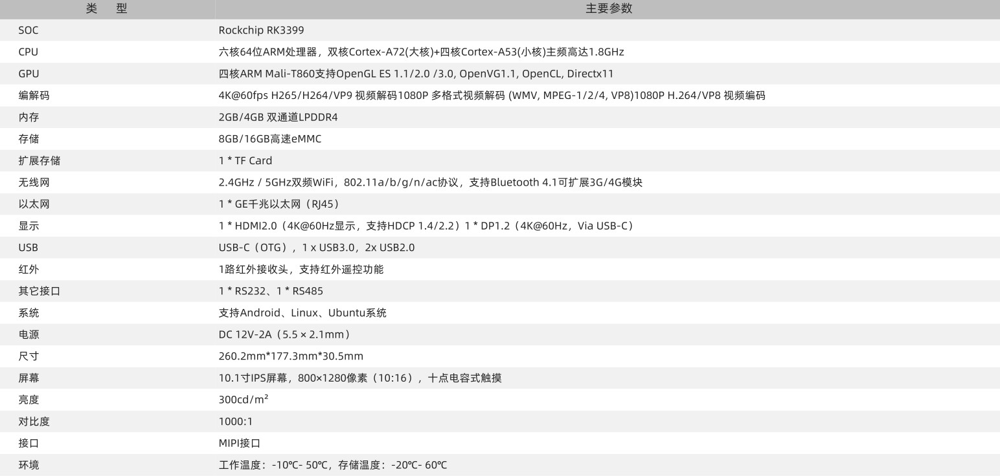
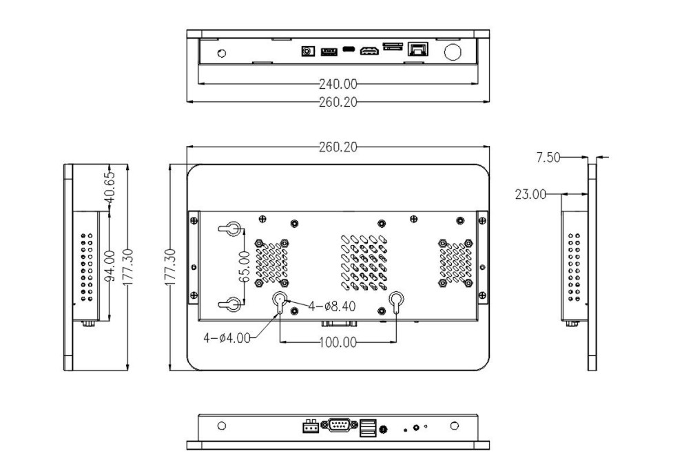

## 产品简介

IPC-M10R800-A3399C V2六核工业级行业平板，基于 AIO-3399C高性能开源平台，采用电容式 10点
触摸屏，全视角高清显示，配置工业级外壳，防尘防干扰，长时间稳定运行，支持 4K 硬解，双屏同显/双
屏异显，丰富的接口方便连接各种工业设备。 
搭载ARM全新Cortex-A72架构、六核64位高性能处理器，主频高达2.0GHz，集成四核 Mali-T860 
GPU。与Cortex-A57 相比，处理性能提升 100%，速度更快，性能更强。采用10.1 寸IPS 高端屏幕，G+G
电容式触摸屏，支持 10点触摸，高灵敏触控，操作稳定，800 x 1280 分辨率，全视角高清显示，色彩还
原逼真，画面清晰流畅。

## 产品参数

## 产品资源

* [[Wiki]](../../主板/AIO-3399C/started.md)
包含Android&Ubuntu 驱动开发等资料(参考AIO-3399C Wiki)
 
* [[SDK 下载地址]](https://www.t-firefly.com/doc/download/200.html#other_369) 
Android SDK 源码

* [[SDK 下载地址]](https://www.t-firefly.com/doc/download/200.html#other_186)
Linux SDK 源码

* [[技术交流论坛]](http://dev.t-firefly.com/forum.php)
超过10万企业客户和用户沟通交流平台

## 产品编译方式
[[Android 10.1寸MIPI 屏幕编译方式]](../../主板/AIO-3399C/compile_android7.1_industry_firmware.md#xian-shi-ping-dm-m10r800-v2-bian-yi)

[[Linux   10.1寸MIPI 屏幕编译方式]](../../主板/AIO-3399C/linux_compile_gpt.md)

## 产品技术支持
IPC-M10R800-A3399C V2核心板可以在多种场景实现客户不同方面的需要，在游戏设备，广告机，自动售货机，机器人等
已经广泛的使用，品质和性能在行业内已经有非常好的口碑，专业的技术团队为广大客户解决硬件设计和软件功能上
的各种各样问题。专业技术支持和更详细资料请联系商务。

### 技术案例
* Android多路编解码
* 双目摄像头数据采集
* Android双屏异显
* 百度人脸识别

### 联系方式
* 邮箱：sales@t-firefly.com
* 手机：(+86) 186 8811 7175
* 座机：0760-89881218
* 全国服务热线：4001-511-533
* 地址：广东省中山市东区中山四路 57 号宏宇大厦 2101 室
 