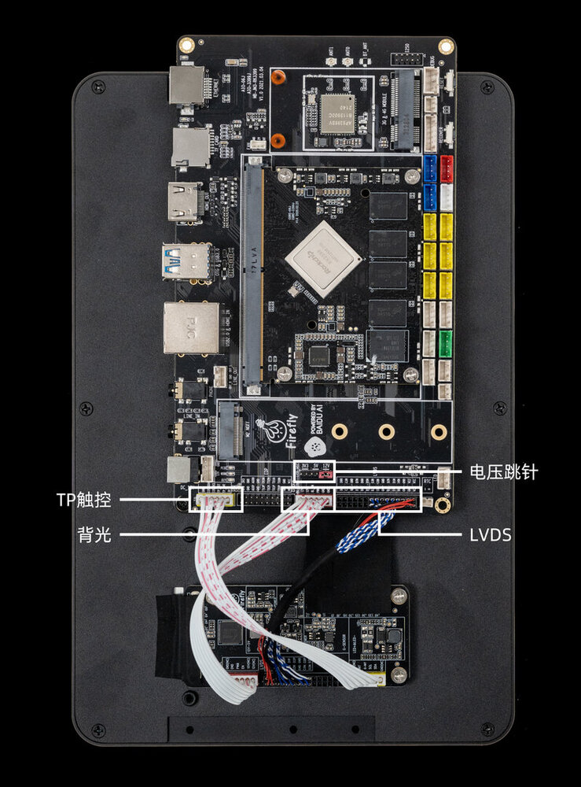
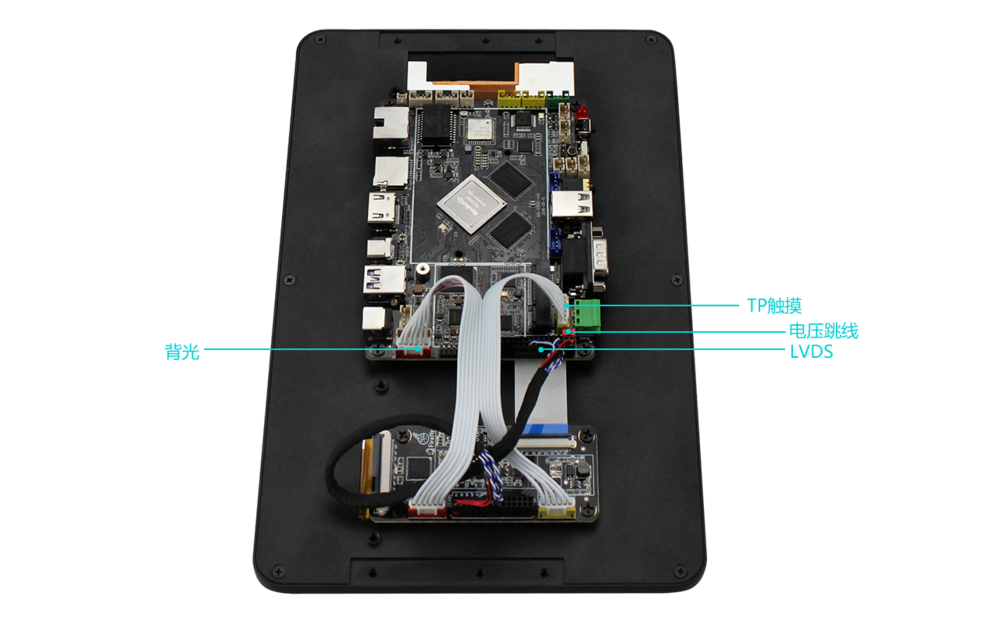

# 一、产品介绍

## 产品简介

### 百度人脸识别开发套件

集百度人脸识别算法与软硬件为一体的人脸识别套件，可接入单目摄像头、双目摄像头、结构光摄像头，能快速实现活体识别、人脸采集、人脸对比识别、人脸库管理等功能。仅需一个套件，即可进行一站式人脸识别开发，加速人工智能产品研发与落地。

## 平台

目前支持人脸识别系统的平台有 `AIO-3399J` 和 `AIO-3399C` 版本。

* 开发板 AIO-3399J + 10.1 寸 LVDS 屏模组 + 专业摄像头组成的开发套件
* 开发板 AIO-3399C + 10.1 寸 LVDS 屏模组 + 专业摄像头组成的开发套件

若想详细了解开发套件平台可以直接到商城搜索[人脸识别套件](https://store.t-firefly.com/goods.php?id=77)。

## 固件和 APP 下载

无需编译可以直接下载使用现成固件。

* [AIO-3399J 10.1 寸屏固件下载](https://community.t-firefly.com/doc/download/48)
* [AIO-3399C 10.1 寸屏固件下载](https://community.t-firefly.com/doc/download/48)
* [人脸识别 APP 下载](http://www.t-firefly.com/share/index/index/id/a6d7830a6f4f1146159b49a324172c67.html)

注意：

1. 百度人脸 2.0.1 版本之后，可以恢复出厂设置、更新系统以及重新烧录固件。一个激活码对应一台设备，与系统无关。
2. 每个激活码最多只能激活 200 次。请不要将 app 卸载重装或者清除 app 存储数据，否则激活就会失效。如果是普通用户可以直接通过 `adb install -r faceOffline_v1.x.x.apk` 进行重装，不要卸载；如果是开发者可以用百度人脸识别代码编译直接安装，但是要确保 apk 的包名和签名不变。
3. 最新版的 app 刚刚打开时可能会有 3 到 4 秒时间在加载人脸识别相关配置文件。
4. 百度人脸识别 2.0.1 版本需要重新激活，在 2.0.1 版本之前已经激活过的激活码不能在 2.0.1 版本上使用了。如果想使用 2.0.1 版本，可以和官方申请激活码。

# 二、人脸识别 SDK

首次激活需要网络，激活完成即可离线使用，使用说明详情参考[人脸离线识别 SDK-Android 开发文档](http://ai.baidu.com/docs#/Face-Offline-SDK-Android/top)。

# 三、SDK 申请

将人脸识别套件购买信息和订单号发送到 `sales@t-firefly.com` 邮箱，官方审核成功后 2 天内会以邮件的形式提供 SDK。

# 四、硬件连接

AIO-3399J 屏的接线说明：

AIO-3399C 屏的接线说明：

# 五、社区论坛

* 平台问题可以直接发帖子到 [Firefly 人脸识别开发套件社区论坛](http://dev.t-firefly.com/forum-352-1.html)提问
* 应用算法等问题可以到[百度人脸识别交流平台](http://ai.baidu.com/forum/topic/list/165)提问

# 六、Q&A 平台答疑

Q：10.1 寸屏没显示？

A：请确认硬件是否接触异常，详细可看连接方法。

Q：人脸识别 App 出现闪退问题？

A：闪退问题一般只出现在 1.0.7.1 版本，主要是由算法模型占用内存过多导致。请升级到最新版本或者降低版本即可。

Q：无法 adb 连接进行 debug？

A：[AIO-3399J ADB 使用](../../主板/AIO-3399J/adb_use.md)

A：[AIO-3399C ADB 使用](../../主板/AIO-3399C/adb_use.md)

Q：USB3.0 上层口无法识别？

A：关闭 `device` 模式，需要切换成 `host` 模式，`设置` -> `USB` -> `连接到 PC` 取消勾选即可切换到 `host` 模式。