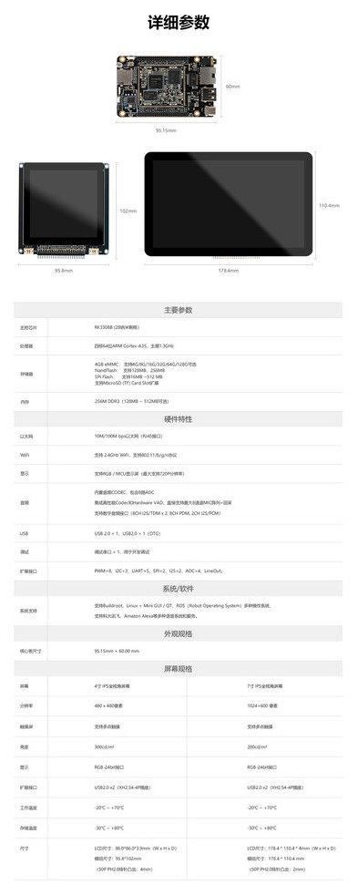

# 介绍

## 简介

### 产品概述
微型IoT主板可搭配一个或多个模组组合成高性能智能IoT开发套件，支持多种IoT系统、语音系统和服务，以及Buildroot+Qt应用开发，拥有丰富的扩展接口，可快速应用于IoT智能物联网、智能语音识别、人机界面、工业控制、智能机器人等领域

## 智能IoT套件开发
### Qt应用开发
微型IoT主板搭配高分辨率显示屏进行Qt应用开发，SDK提供开源Qt应用程序包含音乐应用、视频应用、图片应用、设置应用
* [Qt开发](../../../zh/核心板/Core-3308Y/qt_development.md)
* [ROC-RK3308B-CC Qt固件下载](https://community.t-firefly.com/doc/download/67)
* [ROC-RK3308B-CC-PLUS Qt固件下载](https://community.t-firefly.com/doc/download/67)
* [智能IoT套件购买链接](https://store.t-firefly.com/goods.php?id=125)

### 语音开发
微型IoT主板搭配语音模组进行语音系统和服务开发，关于智能语音识别开发，客户如需深入的业务定制合作，可与我司或者对应的语音公司进行商务沟通
* [语音模组连接](../../../zh/核心板/Core-3308Y/module_speech.md)
* [录放音使用](../../../zh/核心板/Core-3308Y/faq.md)
* [语音模组购买链接](https://store.t-firefly.com/goods.php?id=132)

### 智能网关开发
微型IoT主板搭配4G模组EC20进行智能网关开发，IoT主板USB接口连接带有USB转接板的EC20模块后可通过命令获取网络，而网络又可通过以太网口共享给连接设备
* [EC20模组连接](../../../zh/核心板/Core-3308Y/module_wireless.md)
* [EC20模组购买链接](https://store.t-firefly.com/goods.php?id=49)

## 资源
* [SDK下载](https://community.t-firefly.com/doc/download/67)
* 套件开发问题可到[Firefly智能IoT开发套件社区论坛](http://dev.t-firefly.com/forum-572-1.html)发帖
* 主板平台问题可到[Firefly Core-3308Y社区论坛](http://dev.t-firefly.com/forum-499-1.html)发帖

 