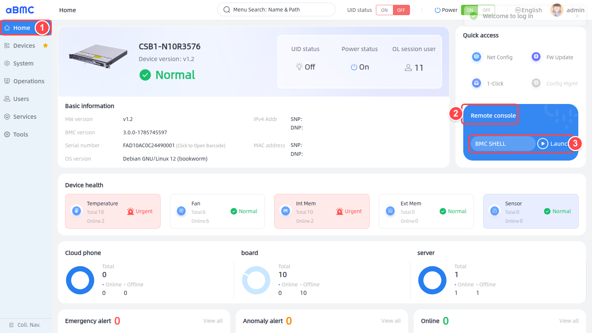
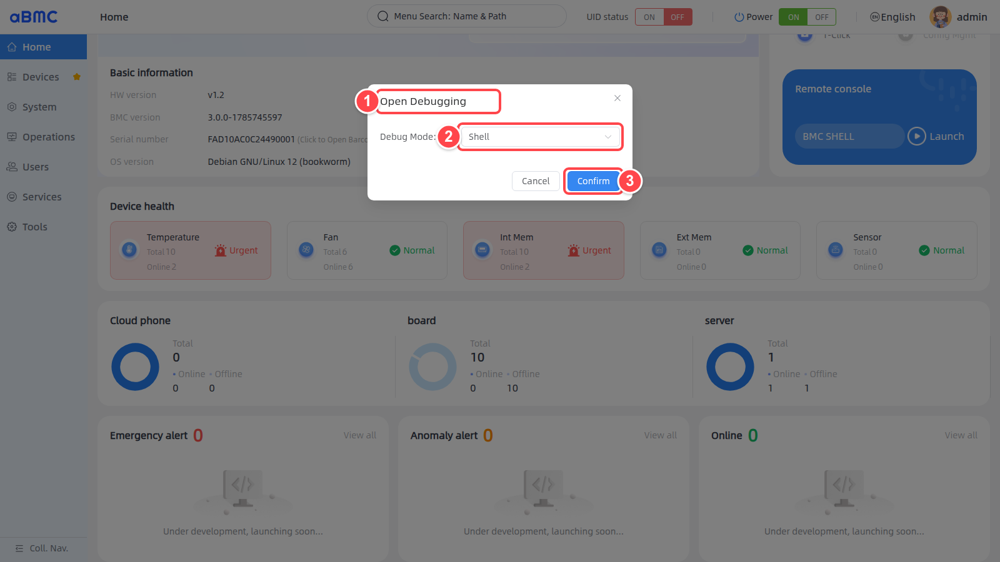
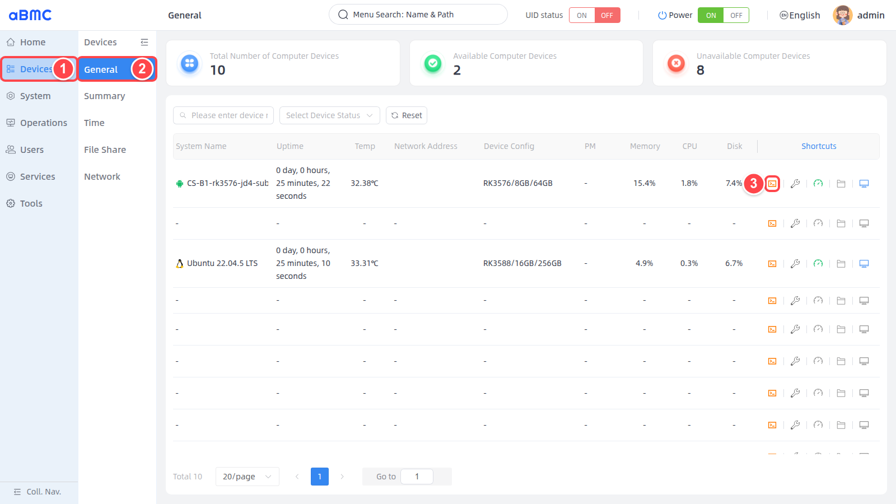
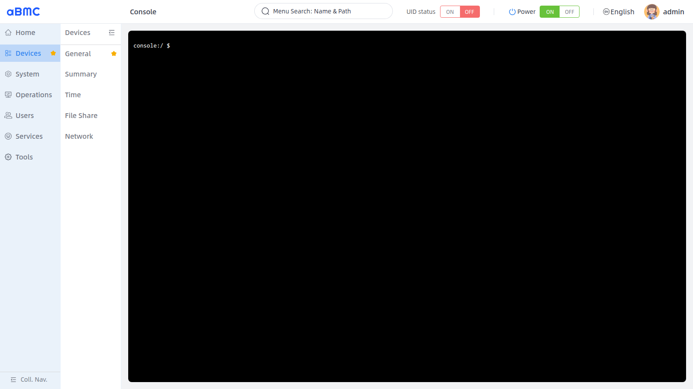
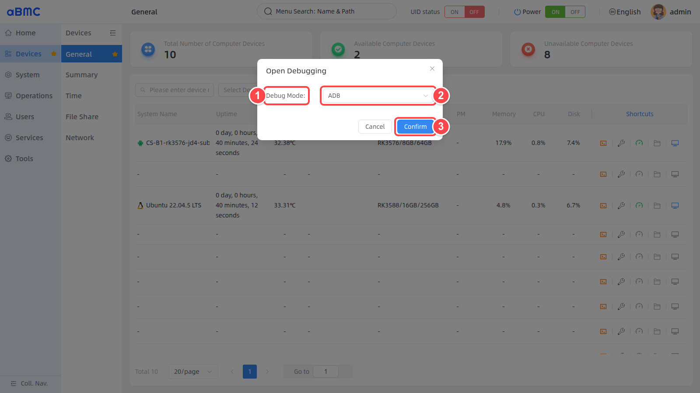

# 访问子节点

## aBMC Shell

### 打开 aBMC Shell 入口

1. 登录 aBMC Web 页面后，在左侧导航栏中选择 **Home**。
2. 在右侧 **Quick access** 区域找到 **Remote console**。
3. 确认控制台类型显示为 **BMC SHELL**，单击 **Launch**。

### 选择 Shell 调试模式

1. 确认页面已经打开 **Open Debugging** 窗口。
2. 在 **Debug Mode** 中选择 **Shell**。
3. 单击 **Confirm**，在新浏览器窗口中打开 BMC 终端。

### 确认 Shell 连接

终端显示类似 `root@bmc:~#` 的提示符时，表示已经连接到 BMC 管理控制器，可以执行所需的 BMC 系统维护命令。

<Callout title="操作对象说明" type="warn">
  aBMC Shell 操作的是 BMC 管理控制器，不是计算子节点。终端中执行的命令会直接影响 BMC 系统，请在确认命令作用和影响范围后再执行。
</Callout>

## 串口登录

### 打开子节点调试窗口

1. 在左侧导航栏中选择 **Devices**。
2. 在设备菜单中选择 **General**，并在设备列表中找到要访问的子节点。建议选择状态为 **Online** 或 **Ready** 的节点。
3. 在目标节点的 **Shortcuts** 列中单击第一个终端图标，即 **Open Shell Command**。页面宽度不足时，可先将设备列表横向滚动到最右侧。

### 选择 Serial 调试模式

1. 在 **Open Debugging** 窗口中展开 **Debug Mode**。
2. 选择 **Serial**。
3. 单击 **Confirm**，在新浏览器窗口中打开该子节点的串口终端。

### 确认串口连接

1. 等待终端建立连接。
2. 如果终端暂时为空白，请在黑色终端区域单击一次，然后按 **Enter** 键唤醒串口输出。
3. 终端显示子节点提示符或登录提示时，表示串口连接成功。子节点操作系统如需登录，请使用该子节点自身的系统账号和密码；Web 账号 `admin/admin` 仅用于登录 aBMC 页面。

## ADB 登录

### 打开子节点调试窗口

1. 在左侧导航栏中选择 **Devices**。
2. 在设备菜单中选择 **General**，并在设备列表中找到要访问的 Android 子节点。建议选择状态为 **Online** 或 **Ready** 的节点。
3. 在目标节点的 **Shortcuts** 列中单击第一个终端图标，即 **Open Shell Command**。页面宽度不足时，可先将设备列表横向滚动到最右侧。

### 选择 ADB 调试模式

1. 在 **Open Debugging** 窗口中确认 **Debug Mode**。
2. 选择 **ADB**。
3. 单击 **Confirm**，在新浏览器窗口中打开该子节点的 ADB 终端。

### 确认 ADB 连接

1. 等待终端与目标子节点建立 ADB 连接。
2. 如果终端暂时为空白，请在黑色终端区域单击一次，然后按 **Enter** 键刷新提示符。
3. 终端显示类似 `CS_B1_rk3576_jd4_sub:/ #` 的提示符时，表示已经进入目标子节点的 ADB Shell，可以执行所需的节点维护命令。

