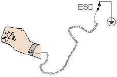

# 服务器安装
## 工具准备

相关工具准备如下：

- 防静电腕带或防静电手套
- M3 十字螺丝刀
- 劳保手套
- 防静电包装袋
- 一字螺丝刀

## 防静电

#### 操作准则

为降低静电对您和产品造成损伤的几率，请注意以下操作准则：

- 所有机房应该铺设防静电地板（或防静电地垫），使用防静电工作椅。机房的隔板、屏风、窗帘等应使用防静电材料。
- 机房的落地式用电设备、金属框架、机架的金属外壳必须直接与大地连接，工作台上的所有用电仪器工具应通过工作台的公共接地点接地。
- 请注意监控机房温度、湿度。暖气会降低室内湿度并增加静电。
- 在运输、保管服务器组件的过程中，必须使用专用的防静电袋与防静电盒，以确保服务器组件的防静电安全。
- 机房内的人员在进行服务器组件安装、插拔等接触操作时必须佩戴防静电腕带，并将接地端插入机架上的 ESD 插孔。
- 在接触设备前，应当穿上防静电工作服、佩戴防静电手套或防静电腕带、去除身体上携带的易导电物体（如首饰、手表等），以免被电击或灼伤，如图所示。

    

- 防静电腕带的两端必须接触良好，一端接触您的皮肤，另一端牢固地连接到机箱的 ESD 接口。佩戴防静电腕带的具体步骤请参见佩戴防静电腕带。
- 在更换的过程中，应将所有还没有安装的服务器组件保留在带有防静电屏蔽功能的包装袋中，将暂时拆下来的服务器组件放置在具有防静电功能的泡沫塑料垫上。
- 请勿触摸焊接点、引脚或裸露的电路。

### 佩戴防静电腕带

请确认机柜已正确接地。

1. 如图所示，将手伸进防静电腕带。

    

2. 拉紧锁扣，确认防静电腕带与皮肤接触良好。

3. 将防静电腕带的接地端插入机柜的防静电腕带插孔。

## 安装环境要求

### 空间要求和通风要求

为方便服务器维修和正常通风，请满足以下空间和通风要求：

- 服务器必须安装在出入受限区域。
- 保持设备所在区域整洁。
- 为了设备通风散热和便于设备维护，确保机柜前后都要空余 800 mm 的空间。
- 服务器入风口处应避免有障碍物阻挡，影响正常进风和散热。
- 服务器放置位置的空调送风量应足够提供服务器需要的风量，保证服务器内部各器件散热。

## 温度要求与湿度要求

为确保服务器能够持续安全可靠地运行，请将服务器安装或放置在通风良好、温度及湿度可控制的环境中。

- 不论气候条件，均应设置长年的温控装置。
- 对于干燥或湿度过大的地区可采用加湿机或抽湿机来保证环境湿度。

| 项目 | 说明 |
| :--- | :--- |
| 温度 | 5 ℃ ～ 40 ℃（41 ℉ ～ 104 ℉） |
| 湿度 | 8% RH ～ 90% RH（无冷凝） |

## 机柜要求

为确保服务器能够持续安全可靠地运行，请将服务器安装或放置在通风良好、温度及湿度可控制的环境中。

- 满足 IEC（International Electrotechnical Commission）297 标准的宽 19 英寸、深 800 mm 以上的通用机柜。
- 在机柜门上安装防尘网。
- 在机柜后面提供交流电源接入。