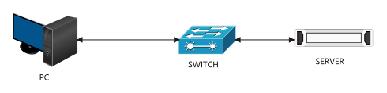
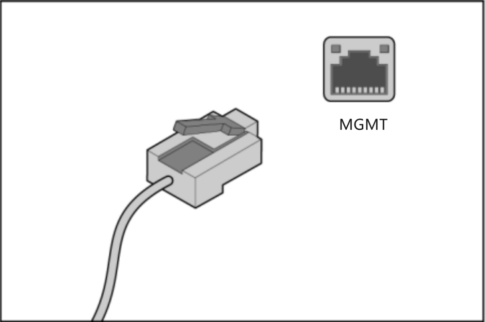
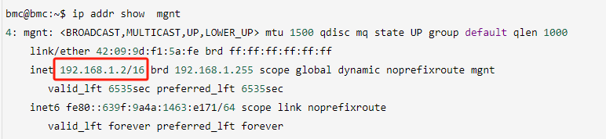
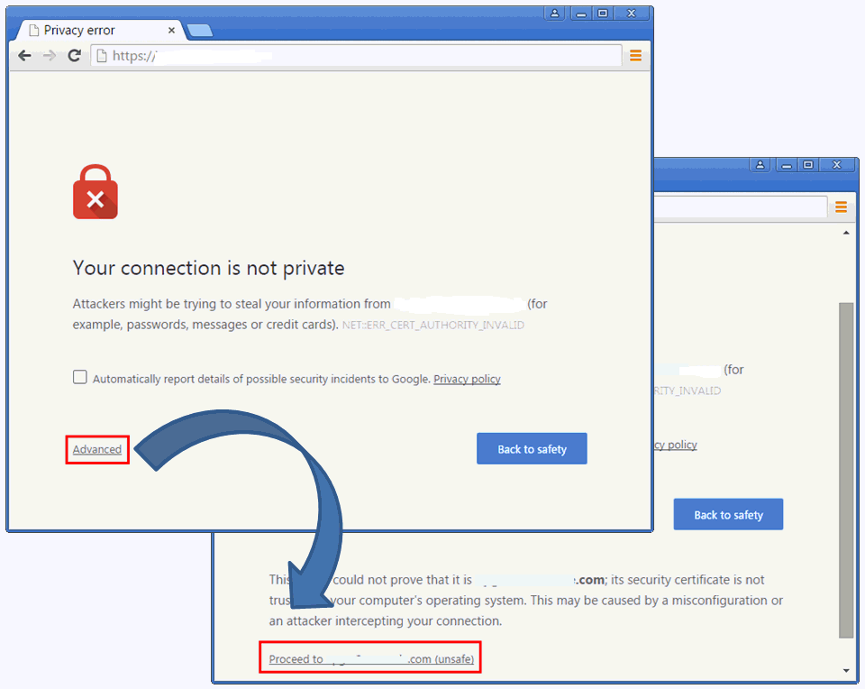
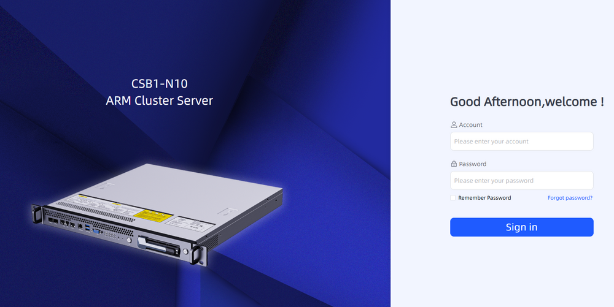
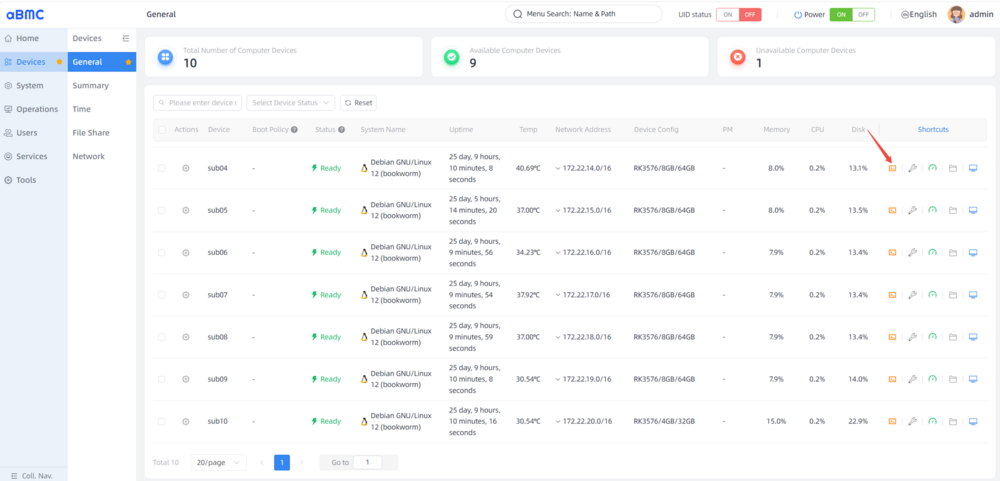
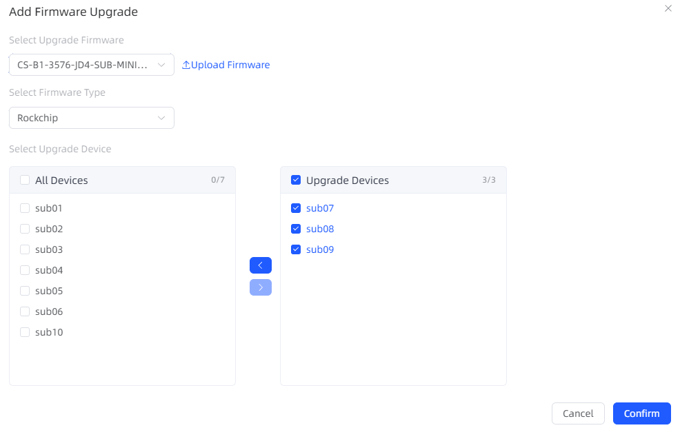
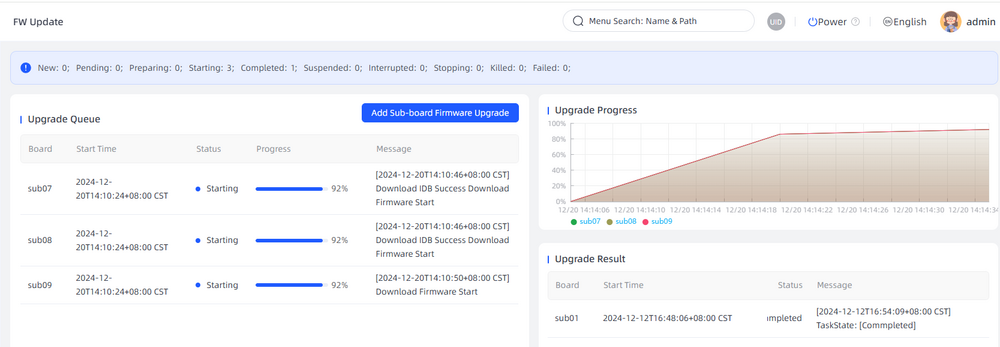
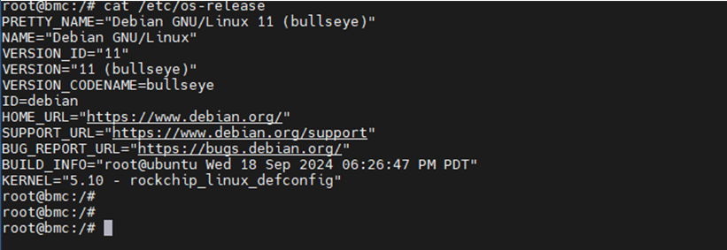

## 远程登录服务器

### 登录须知
BMC默认设置了缺省参数以方便用户操作，参数如下表所示。为了保证系统的安全性，建议在首次操作时修改缺省值，并定期更新。

<table border="1" cellPadding="8" cellSpacing="0" width="100%">
  <thead>
    <tr>
      <th>类别</th>
      <th>名称</th>
      <th>默认值</th>
    </tr>
  </thead>
  <tbody>
    <tr>
      <td rowSpan="2">aBMC 管理系统数据</td>
      <td>登录用户名</td>
      <td>admin</td>
    </tr>
    <tr>
      <td>登录密码</td>
      <td>admin</td>
    </tr>
    <tr>
      <td rowSpan="2">aBMC 管理网口 IPv4 地址 ● MGNT 或 GM 网口</td>
      <td rowSpan="2">管理网口 IP 与子网掩码</td>
      <td>默认 IP 地址：192.168.1.2</td>
    </tr>
    <tr>
      <td>默认子网掩码：255.255.255.0</td>
    </tr>
    <tr>
      <td>BMC Console 串口</td>
      <td>波特率</td>
      <td>115200</td>
    </tr>
    <tr>
      <td rowSpan="2">BMC Linux 用户数据</td>
      <td>登录用户名</td>
      <td>bmc</td>
    </tr>
    <tr>
      <td>登录密码</td>
      <td>bmc</td>
    </tr>
  </tbody>
</table>

## 5.4.2 登录 aBMC Web 远程虚拟控制台

aBMC 提供 Web 界面，通过可视化、友好的界面来帮助用户完成服务器的管理。

### 5.4.2.1 环境准备

#### 1. 将服务器连接到网络

登录 aBMC 前，请先将 aBMC 管理接口连接到网络，确保本地 PC 和服务器路由可达，如下图所示。
 

服务器支持以下两种 aBMC 管理接口，详情请参考网络设置，你可以根据业务需求，选择合适的 aBMC 管理接口。

- **aBMC 共享网口**：可以同时处理 aBMC 管理流量和服务器业务数据流量的网络接口。
- **aBMC 专用网口**：专门用于处理 aBMC 管理流量的网络接口，如下图所示。

 

#### 2. 获取 aBMC 管理 IP 地址

登录 aBMC 前，需要先获取 aBMC 管理 IP（aBMC 专用网口/共享网卡的 IP 地址）。可以通过 Linux 系统的网络命令（`ip` 或 `ifconfig`）来获取 aBMC 管理 IP 地址，如下图所示使用 `ip` 命令获取 MGMT 网卡 IP 地址：

> （此处为命令执行示例图）

 

#### 3. 访问aBMC
通过Web浏览器即可访问aBMC。aBMC支持的浏览器版本及客户端分辨率如下表所示。
**WEB客户端配置需求**

<table border="1" cellPadding="8" cellSpacing="0" width="100%">
  <thead>
    <tr>
      <th>浏览器版本</th>
      <th>默认值分辨率</th>
    </tr>
  </thead>
  <tbody>
    <tr>
      <td>Google Chrome 48.0 及以上</td>
      <td rowSpan="4">要求不低于 1366*768，推荐设置为 1600*900 或更高</td>
    </tr>
    <tr>
      <td>Mozilla Firefox 50.0 及以上</td>
    </tr>
    <tr>
      <td>Internet Explorer 11 及以上</td>
    </tr>
    <tr>
      <td>Microsoft Edge 97 及以上</td>
    </tr>
  </tbody>
</table>

#### 5.4.2.2 登录aBMC Web页面
本指南以Chrome浏览器为例介绍登录 aBMC 界面的操作步骤。
1.  打开Chrome浏览器，在地址栏使用HTTPS方式输入 aBMC 管理IP地址（如https://192.168.1.2），弹出告警窗口，如下图所示。
    
2. 点击“Advanced”按钮：当你看到类似于 “Your connection is not private”（你的连接不是私人连接）或者 “Warning: Potential Security Risk Ahead”（警告：潜在的安全风险）时，点击页面底部的 “Advanced” 按钮。
3. 点击“Proceed to (site) (unsafe)”：通常在警告信息下方会有这个选项，点击它就能继续访问该网站。
下图为aBMC登录页面
    
4. 成功登录后可以看到aBMC整机设备概览，用户对服务器运行状态进行监控分析和健康检查。
下图为设备列表页面，用户可以在可以通过此页面查看ARM计算单元运行信息和Shell命令行操作。

下图为aBMC的“固件升级”页面，方便用户对ARM计算单元进行固件升级操作。

5. 更多aBMC的操作请查看《aBMC用户指南》

### 5.4.3 登录aBMC 命令行

  <h3>Explanation</h3>
  <ul style="padding-left: 24px; margin: 10px 0;">
    <li>为保证系统的安全性，初次登录时，请及时修改初始密码，并定期更新。</li>
  </ul>

#### 5.4.3.1 通过 Console 串口登录

1. 使用 RJ45 串口线连接 Console。
2. 通过超级终端登录串口命令行，需要设置的参数有：
   - 波特率：115200
   - 数据位：8
   - 奇偶校验：无
   - 停止位：1
   - 数据流控制：无
3. 呼叫成功后输入用户名和密码。
4. 登录成功。

#### 5.4.3.2 使用 SSH 登录

1. 可以使用系统 `ssh` 命令或者 MobaXterm 通过 SSH 登录 BMC。
2. 输入默认账号密码。