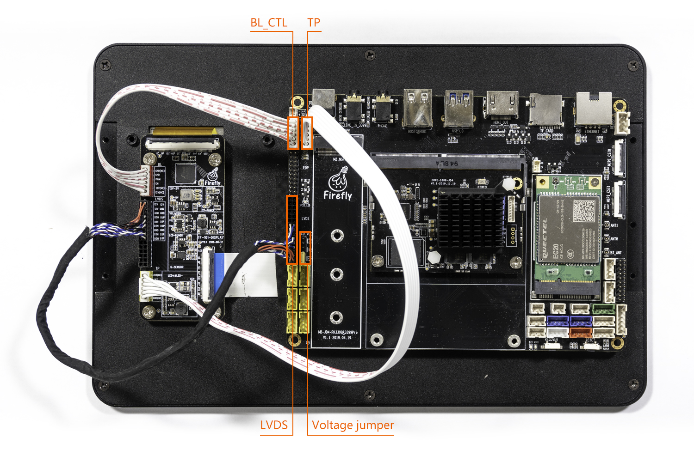

# 屏幕模组

## [10.1寸LVDS屏模组](https://store.t-firefly.com/goods.php?id=80)
### 产品参数
* 型号：HSX101H40C-L28A
* 尺寸：10.1寸
* 分辨率：800x1280
* 显示接口：LVDS
* 可视角度：170°
* 触摸屏：多点电容触摸

### LVDS屏使用

官方发布的固件以及默认编译出来的固件都是支持LVDS显示的，接上屏幕就可以正常显示。

#### 实物图

接线注意事项：

* TP接口: LVDS接线板上的TP接口与底板上的TP接口相接(即黄色端口)
* BL接口：LVDS接线板上的BL接口与底板上的BL接口相接(即红色端口)
* LVDS接口：LVDS接线板上的BL接口与底板上的BL接口相接(注意电源接口方向，即红色线为VCC)
* 接12V跳线帽：底板上的LVDS接口旁有三个电源跳线接口，需要用跳线帽将12V的跳线接口相接。

