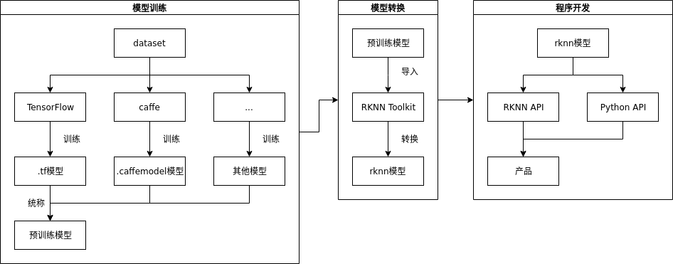

# NPU开发简介

## NPU特性
- 支持 8bit/16bit 运算，运算性能高达 3.0TOPS。
- 相较于 GPU 作为 AI 运算单元的大型芯片方案，功耗不到 GPU 所需要的 1%。
- 可直接加载 Caffe / Mxnet / TensorFlow 模型。
- 提供 AI 开发工具：支持模型快速转换、支持开发板端侧转换 API、支持 TensorFlow / TF Lite / Caffe / ONNX / Darknet 等模型 。
- 提供 AI 应用开发接口：提供 RKNN 跨平台 API、Linux 支持
TensorFlow 开发。

## 开发流程
NPU开发完整的流程如下图所示：

### 1. 模型训练
在模型训练阶段，用户根据需求和实际情况选择合适的框架（如Caffe、TensorFlow等）进行训练得到符合需求的模型。也可直接使用已经训练好的模型。

### 2. 模型转换
此阶段为通过RKNN Toolkit把模型训练中得到的模型转换为NPU可用的模型。

### 3. 程序开发
最后阶段为基于RKNN API或RKNN Tookit的Python API开发程序实现业务逻辑。

**此文档主要介绍模型转换和基于RKNN程序开发，不涉及模型训练的内容。**