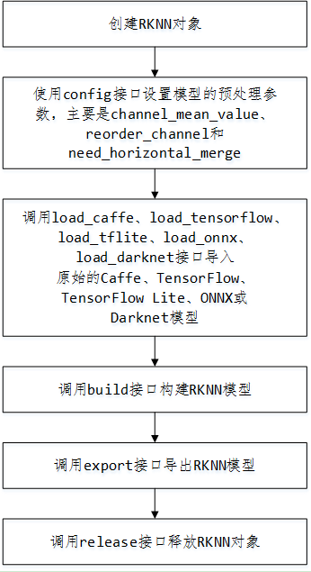
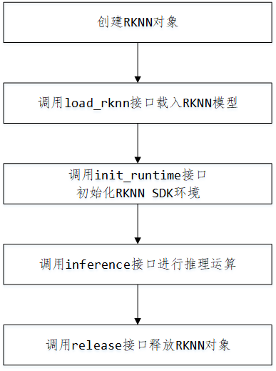

# RKNN Toolkit

Rockchip提供RKNN-Toolkit开发套件进行模型转换、推理运行和性能评估。

用户通过提供的 python 接口可以便捷地完成以下功能：

1）模型转换：支持 Caffe、Tensorflow、TensorFlow Lite、ONNX、Darknet 模型，支持RKNN 模型导入导出，后续能够在硬件平台上加载使用。

2）模型推理：能够在 PC 上模拟运行模型并获取推理结果，也可以在指定硬件平台RK3399Pro Linux上运行模型并获取推理结果。

3）性能评估：能够在 PC 上模拟运行并获取模型总耗时及每一层的耗时信息，也可以通过联机调试的方式在指定硬件平台 RK3399Pro Linux上运行模型，并获取模型在硬件上运行时的总时间和每一层的耗时信息。

**RKNN Tookit仅支持Linux系统，可在PC上使用。**

## 程序安装
RKNN Toolkit 使用SDK中的`/external/rknn-toolkit`目录。

### 在PC中安装

#### Ubuntu 16.04
基础安装：
```bash
sudo apt-get install -y python3 python3-pip libglib2.0-dev \
        libsm-dev libxrender-dev libxext-dev
```

安装RKNN Toolkit:
```bash
pip3 install --user -r rknn-toolkit/packages/requirements-cpu.txt
# rknn-toolkit的版本可能不一样，请选择对应的文件进行安装
pip3 install --user rknn-toolkit/packages/rknn_toolkit-1.3.0-cp35-cp35m-linux_x86_64.whl
```
如果PC中有GPU加速则用requirements-gpu.txt替换requirements-cpu.txt。

#### Ubuntu 18.04
步骤如Ubuntu 16.04，只需将rknn_toolkit-1.3.0-cp35-cp35m-linux_x86_64.whl替换为rknn_toolkit-1.3.0-cp36-cp36m-linux_x86_64.whl

## 在PC中程序升级（1.0.0 -> 1.3.0）

#### Ubuntu 18.04
```bash
pip3 install --user -r rknn-toolkit/packages/requirements-cpu.txt
pip3 install --user -U rknn-toolkit/packages/rknn_toolkit-1.3.0-cp36-cp36m-linux_x86_64.whl
```
如果PC中有GPU加速则用requirements-gpu.txt替换requirements-cpu.txt。

### Ubuntu 16.04
```bash
pip3 install --user -r rknn-toolkit/packages/requirements-cpu.txt
pip3 install --user -U rknn-toolkit/packages/rknn_toolkit-1.3.0-cp35-cp35m-linux_x86_64.whl
```

## API调用流程

### 模型转换


模型转换使用示例如下,详细请参考RKNN Tookit中的example。
```python
from rknn.api import RKNN  
 
INPUT_SIZE = 64
 
if __name__ == '__main__':
    # 创建RKNN执行对象
    rknn = RKNN()
    # 配置模型输入，用于NPU对数据输入的预处理
    # channel_mean_value='0 0 0 255'，那么模型推理时，将会对RGB数据做如下转换
    # (R - 0)/255, (G - 0)/255, (B - 0)/255。推理时，RKNN模型会自动做均值和归一化处理
    # reorder_channel=’0 1 2’用于指定是否调整图像通道顺序，设置成0 1 2即按输入的图像通道顺序不做调整
    # reorder_channel=’2 1 0’表示交换0和2通道，如果输入是RGB，将会被调整为BGR。如果是BGR将会被调整为RGB
    #图像通道顺序不做调整
    rknn.config(channel_mean_value='0 0 0 255', reorder_channel='0 1 2')
 
    # 加载TensorFlow模型
    # tf_pb='digital_gesture.pb'指定待转换的TensorFlow模型
    # inputs指定模型中的输入节点
    # outputs指定模型中输出节点
    # input_size_list指定模型输入的大小
    print('--> Loading model')
    rknn.load_tensorflow(tf_pb='digital_gesture.pb',
                         inputs=['input_x'],
                         outputs=['probability'],
                         input_size_list=[[INPUT_SIZE, INPUT_SIZE, 3]])
    print('done')
 
    # 创建解析pb模型
    # do_quantization=False指定不进行量化
    # 量化会减小模型的体积和提升运算速度，但是会有精度的丢失
    print('--> Building model')
    rknn.build(do_quantization=False)
    print('done')
 
    # 导出保存rknn模型文件
    rknn.export_rknn('./digital_gesture.rknn')
 
    # Release RKNN Context
    rknn.release()
```

### 模型推理


模型推理使用示例如下,详细请参考RKNN Tookit中的example，以`rknn-toolkit/example/mobilenet_v1`为例。

RKNN-Toolkit 通过 PC 的 USB 连接到开发板硬件,将构建或导入的 RKNN 模型传到 RK1808 上运行,并从 RK1808 上获取推理结果、性能信息。

请执行以下步骤

1. 确保开发板的 USB OTG 连接到 PC,并且 ADB 能够正确识别到设备,即在 PC 上执行`adb devices -l`命令能看到目标设备。

2. 调用 `init_runtime` 接口初始化运行环境时需要指定 target 参数和 device_id 参数。其中 target 参数表明硬件类型, 选值为 `rk1808`, 当 PC 连接多个设备时,还需要指定 device_id 参数,即设备编号,可以通过`adb devics`命令查看,举例如下:
	```
	$ adb devices
	List of devices attached 
	0123456789ABCDEF        device
	```
	即改为
	```
	ret = rknn.init_runtime(target='rk1808', device_id='0123456789ABCDEF')
	```

3. 运行

	```
	python3 ./test.py
	```
	运行成功后就可以获得经过RK1808推理后得到的数据。 

```python
mport numpy as np
import cv2
from rknn.api import RKNN

def show_outputs(outputs):
    output = outputs[0][0]
    output_sorted = sorted(output, reverse=True)
    top5_str = 'mobilenet_v1\n-----TOP 5-----\n'
    for i in range(5):
        value = output_sorted[i]
        index = np.where(output == value)
        for j in range(len(index)):
            if (i + j) >= 5:
                break
            if value > 0:
                topi = '{}: {}\n'.format(index[j], value)
            else:
                topi = '-1: 0.0\n'
            top5_str += topi
    print(top5_str)

def show_perfs(perfs):
    perfs = 'perfs: {}\n'.format(outputs)
    print(perfs)

if __name__ == '__main__':

    # Create RKNN object
    rknn = RKNN()
    
    # pre-process config
    print('--> config model')
    rknn.config(channel_mean_value='103.94 116.78 123.68 58.82', reorder_channel='0 1 2')
    print('done')

    # Load tensorflow model
    print('--> Loading model')
    ret = rknn.load_tflite(model='./mobilenet_v1.tflite')
    if ret != 0:
        print('Load mobilenet_v1 failed!')
        exit(ret)
    print('done')

    # Build model
    print('--> Building model')
    ret = rknn.build(do_quantization=True, dataset='./dataset.txt')
    if ret != 0:
        print('Build mobilenet_v1 failed!')
        exit(ret)
    print('done')

    # Export rknn model
    print('--> Export RKNN model')
    ret = rknn.export_rknn('./mobilenet_v1.rknn')
    if ret != 0:
        print('Export mobilenet_v1.rknn failed!')
        exit(ret)
    print('done')

    # Set inputs
    img = cv2.imread('./dog_224x224.jpg')
    img = cv2.cvtColor(img, cv2.COLOR_BGR2RGB)

    # init runtime environment
    print('--> Init runtime environment')
    ret = rknn.init_runtime(target='rk1808', device_id='0123456789ABCDEF')
    if ret != 0:
        print('Init runtime environment failed')
        exit(ret)
    print('done')

    # Inference
    print('--> Running model')
    outputs = rknn.inference(inputs=[img])
    show_outputs(outputs)
    print('done')

    # perf
    print('--> Begin evaluate model performance')
    perf_results = rknn.eval_perf(inputs=[img])
    print('done')

    rknn.release()
```
## API
详细的API请参考RKNN-Toolkit中的使用指南文档在`<rk1808-linux-sdk>/docs/Develop reference documents/NPU`目录中的：**《RKNN-Toolkit使用指南_V\*.pdf》**。