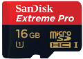
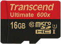
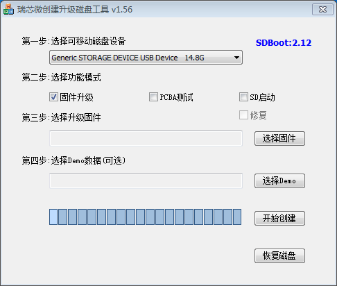
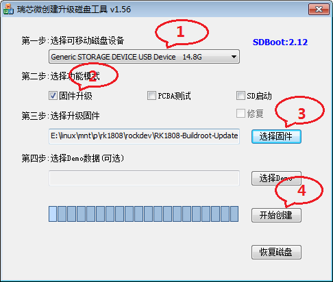
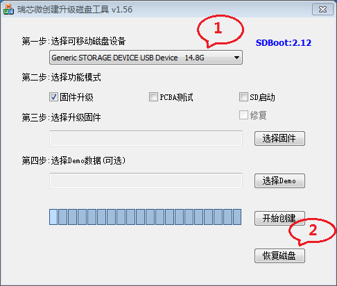

# SD卡升级

本章节介绍如何使用SD卡将固件烧写到eMMC中。

## 准备SD卡
作为启动盘，一张**优质可靠、高速读写**的 SD 卡，对于系统的稳定性来说是非常关键。现将 [《如何准备一张 SD 卡(英文)》](https://docs.armbian.com/User-Guide_Getting-Started/#how-to-prepare-a-sd-card)一文的要点摘录如下：

- 遇到启动或稳定性问题，有超过 95% 的可能是电源供应不足或 SD 卡问题（坏卡，坏读卡器，烧写SD卡时出错，卡读写太慢）。
 - 推荐使用 Class 10 以上的 SD 卡，并使用专业工具去测试是否真卡。
 - 尽量使用带校验的烧写工具。
 - 如需将 SD 卡恢复至出厂设置，使用 [SD Formatter](https://www.sdcard.org/downloads/formatter_4/) 工具做格式化。
 - 选择以下优质 SD 卡：

  

## 烧写工具

使用SD Firmware Tool工具制作SD升级卡

下载[SD_Firmware_Tool_1.56](http://download.t-firefly.com/product/RK3328/Tools/SD_Firmware_Tool/SD_Firmware_Tool1.56.zip)

## 准备固件

### 使用官方固件

官方发布的固件都是支持使用SD卡升级的, 请到[Core-1808-JD4固件下载页](https://community.t-firefly.com/doc/download/73)下载相应的固件。

## 制作SD升级卡

首先下载[SD Firmware Tool](http://download.t-firefly.com/product/RK3328/Tools/SD_Firmware_Tool/SD_Firmware_Tool1.56.zip)去下载 `SD_Firmware_Tool`，并解压。

运行 `SD_Firmware_Tool.exe`:

1. 插入 SD 卡。
2. 从组合框中选择 SD 卡对应的设备。
3. 勾选 "固件升级" 选项。
4. 点击 "选择固件" 按钮，在文件对话框中选择需要升级的固件。
5. 点击 "开始创建" 按钮。
6. 等待操作完成，直到提示成功对话框出现：

	

7. 在SD卡中生成 `rksdfw.tag` ， `sd_boot_config.config` ， `sdupdate.img` 3个文件。
8. 拔出 SD 卡。

## 升级固件

制作完升级卡过后接下来，使用SD升级卡升级固件请执行以下命令

1. 将板子断电，插入SD升级卡
2. 上电，升级过程中有一盏LED等会不停的闪烁或者通过屏幕观察升级过程。
3. 升级完成后LED会停止闪烁，屏幕也会提示升级完成，然后拔出SD卡，这时候开发板会自动重启，升级完成。

## 注意事项

制作过升级卡的SD卡包含有升级信息，插入开发板上启动仍然会从SD卡启动，如果需要恢复为普通的SD卡，请执行以下步骤：

1. 插入 SD 卡。
2. 从组合框中选择 SD 卡对应的设备。
3. 点击 "恢复磁盘" 按钮。
4. 等待操作完成，直到提示成功对话框出现。

