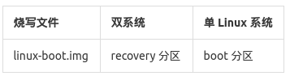

# 编译内核  

## 准备工作  

### 安装开发包

安装开发包：  

```
sudo apt-get install build-essential lzop libncurses5-dev libssl-dev
# 如果使用的是 64 位的 Ubuntu，还需要安装：
sudo apt-get install libc6:i386
```

### 安装 mkbootimg 工具

```
git clone https://github.com/neo-technologies/rockchip-mkbootimg.git
cd rockchip-mkbootimg
make && sudo make install
```

### 获取内核源码和安装交叉编译工具链

如果已经下载 Firefly-RK3128 Android SDK，内核源码和交叉编译工具链分别在 SDK/kernel 和 SDK/prebuilts 目录里，无需额外下载，请跳到下一步。  
如果没有下载 SDK，则需要下载内核源码及 Android 的 arm-eabi-4.6 交叉编译工具链。

下载内核源码：  

```
git clone https://bitbucket.org/T-Firefly/fireprime-kernel.git
```

## 编译内核

### 编译内核映像

如果不是在 SDK 里编译内核，则需要先指定 ARCH 和 CROSS_COMPILE：

```
export ARCH=arm
export CROSS_COMPILE=/path/to/prebuilts/gcc/linux-x86/arm/arm-eabi-4.6/bin/arm-eabi-
```

在内核源码目录里执行：

```
make fireprime-linux_defconfig
make -j8 rk3128-fireprime.img
```

### 编译内核模块

在内核源码目录里执行：

```
make modules
mkdir modules_install
make INSTALL_MOD_PATH=./modules_install modules_install
```

内核模块是需要拷到根文件系统中即可： 

```
rsync -av ./modules_install/ /path/to/your/rfs/
```

也可以远程拷贝到开发板的根文件系统中，这需要开发板可以通过 ssh 远程连接：

```
rsync -av ./modules_install/ root@开发板IP:/
```

最后清理一下模块安装目录（该目录含有链接，会影响 SDK 的编译）：

```
rm -rf ./modules_install
```

## 创建 linux-boot.img

### 创建内存盘

内核启动时会加载内存盘作为初始的根文件系统，再加载实际的根存储设备，最后切换过去。

```
git clone -b fireprime https://github.com/TeeFirefly/initrd.git
make -C initrd
```

### 打包内核和内存盘

将 kernel 和 initrd 打包成 linux-boot.img：

```
truncate -s "%4" initrd.img
mkbootimg --kernel arch/arm/boot/zImage --ramdisk initrd.img -o linux-boot.img
```

## 修改 parameter 文件

Linux 的根文件系统（RFS）可能在不同的分区或存储设备上（eMMC、TF 卡或 U 盘），所以需要在内核的参数中指定。修改 parameter 文件中的 CMDLINE 行，根据实际情况加入以下之一（# 后是注释，不需要加入）：

```
root=/dev/block/mtd/by-name/linuxroot        # 名为 "linuxroot" 的 nand 分区
root=/dev/mmcblk0p1          # TF 卡的第一个分区
root=/dev/sda1               # U 盘或 USB 硬盘的第一个分区
root=LABEL=linuxroot         # 卷标为 "linuxroot" 的分区，可以是任一存储设备
```

以下是官方双启动固件所使用的 parameter 文件，供参考：

```
FIRMWARE_VER:5.1
MACHINE_MODEL:rk312x
MACHINE_ID:007
MANUFACTURER:RK30SDK
MAGIC: 0x5041524B
ATAG: 0x60000800
MACHINE: 312x
CHECK_MASK: 0x80
KERNEL_IMG: 0x60408000
#RECOVER_KEY: 1,1,0,20,0
CMDLINE:console=ttyFIQ0,115200 earlyprintk androidboot.hardware=rk30board androidboot.console=ttyFIQ0 board.ap_has_alsa=0 init=/init initrd=0x62000000,0x00800000 mtdparts=rk29xxnand:0x00002000@0x00002000(uboot),0x00002000@0x00004000(misc),0x00008000@0x00006000(resource),0x00008000@0x0000e000(kernel),0x00010000@0x00016000(boot),0x00010000@0x00026000(recovery),0x0001a000@0x00036000(backup),0x00040000@0x00050000(cache),0x00002000@0x00090000(kpanic),0x00180000@0x00092000(system),0x00002000@0x00212000(metadata),0x00200000@0x00214000(userdata),0x00020000@0x00414000(radical_update),-@0x00434000(user)
```

## 烧写到设备

参考[《升级固件》](upgrade_firmware.md)烧写 parameter 和相应的分区映像。  
如果是在官方固件的基础上更新，则需要根据固件的类型，将 linux-boot.img 烧写至对应的分区：



如果还没有烧写根文件系统的，可以下载预先做好的镜像，或定制自己的根文件系统，并烧写到 parameter 文件指定的根分区中。