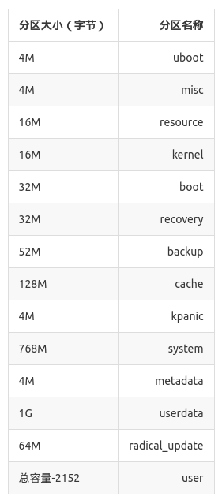
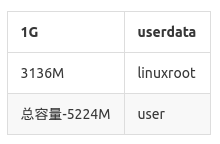
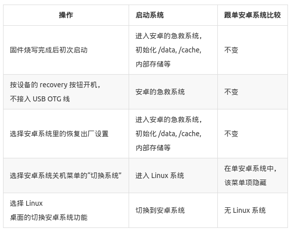

# 双系统启动的设计和实现  

## 前言

本文讨论如何利用安卓系统自身的启动特性，加进 Linux 系统的启动支持，并实现双系统的切换。
要达到这一点，有必要先了解一下安卓系统的启动流程。 

## 安卓系统的启动流程

安卓系统的启动模式有两种：正常模式和急救(recovery)模式。  
急救模式，其内核和根文件系统均独立于正常模式，功能简单，一般很少更新，用作系统修复和维护。  
也就是说，安卓系统本身就是支持双启动的。  
安卓系统的启动流程是：  
```
1 U-Boot 初始化
  1.1 U-Boot 读取 CPU 寄存器，如果有 recovery 标志，则跳转到 3
  1.2 U-Boot 读取 misc 分区，如果含有 recovery 命令，则跳转到 3
  1.3 正常启动模式，跳转到 2
2 正常启动模式
  2.1 加载 boot 分区
    2.1.1 如果 boot 分区含有内核和 initramfs, 则分别加载到内存特定位置，跳转到 	2.3 （略过 kernel 分区处理）
    2.1.2 如果 boot 分区仅含有 initramfs, 则加载到内存特定位置。
2.2 加载 kernel 分区到内存特定位置。
  2.3 跳转到 4
3 急救模式
  3.1 读出 recovery 分区内含的内核 和 initramfs, 分别加载到内存特定位置，跳转到 4
4 初始化内核启动参数，将执行权移交内核。
```

注意，initramfs 是固化了的小型根文件系统，内核启动后会将其解压至内存中，并执行其中的 init 程序进行初始化。也就是说，initramfs 是第一个获得执行权的根文件系统，负责挂载真正的根文件系统（可以在各种各样的存储设备中，如 U盘、TF 卡、USB 硬盘、NAND 或 eMMC 闪存等）。  

## 双启动系统的设计

分析安卓系统的启动流程，一个比较简单的双启动方案就是： 

* 加入 Linux 系统的根文件系统分区。  
* 替换 recovery 分区成 Linux 系统的内核和 initramfs。  
* 改变 misc 分区的内容，就可设定开机启动的操作系统。  
* 在 Linux 系统内实现安卓急救系统的部分功能。  

如何进入 Linux 呢？ 因为我们将 Linux 放在 recovery 分区，因此，问题等价于如何进入安卓的急救模式。以下有几种方式：  

* 拔掉 USB 线，按住开发板的`recovery`键开机（无论是初次上电、重启或按`reset`键开机都可以）。这是临时性的切换，下次开机不按，还是会进入 Linux 。  
* 在安卓系统的设置里选择恢复出厂设置。实际上，恢复出厂设备这个功能已被阉割了，重启后会进入 Linux。  
* 在安卓系统的关机菜单（点底部工具栏的关机按钮进入）增加了一项切换系统的选择。当然，它是检测到`linuxroot`分区才会出现，也就是说单系统是不会出现的。
* 将 SDK 里的`rkst/Image/misc.img`刷进到`misc`分区。  

2~4 项都是通过写 misc 分区，达到切换到 recovery，这里也即是 Linux 的目的。

## 双启动系统的实现

### 分区

我们先来看看纯安卓的存储分区情况。分区信息在 parameter 文件里的`CMDLINE`行：
```
FIRMWARE_VER:4.4.2
   MACHINE_MODEL:rk30sdk
   MACHINE_ID:007
   MANUFACTURER:RK30SDK
   MAGIC: 0x5041524B
   ATAG: 0x60000800
   MACHINE: 3066
   CHECK_MASK: 0x80
   PWR_HLD: 0,0,A,0,1
   #KERNEL_IMG: 0x62008000
   #FDT_NAME: rk-kernel.dtb
   #RECOVER_KEY: 1,1,0,20,0
   CMDLINE:console=ttyFIQ0 androidboot.hardware=rk30board androidboot.console=ttyFIQ0 board.ap_has_alsa=0 init=/init initrd=0x62000000,0x00800000 mtdparts=rk29xxnand:0x00002000@0x00002000(uboot),0x00002000@0x00004000(misc),0x00008000@0x00006000(resource),0x00008000@0x0000e000(kernel),0x00010000@0x00016000(boot),0x00010000@0x00026000(recovery),0x0001a000@0x00036000(backup),0x00040000@0x00050000(cache),0x00002000@0x00090000(kpanic),0x00180000@0x00092000(system),0x00002000@0x00212000(metadata),0x00200000@0x00214000(userdata),0x00020000@0x00414000(radical_update),-@0x00434000(user)
```
`CMDLINE`是传递到内核的命令行，参数`mtdparts`就含有分区信息，其格式是：  
```
0x00002000@0x00002000(uboot)
     大小         偏移     分区名称
   
   单位是 512 字节（即传统磁盘的扇区大小）。
```

转换成表格比较直观些：    



* `uboot` ：是用来存放第二阶段(stage two) U-Boot，如果开发板用的是 eMMC 分区，其 U-Boot 就不需要分阶段。
* `misc` ：非常有用的一个分区，下面会介绍到，用来控制启动模式的。
* `resource` ：存放内核的开机图片和设备树(Device Tree)信息。
* `kernel` ：存放安卓的内核
* `boot` : 存放安卓的正常系统启动的初始内存文件系统(initramfs)。注意，如果在 OTA 方式下，`boot`分区跟`recovery`分区一样，含有内核和初始内存文件系统，此时 `kernel` 分区不作使用。  
* `recovery` : 存放安卓急救模式所使用到的内核和初始内存文件系统。
* `backup` : RK 设计的用来存放备份固件的分区, FireNow 系统开发板没有用到。
* `cache` : 安卓的缓存分区
* `kpanic` : 安卓的 kernel panic 分区（？）
* `system` : 安卓的系统分区（挂载于 `/system`）
* `metadata` : RK 的元数据分区，使用情况不详
* `userdata` : 安卓的数据分区（挂载于 `/data`）
* `radical_update` : RK 的升级分区，使用情况不详
* `user` : 安卓的内部存储分区（挂载于` /mnt/sdcard`）

我们需要增加一个名为 'linuxroot' 的新分区，用来存放 Linux 的根文件系统。为了使分区保持兼容，我们选择了替换 radical_update 分区，容量给够 3G ： 



这样，修改后的 parameter 文件，其 CMDLINE 更改为：    
```
CMDLINE:console=ttyFIQ0 androidboot.hardware=rk30board androidboot.console=ttyFIQ0 board.ap_has_alsa=0 root=/dev/block/mtd/by-name/linuxroot rw rootfstype=ext4 init=/sbin/init initrd=0x62000000,0x00800000 mtdparts=rk29xxnand:0x00002000@0x00002000(uboot),0x00002000@0x00004000(misc),0x00008000@0x00006000(resource),0x00008000@0x0000e000(kernel),0x00010000@0x00016000(boot),0x00010000@0x00026000(recovery),0x0001a000@0x00036000(backup),0x00040000@0x00050000(cache),0x00002000@0x00090000(kpanic),0x00180000@0x00092000(system),0x00002000@0x00212000(metadata),0x00200000@0x00214000(userdata),0x00620000@0x00414000(linuxroot),-@0x00a34000(user)
```

### misc 分区的格式
改变 misc 分区的内容，实现设定开机启动的操作系统，就必须了解 misc 分区的格式。
misc.img 是初次烧写固件时写到 misc 分区的映像，用 hexdump 命令可以方便地查看其内容：  
```
   $ hexdump -C rkst/Image/misc.img
   00000000  00 00 00 00 00 00 00 00  00 00 00 00 00 00 00 00  |................|
   *
   00004000  62 6f 6f 74 2d 72 65 63  6f 76 65 72 79 00 00 00  |boot-recovery...|
   00004010  00 00 00 00 00 00 00 00  00 00 00 00 00 00 00 00  |................|
   *
   00004040  72 65 63 6f 76 65 72 79  0a 2d 2d 77 69 70 65 5f  |recovery.--wipe_|
   00004050  61 6c 6c 00 00 00 00 00  00 00 00 00 00 00 00 00  |all.............|
   00004060  00 00 00 00 00 00 00 00  00 00 00 00 00 00 00 00  |................|
   *
   0000c000
```
可见，前 16K (0x4000) 字节都是 0，然后是一个 "boot-recovery" 命令，后面又跟着 "recovery", "–wipe\_all" 这些动作和参数，因此初次升级固件，系统会进入 recovery 模式，格式化所需的分区，之后才重启进入安卓系统。  
将 misc 分区清空，系统启动时就会加载 boot 和 kernel 分区，从而进入 Android；而往 misc 分区写入 "boot-recovery" 命令，系统启动时就会加载 recovery 分区，从而进入 Linux 系统。  
开发时，可以用烧写工具烧写 misc 分区，从而控制进入哪个系统。  

### 保留安卓急救系统

将安卓系统本来的 recovery 分区替换成 Linux 系统的内核和 initramfs，从而实现双系统的启动，这很简单直观，却去掉了安卓急救系统。  
安卓的急救系统可以做多项系统维护工作，比较重要。某些安卓急救系统的功能，例如恢复出厂设置等，虽然可以在 Linux 系统自己加进相应的命令去处理，但显得烦琐而且容易出错；另一些功能，如 OTA 升级，不是无法替代，就是成本太高，需要移植相关模块。  
安卓急救系统需要保留，但 recovery 分区又被替换掉，该怎样去实现呢？方法可以有多种，例如修改 U-Boot, 增加另一分区的引导。我们的目标是系统的修改保持在最低限度内，从而降低复杂性。  
现在采用的方法，是保留 recovery 分区为 Linux 系统的内核和 initramfs 不变，将安卓系统的急救系统（即原 recovery 分区里的安卓系统的内核和 initramfs）里的 initramfs 放在 backup 分区里（该分区一般没有用上），然后修改 Linux 系统的 initramfs 里的初始化流程：  
```
   1. 判断 misc 分区是否有特殊的标志内容“firefly-linux”，如果没有，则转 6。
   2. 判断 backup 分区是否含有安卓急救系统的 initramfs，如果没有，则转 6。
   3. 提取 backup 分区的 initramfs，解压至 /root 目录中。
   4. 将 /proc, /sys, /dev 等重要的系统目录移到 /root 中 (mount –n –o move)。
   5. 执行 exec chroot /root /init 命令，将 /root 目录切换成新的根目录，并执行里面的 init 程序，从而引导安卓系统本身的急救系统。操作完成。
   6. 走原有流程，正常加载 Linux 系统。操作完成。
```

采用这样的修改，用 Linux 系统的 initramfs 有选择地去加载安卓的急救系统，便可以达到要求。Linux 系统的 initramfs 的 init程序是 shell 脚本，修改和调试起来非常方便安卓系统的急救程序无需任何修改。  
剩下要做的，就要修改安卓系统的切换系统菜单项，将入切换到 Linux 系统的特殊标志内容“firefly-linux”写到 misc 分区即可。如此修改，可以最大程序上兼容原有系统： 

  


实现见以下提交: https://github.com/TeeFirefly/initrd/commit/24035459bbb5d84e4408e0901e488d88d5014af0
### 如何从 Linux 切换回 Android
很简单，写个脚本 /usr/local/bin/b2android.sh 将 misc 分区清空，然后重启即可：
```
   sudo dd if=/dev/zero of=/dev/block/mtd/by-name/misc bs=16k count=3
   sudo reboot
```
### 如何从 Android 切换回 Linux

相关的提交为：  

* [https://bitbucket.org/T-Firefly/firenow-lollipop/commits/c3f07c18e3da2359877722910fea2973a58683f4](https://bitbucket.org/T-Firefly/firenow-lollipop/commits/c3f07c18e3da2359877722910fea2973a58683f4)
* [https://bitbucket.org/T-Firefly/firenow-lollipop/commits/94b43d7e9c4636fa7c20f9c9316c4514ad9d12bb](https://bitbucket.org/T-Firefly/firenow-lollipop/commits/94b43d7e9c4636fa7c20f9c9316c4514ad9d12bb)
* [https://bitbucket.org/T-Firefly/firenow-lollipop/commits/be90bd3d29cf7c50956df3091189db0d117909e4](https://bitbucket.org/T-Firefly/firenow-lollipop/commits/be90bd3d29cf7c50956df3091189db0d117909e4)  

主要的切换脚本为 device/rockchip/common/boot-linux.sh  
```
   #!/system/bin/sh
   out=/dev/block/rknand_misc
   pad() {
       busybox dd if=/dev/zero bs=$1 count=1
   }
   echo_pad() {
       echo -n "$1" | busybox dd bs=$2 conv=sync;
   }
   {   pad 16k
       echo_pad boot-recovery 8k
       echo_pad firefly-linux 8k
       pad 16k
   } > $out  
```