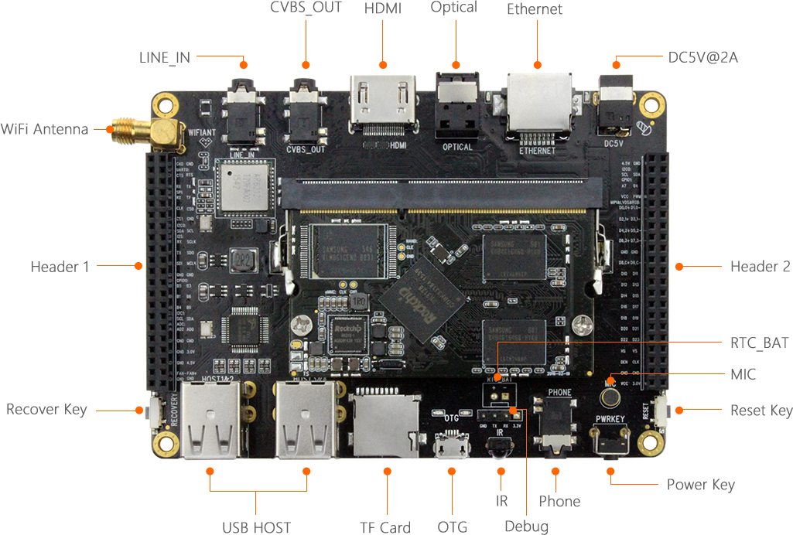
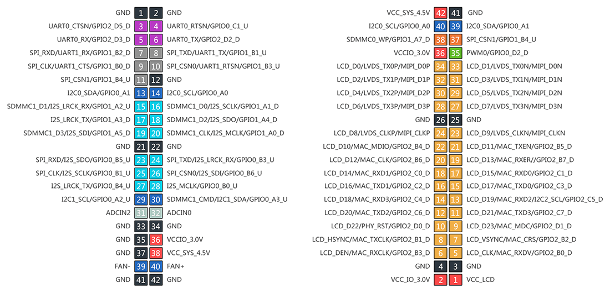
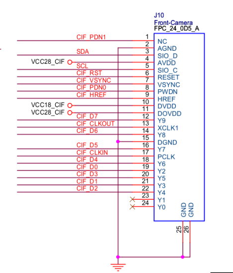

# 接口定义

## 整机接口定义
Firefly-RK3128 开发板提供了丰富的接口，主要包括：HDMI、音频数字光纤、以太网、电源接口、复位按键、电源键、音频输入输出、硅麦、串口调试接口、红外接收、OTG接口、TF卡槽、USB Host1~4、Recover按键、WIFI天线、CSI 摄像头接口，除此之外还包括两排扩展接口。具体如下图：

## 扩展接口定义

## DVP 摄像头接口
