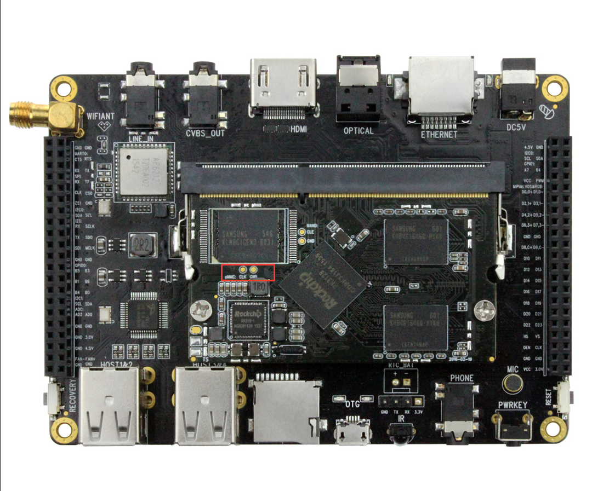
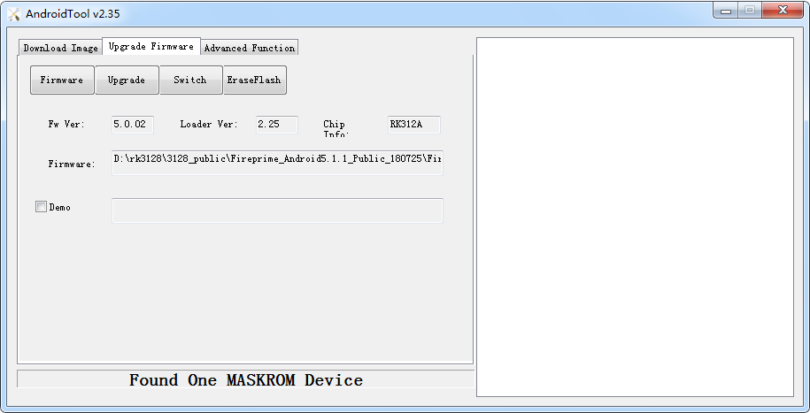

# MaskRom模式

***有关启动模式的介绍，请参阅[《启动模式》](bootmode.md)一章***

MaskRom 模式是设备变砖的最后一条防线。强行进入 MaskRom 涉及硬件操作，有一定风险，因此仅在设备进入不了 Loader 模式、SD 卡启动也失效的情况下，方可尝试 MaskRom 模式。

请小心阅读，并谨慎操作！

* 操作步骤如下：
1. 设备断开所有电源。
2. 拔出 SD 卡。
3. 用 Micro USB OTG 线的一端插入开发板的 OTG 口，而一端暂不接。
4. 用金属镊子接通核心板上的如下图红框所示的两个测试点，并保持。
5. 将 Micro USB OTG 线的另一端插入主机。
6. 稍候片刻，之后松开镊子。

这时，设备应该就会进入 MaskRom 模式。
