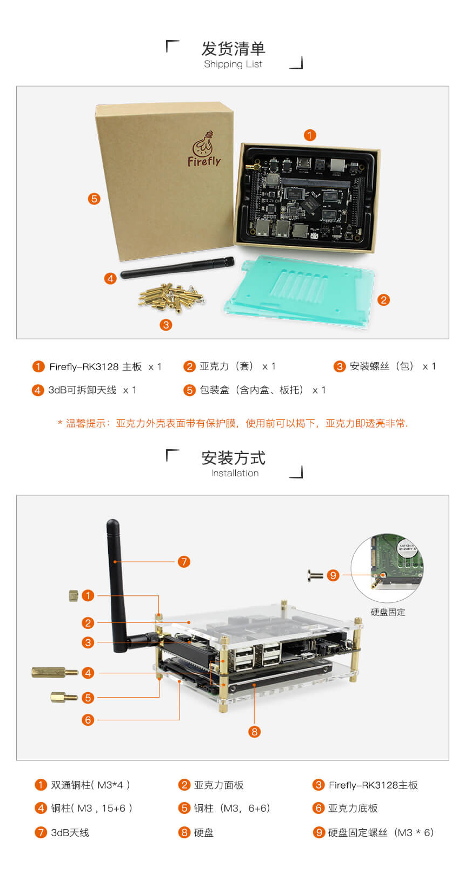

# 入手指南

## 配件

- Firefly-RK3128 的标准套装包含以下配件：
    + Core-3128J 核心板一块
    + Firefly-RK3128 基板一块
    + WiFi 天线

- 另外可以选购的配件有：
    + [5V/2.5A 的直流电源适配器（支持 220V 和 110V 输入）](https://store.t-firefly.com/goods.php?id=4)
    + [Firefly 串口模块](https://store.t-firefly.com/goods.php?id=24)
    + [散热风扇套件（5V/0.12A）](https://store.t-firefly.com/goods.php?id=18)
    + [散热片套装](https://store.t-firefly.com/goods.php?id=28)

**另外，在使用过程中，你可能需要以下配件：**

- 显示设备
    + 带 HDMI 接口的显示器或电视，及 HDMI 连接线
- 网络
    + 100M/1000M 以太网线缆，及有线路由器
    + WiFi 路由器
- 输入设备
    + USB 无线/有线的鼠标/键盘
    + 红外遥控器
- 升级固件，调试
    + Micro USB 连接线
    + 串口转 USB 适配器

**发货清单参考如下**

## 开机

确认主板配件连接无误后，将电源适配器插入带电的插座上，电源线接口插入开发板，开发板第一次加电会自动开机。
在 Android 系统选择关机后，维持开发板供电，此时 Firefly-RK3128 有两种开机方式：
* 长按电源键三秒
* 按红外遥控器上的开机按钮

开机时，蓝色的电源指示灯会亮起。