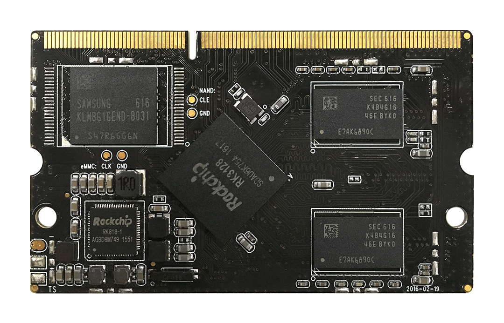
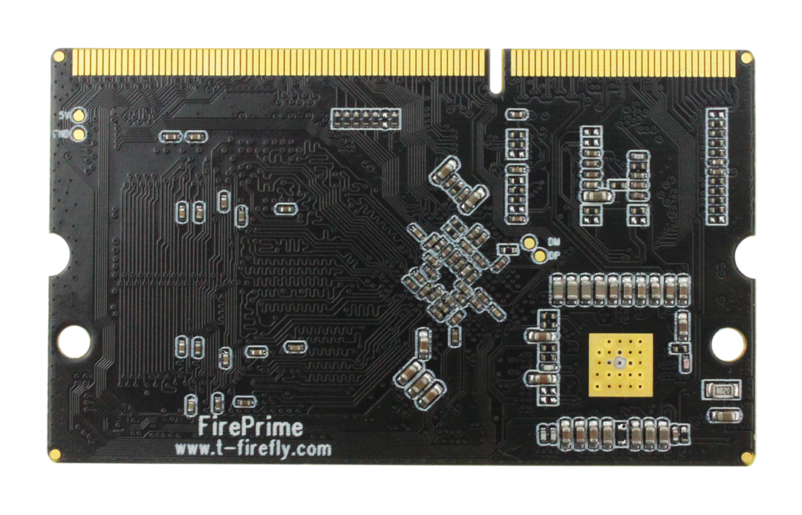
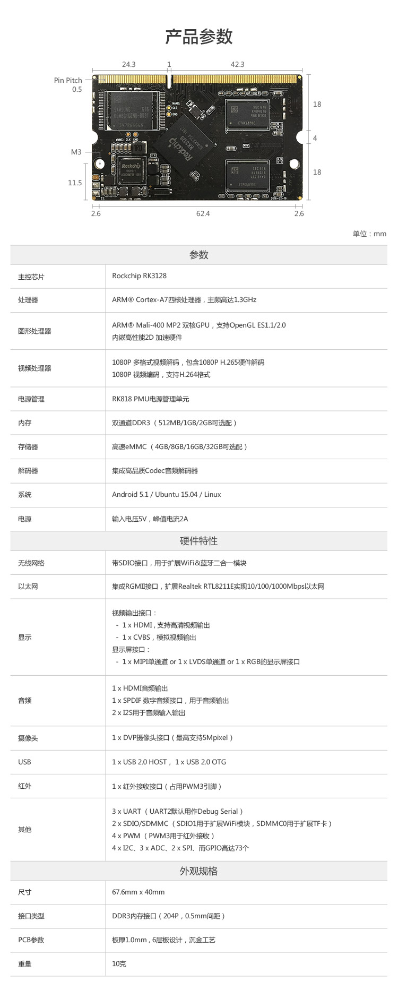

# 产品简介

## 产品概述 
Core-3128J 核心板 是一款基于四核 Cortex-A7 高性能核心板，采用 Rockchip RK3128
四核 Cortex-A7 1.3GHz 处理器，提供多种存储配置选择，用户仅需扩展功能底板即可快速实
现项目研产。核心板布局紧凑美观，尺寸仅有 67.6mm x 41mm，可以节约更多宝贵的空间。

Core-3128J 核心板支持 Android、Linux 等操作系统，具备完善的软件支持，同时有很多现成的应用
程序，用户开发更加简单、方便，可广泛应用于自劢售货机、智能 POS 机、一体机、工业电脑等多个行业。
核心板进行了严格的电磁、温度、高压脉冲、老化等测试，性能稳定可靠，可以大批量供应。

## 产品参数

## 产品资源

* [[Wiki]](http://wiki.t-firefly.com/zh_CN/AIO-3128C/getting_started.html)
包含Android&Ubuntu 驱动开发等资料(参考Fireprime Wiki)
 
* [[Git 链接地址]](https://bitbucket.org/T-Firefly/firenow-lollipop) 
Android SDK 源码

* [[技术交流论坛]](http://dev.t-firefly.com/forum.php)
超过10万企业客户和用户沟通交流平台

## 产品技术支持
Core-3128J 核心板可以在多种场景实现客户不同方面的需要，在游戏设备，广告机，自动售货机，机器人等
已经广泛的使用，品质和性能在行业内已经有非常好的口碑，专业的技术团队为广大客户解决硬件设计和软件功能上
的各种各样问题。专业技术支持和更详细资料请联系商务。

### 联系方式
* 邮箱：sales@t-firefly.com
* 手机：(+86) 186 8811 7175
* 座机：0760-89881218
* 全国服务热线：4001-511-533
* 地址：广东省中山市东区中山四路 57 号宏宇大厦 2101 室